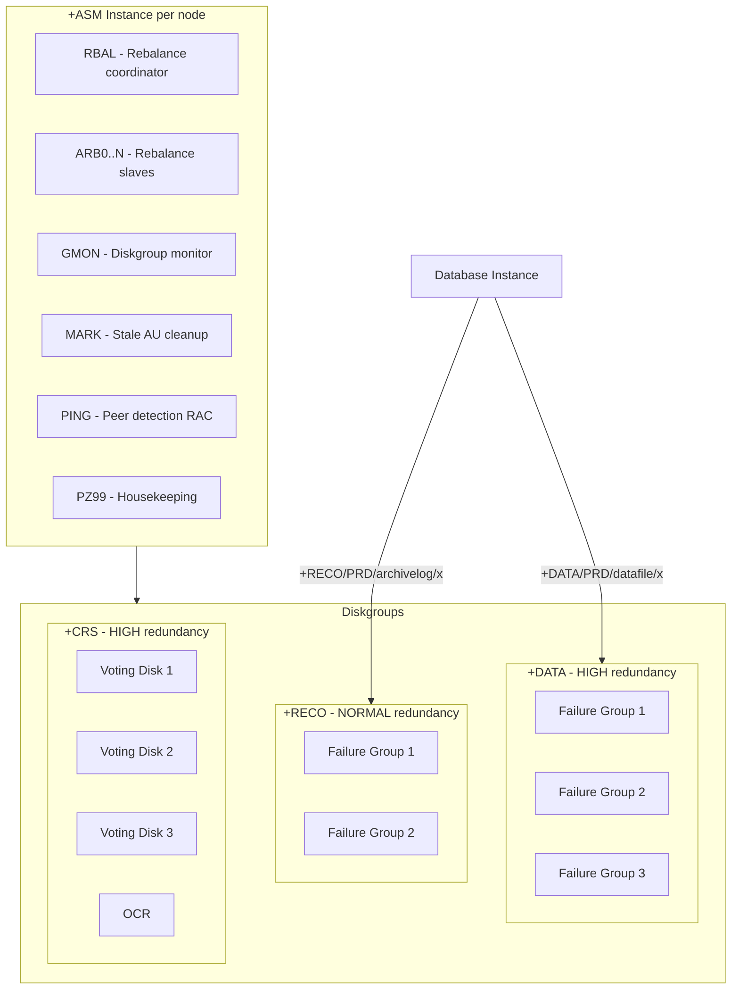
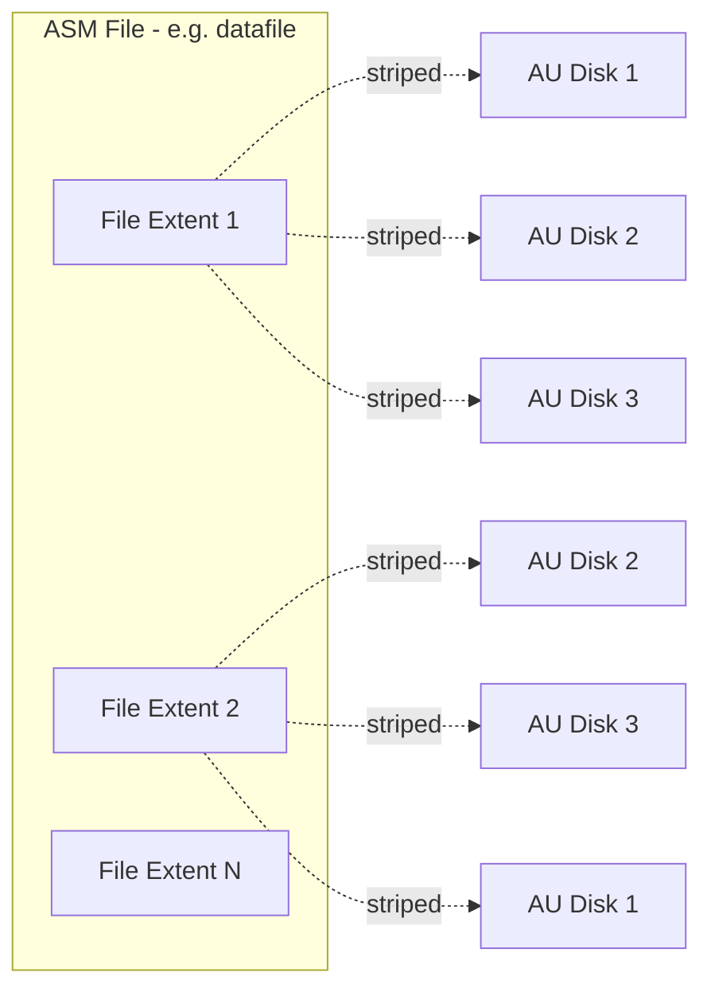
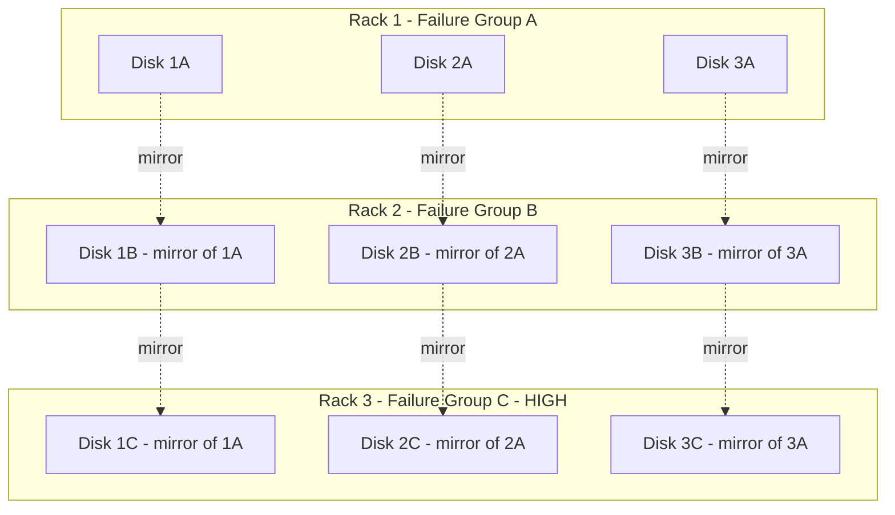
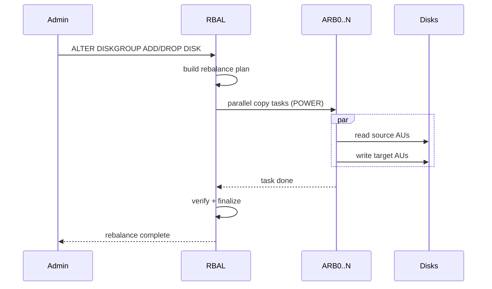

# ASM Architecture

## ASM Instance and Diskgroups

```mermaid
flowchart TB
    subgraph ASM_Inst[+ASM Instance per node]
        RBAL[RBAL - Rebalance coordinator]
        ARB[ARB0..N - Rebalance slaves]
        GMON[GMON - Diskgroup monitor]
        MARK[MARK - Stale AU cleanup]
        PING[PING - Peer detection RAC]
        PZ99[PZ99 - Housekeeping]
    end
    subgraph DGs[Diskgroups]
        subgraph DATA["+DATA - HIGH redundancy"]
            FG1_DATA[Failure Group 1]
            FG2_DATA[Failure Group 2]
            FG3_DATA[Failure Group 3]
        end
        subgraph RECO["+RECO - NORMAL redundancy"]
            FG1_RECO[Failure Group 1]
            FG2_RECO[Failure Group 2]
        end
        subgraph CRS["+CRS - HIGH redundancy"]
            V1[Voting Disk 1]
            V2[Voting Disk 2]
            V3[Voting Disk 3]
            OCR[OCR]
        end
    end
    DB_Inst[Database Instance] -->|+DATA/PRD/datafile/x| DATA
    DB_Inst -->|+RECO/PRD/archivelog/x| RECO
    ASM_Inst --> DGs
```

## Allocation Unit and File Extent Layout

```mermaid
flowchart LR
    subgraph File[ASM File - e.g. datafile]
        FE1[File Extent 1]
        FE2[File Extent 2]
        FEN[File Extent N]
    end
    FE1 -.striped.-> AU_D1[AU Disk 1]
    FE1 -.striped.-> AU_D2[AU Disk 2]
    FE1 -.striped.-> AU_D3[AU Disk 3]
    FE2 -.striped.-> AU_D2b[AU Disk 2]
    FE2 -.striped.-> AU_D3b[AU Disk 3]
    FE2 -.striped.-> AU_D1b[AU Disk 1]
```

## Failure Groups and Mirroring

```mermaid
flowchart TB
    subgraph Rack1[Rack 1 - Failure Group A]
        D1A[Disk 1A]
        D2A[Disk 2A]
        D3A[Disk 3A]
    end
    subgraph Rack2[Rack 2 - Failure Group B]
        D1B[Disk 1B - mirror of 1A]
        D2B[Disk 2B - mirror of 2A]
        D3B[Disk 3B - mirror of 3A]
    end
    subgraph Rack3[Rack 3 - Failure Group C - HIGH]
        D1C[Disk 1C - mirror of 1A]
        D2C[Disk 2C - mirror of 2A]
        D3C[Disk 3C - mirror of 3A]
    end
    D1A -.mirror.-> D1B
    D1B -.mirror.-> D1C
    D2A -.mirror.-> D2B
    D2B -.mirror.-> D2C
    D3A -.mirror.-> D3B
    D3B -.mirror.-> D3C
```

## Rebalance Operation

```mermaid
sequenceDiagram
    participant Admin
    participant RBAL
    participant ARB as ARB0..N
    participant Disks

    Admin->>RBAL: ALTER DISKGROUP ADD/DROP DISK
    RBAL->>RBAL: build rebalance plan
    RBAL->>ARB: parallel copy tasks (POWER)
    par
        ARB->>Disks: read source AUs
        ARB->>Disks: write target AUs
    end
    ARB-->>RBAL: task done
    RBAL->>RBAL: verify + finalize
    RBAL-->>Admin: rebalance complete
```
