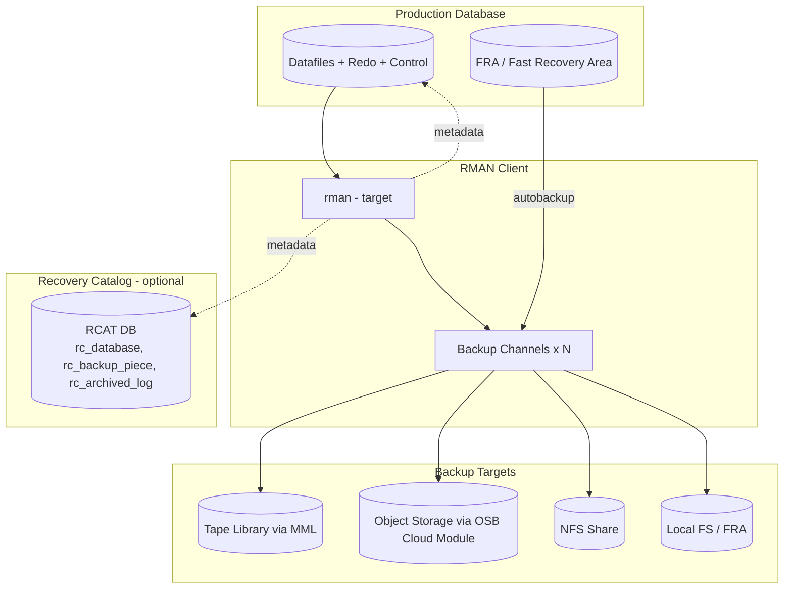
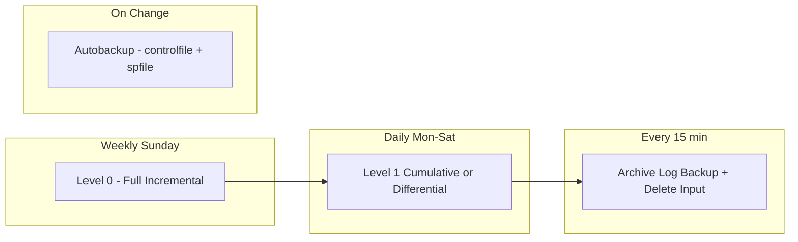
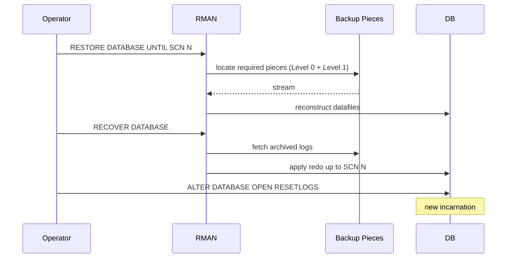
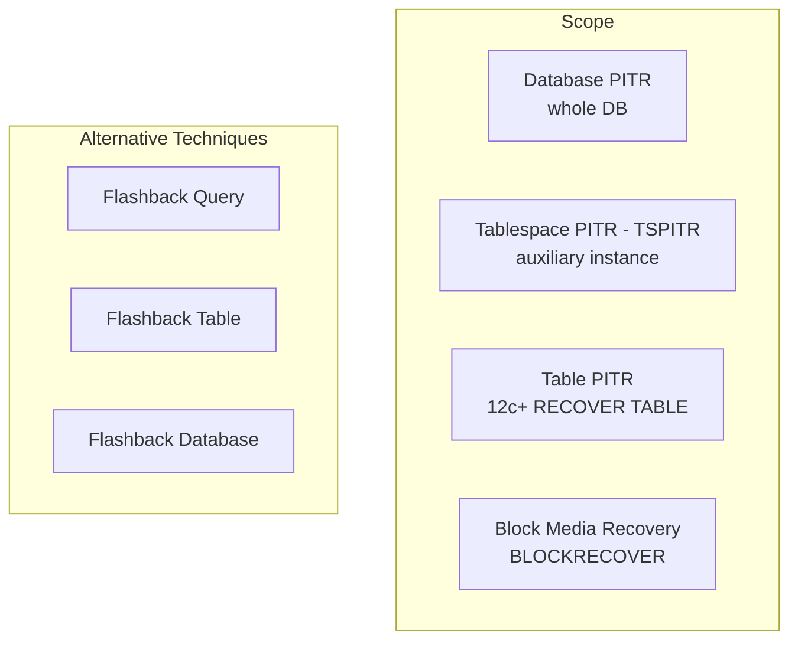
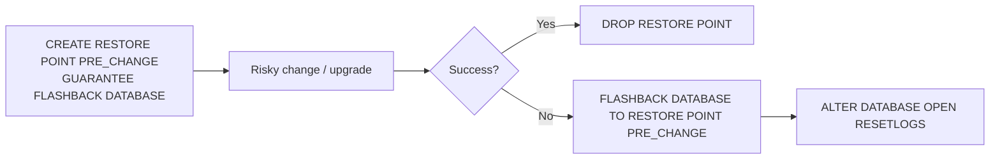

# Backup and Recovery Architecture

## RMAN Reference Setup

```mermaid
flowchart TB
    subgraph Source[Production Database]
        DB[(Datafiles + Redo + Control)]
        FRA[(FRA / Fast Recovery Area)]
    end
    subgraph RMAN_Client[RMAN Client]
        RMAN[rman - target]
        Channels[Backup Channels x N]
    end
    subgraph Catalog[Recovery Catalog - optional]
        RC[(RCAT DB<br/>rc_database, rc_backup_piece, rc_archived_log)]
    end
    subgraph Targets[Backup Targets]
        TAPE[(Tape Library via MML)]
        S3[(Object Storage via OSB Cloud Module)]
        NFS[(NFS Share)]
        LocalFS[(Local FS / FRA)]
    end
    DB --> RMAN
    RMAN --> Channels
    Channels --> TAPE
    Channels --> S3
    Channels --> NFS
    Channels --> LocalFS
    RMAN -.metadata.-> RC
    RMAN -.metadata.-> DB
    FRA -->|autobackup| Channels
```

## Backup Strategy Layers

```mermaid
flowchart LR
    subgraph Weekly[Weekly Sunday]
        L0[Level 0 - Full Incremental]
    end
    subgraph Daily[Daily Mon-Sat]
        L1[Level 1 Cumulative or Differential]
    end
    subgraph FreqArch[Every 15 min]
        Arch[Archive Log Backup + Delete Input]
    end
    subgraph Rare[On Change]
        CTL[Autobackup - controlfile + spfile]
    end
    L0 --> L1
    L1 --> Arch
```

## Restore + Recover Flow

```mermaid
sequenceDiagram
    participant Op as Operator
    participant R as RMAN
    participant BP as Backup Pieces
    participant DB

    Op->>R: RESTORE DATABASE UNTIL SCN N
    R->>BP: locate required pieces (Level 0 + Level 1)
    BP-->>R: stream
    R->>DB: reconstruct datafiles
    Op->>R: RECOVER DATABASE
    R->>BP: fetch archived logs
    R->>DB: apply redo up to SCN N
    Op->>DB: ALTER DATABASE OPEN RESETLOGS
    Note over DB: new incarnation
```

## Point-in-Time Recovery Types

```mermaid
flowchart TB
    subgraph Scope[Scope]
        DB_PITR[Database PITR<br/>whole DB]
        TS_PITR[Tablespace PITR - TSPITR<br/>auxiliary instance]
        Tab_PITR[Table PITR<br/>12c+ RECOVER TABLE]
        Block_PITR[Block Media Recovery<br/>BLOCKRECOVER]
    end
    subgraph Alternatives[Alternative Techniques]
        FBQ[Flashback Query]
        FBT[Flashback Table]
        FBDB[Flashback Database]
    end
```

## Guaranteed Restore Point + Flashback

```mermaid
flowchart LR
    Pre[CREATE RESTORE POINT PRE_CHANGE<br/>GUARANTEE FLASHBACK DATABASE] --> Change[Risky change / upgrade]
    Change --> Test{Success?}
    Test -->|Yes| Drop[DROP RESTORE POINT]
    Test -->|No| Flash[FLASHBACK DATABASE TO RESTORE POINT PRE_CHANGE]
    Flash --> Reopen[ALTER DATABASE OPEN RESETLOGS]
```
