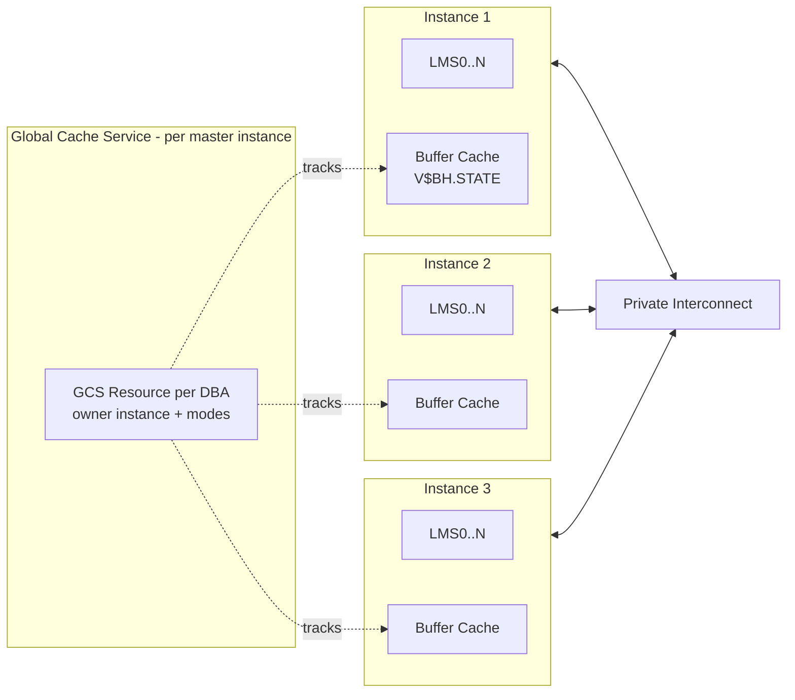
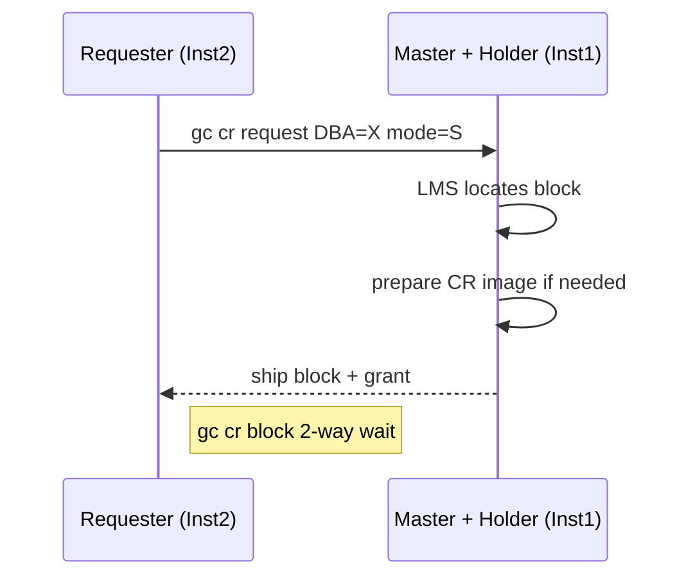
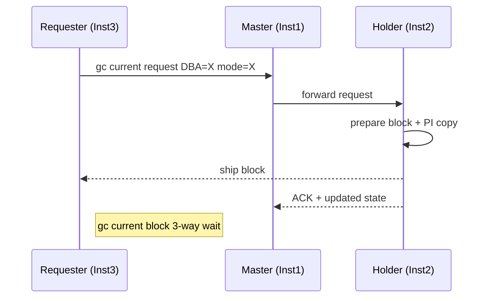
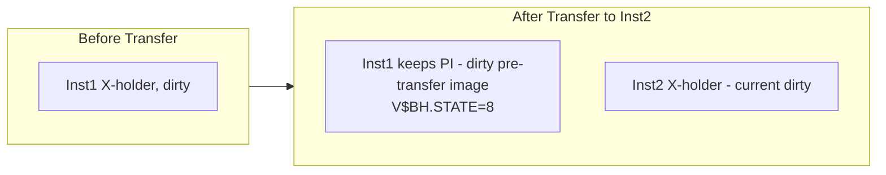
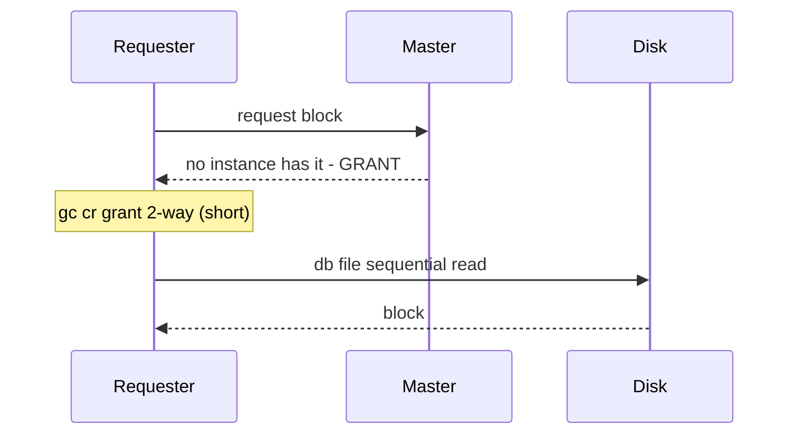

# Cache Fusion

## Block Modes and PCM Resources

## 2-Way Transfer (Requester + Master/Holder)

## 3-Way Transfer (Requester -> Master -> Holder)

## Past Image (PI) Block

## Grant vs Read from Disk

