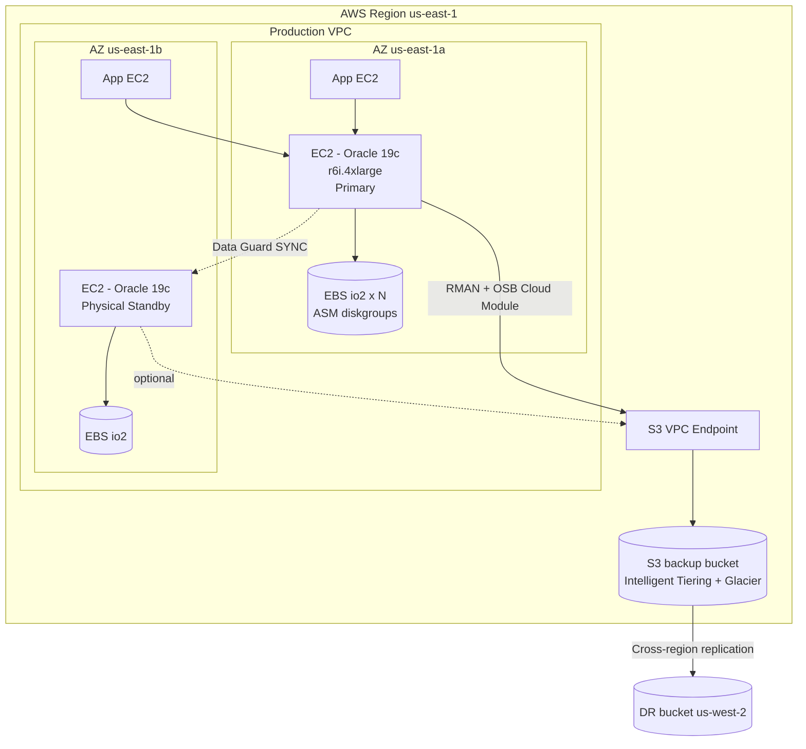
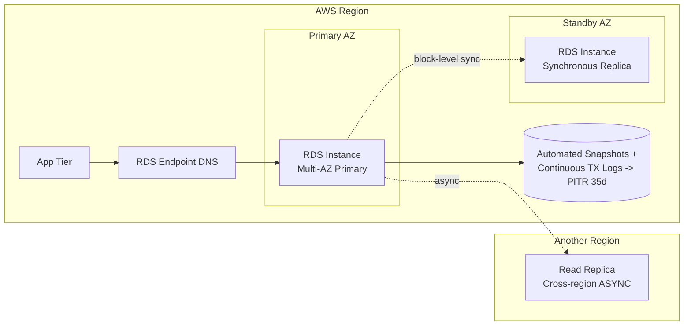
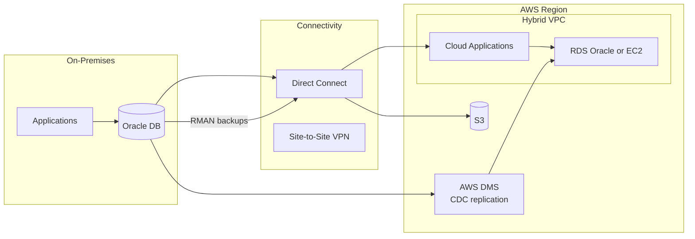
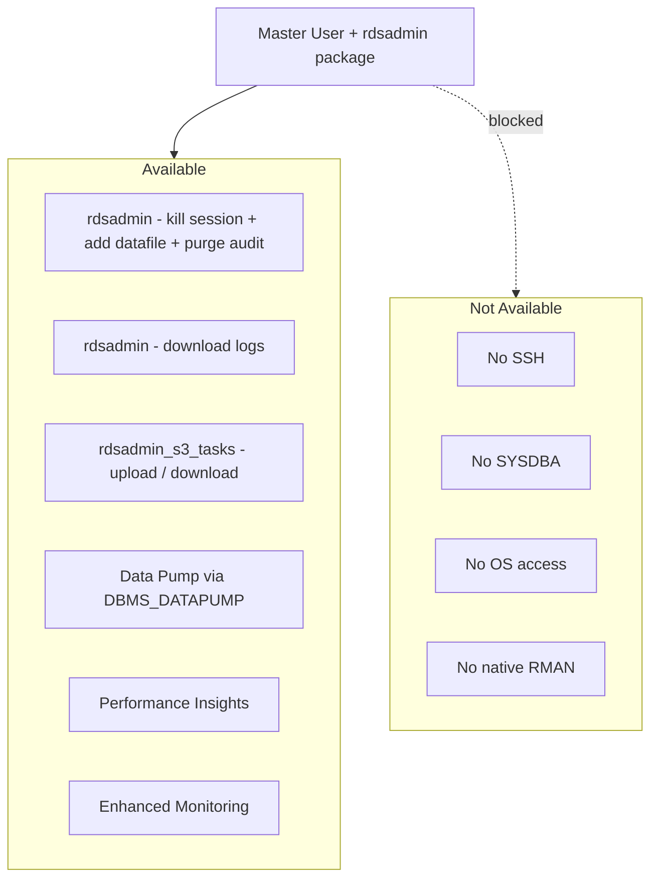

# AWS Cloud Architecture

## EC2 BYOL - Reference

```mermaid
flowchart TB
    subgraph AWS_Region[AWS Region us-east-1]
        subgraph VPC[Production VPC]
            subgraph AZ_A[AZ us-east-1a]
                App1[App EC2]
                DB1[EC2 - Oracle 19c<br/>r6i.4xlarge<br/>Primary]
                EBS1[(EBS io2 x N<br/>ASM diskgroups)]
            end
            subgraph AZ_B[AZ us-east-1b]
                App2[App EC2]
                DB2[EC2 - Oracle 19c<br/>Physical Standby]
                EBS2[(EBS io2)]
            end
        end
        S3[(S3 backup bucket<br/>Intelligent Tiering + Glacier)]
        VPCEP[S3 VPC Endpoint]
    end
    App1 --> DB1
    App2 --> DB1
    DB1 -.Data Guard SYNC.-> DB2
    DB1 --> EBS1
    DB2 --> EBS2
    DB1 -->|RMAN + OSB Cloud Module| VPCEP --> S3
    DB2 -.optional.-> VPCEP
    S3 -->|Cross-region replication| DR[(DR bucket us-west-2)]
```

## RDS Oracle Multi-AZ

```mermaid
flowchart LR
    subgraph AWS_Region_RDS[AWS Region]
        App[App Tier] --> RDS_Endpoint[RDS Endpoint DNS]
        subgraph Primary_AZ[Primary AZ]
            RDS_Prim[RDS Instance<br/>Multi-AZ Primary]
        end
        subgraph Standby_AZ[Standby AZ]
            RDS_Stby[RDS Instance<br/>Synchronous Replica]
        end
        RDS_Endpoint --> RDS_Prim
        RDS_Prim -.block-level sync.-> RDS_Stby
        Backups[(Automated Snapshots +<br/>Continuous TX Logs -> PITR 35d)]
        RDS_Prim --> Backups
    end
    subgraph OtherRegion[Another Region]
        RR[Read Replica<br/>Cross-region ASYNC]
    end
    RDS_Prim -.async.-> RR
```

## Hybrid On-Prem + AWS

```mermaid
flowchart LR
    subgraph OnPrem[On-Premises]
        DC_App[Applications]
        DC_DB[(Oracle DB)]
    end
    subgraph Connect[Connectivity]
        DX[Direct Connect]
        VPN[Site-to-Site VPN]
    end
    subgraph AWS[AWS Region]
        subgraph VPC_H[Hybrid VPC]
            Cloud_App[Cloud Applications]
            Cloud_DB[RDS Oracle or EC2]
        end
        DMS[AWS DMS<br/>CDC replication]
        S3[(S3)]
    end
    DC_App --> DC_DB
    DC_DB --> DX
    DC_DB --> DMS
    DX --> Cloud_App
    Cloud_App --> Cloud_DB
    DMS --> Cloud_DB
    DC_DB -->|RMAN backups| DX --> S3
```

## RDS Access Layers

```mermaid
flowchart TB
    Master[Master User + rdsadmin package]
    subgraph Blocked[Not Available]
        NoSSH[No SSH]
        NoSYSDBA[No SYSDBA]
        NoOS[No OS access]
        NoRMAN[No native RMAN]
    end
    subgraph Available[Available]
        RDSAdmin[rdsadmin - kill session + add datafile + purge audit]
        RDSLog[rdsadmin - download logs]
        RDSTasks[rdsadmin_s3_tasks - upload / download]
        RDSDPUMP[Data Pump via DBMS_DATAPUMP]
        PI[Performance Insights]
        EM[Enhanced Monitoring]
    end
    Master --> Available
    Master -.blocked.-> Blocked
```
