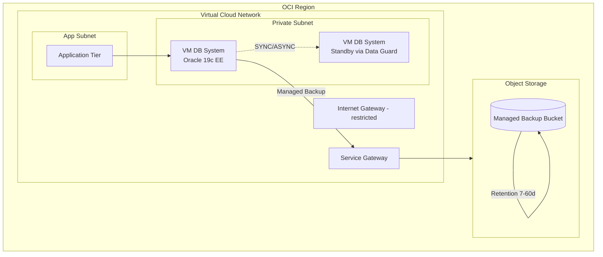
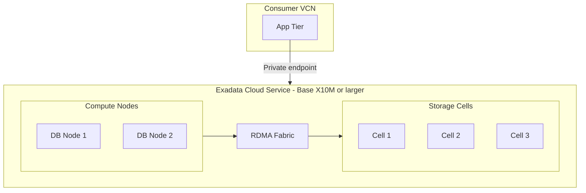
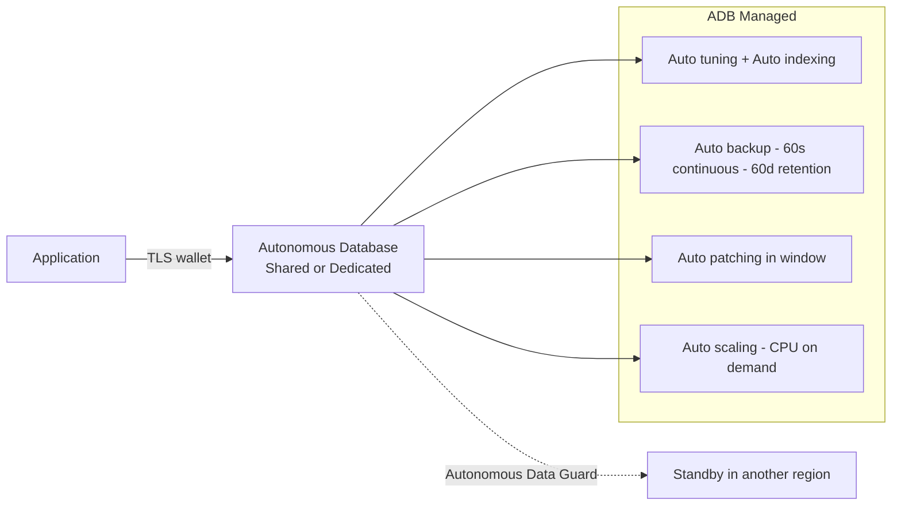
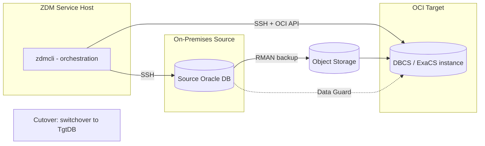
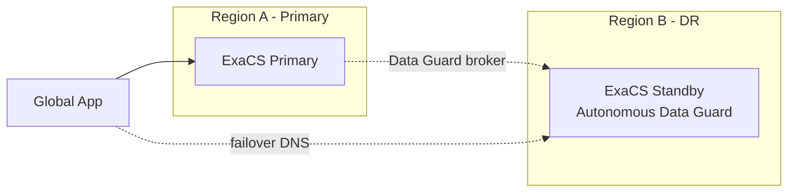

# OCI Cloud Architecture

## OCI DBCS - VM DB System

```mermaid
flowchart TB
    subgraph OCI_Region[OCI Region]
        subgraph VCN[Virtual Cloud Network]
            subgraph PrivSN[Private Subnet]
                DB[VM DB System<br/>Oracle 19c EE]
                DGDB[VM DB System<br/>Standby via Data Guard]
            end
            subgraph AppSN[App Subnet]
                AppTier[Application Tier]
            end
            SG[Service Gateway]
            IG[Internet Gateway - restricted]
        end
        subgraph ObjStore[Object Storage]
            Backups[(Managed Backup Bucket)]
        end
    end
    AppTier --> DB
    DB -.SYNC/ASYNC.-> DGDB
    DB -->|Managed Backup| SG --> ObjStore
    Backups -->|Retention 7-60d| Backups
```

## Exadata Cloud Service (ExaCS)

```mermaid
flowchart TB
    subgraph ExaCS[Exadata Cloud Service - Base X10M or larger]
        subgraph Compute[Compute Nodes]
            DBN1[DB Node 1]
            DBN2[DB Node 2]
        end
        subgraph Storage[Storage Cells]
            C1[Cell 1]
            C2[Cell 2]
            C3[Cell 3]
        end
        Fabric[RDMA Fabric]
        Compute --> Fabric --> Storage
    end
    subgraph Consumer[Consumer VCN]
        AppNodes[App Tier]
    end
    AppNodes -->|Private endpoint| ExaCS
```

## Autonomous Database

```mermaid
flowchart LR
    App[Application] -->|TLS wallet| ADB[Autonomous Database<br/>Shared or Dedicated]
    subgraph ADB_Layers[ADB Managed]
        Auto[Auto tuning + Auto indexing]
        AutoBackup[Auto backup - 60s continuous - 60d retention]
        AutoPatch[Auto patching in window]
        AutoScale[Auto scaling - CPU on demand]
    end
    ADB --> Auto
    ADB --> AutoBackup
    ADB --> AutoPatch
    ADB --> AutoScale
    ADB -.Autonomous Data Guard.-> DR[Standby in another region]
```

## Zero Downtime Migration to OCI

```mermaid
flowchart LR
    subgraph OnPrem[On-Premises Source]
        SrcDB[(Source Oracle DB)]
    end
    subgraph ZDMHost[ZDM Service Host]
        ZDM[zdmcli - orchestration]
    end
    subgraph OCI_Target[OCI Target]
        TgtDB[(DBCS / ExaCS instance)]
    end
    ZDM -->|SSH| SrcDB
    ZDM -->|SSH + OCI API| TgtDB
    SrcDB -->|RMAN backup| ObjStore[(Object Storage)]
    ObjStore --> TgtDB
    SrcDB -.Data Guard.-> TgtDB
    Note[Cutover: switchover to TgtDB]
```

## OCI Multi-Region DR

```mermaid
flowchart LR
    subgraph Region_A[Region A - Primary]
        Prod[ExaCS Primary]
    end
    subgraph Region_B[Region B - DR]
        DR_Std[ExaCS Standby<br/>Autonomous Data Guard]
    end
    Prod -.Data Guard broker.-> DR_Std
    App[Global App] --> Prod
    App -.failover DNS.-> DR_Std
```
