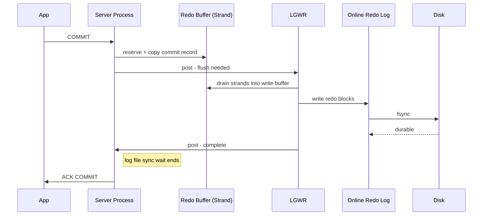
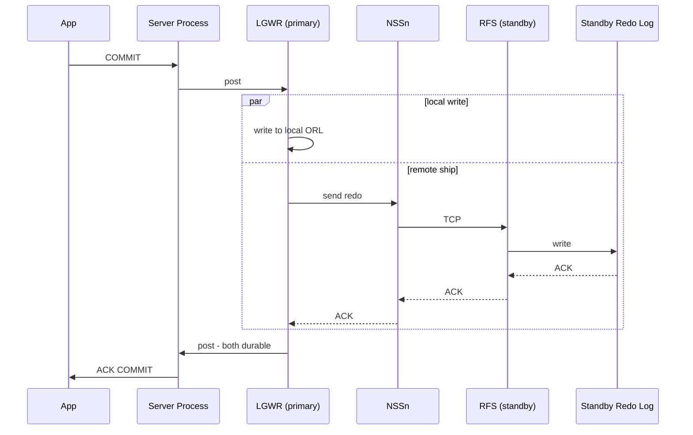
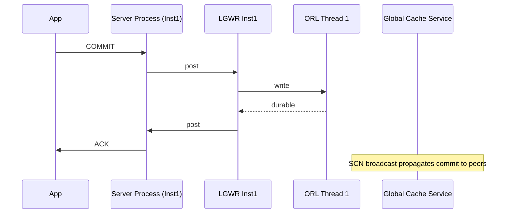
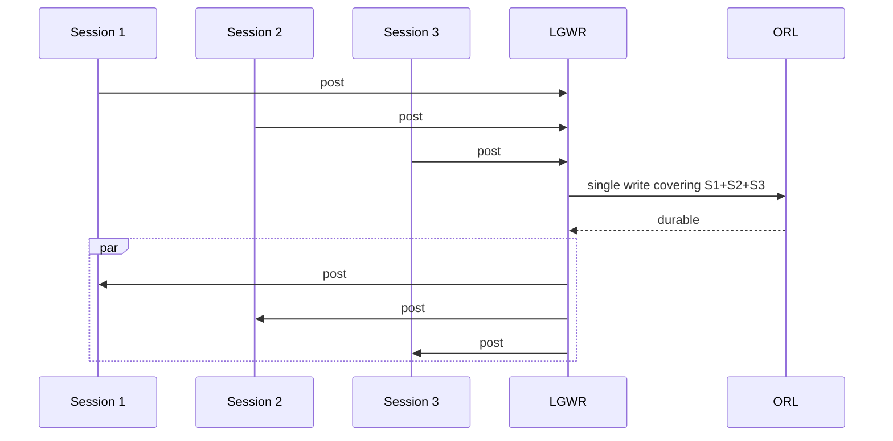

# Commit Flow

## Standard Commit (Single Instance)

```mermaid
sequenceDiagram
    participant App
    participant S as Server Process
    participant RB as Redo Buffer (Strand)
    participant LGWR
    participant ORL as Online Redo Log
    participant Disk

    App->>S: COMMIT
    S->>RB: reserve + copy commit record
    S->>LGWR: post - flush needed
    LGWR->>RB: drain strands into write buffer
    LGWR->>ORL: write redo blocks
    ORL->>Disk: fsync
    Disk-->>ORL: durable
    LGWR->>S: post - complete
    Note right of S: log file sync wait ends
    S->>App: ACK COMMIT
```

## Data Guard Commit (MAX AVAILABILITY - SYNC)

```mermaid
sequenceDiagram
    participant App
    participant S as Server Process
    participant LGWR_P as LGWR (primary)
    participant NSS as NSSn
    participant RFS as RFS (standby)
    participant SRL as Standby Redo Log

    App->>S: COMMIT
    S->>LGWR_P: post
    par local write
        LGWR_P->>LGWR_P: write to local ORL
    and remote ship
        LGWR_P->>NSS: send redo
        NSS->>RFS: TCP
        RFS->>SRL: write
        SRL-->>RFS: ACK
        RFS-->>NSS: ACK
        NSS-->>LGWR_P: ACK
    end
    LGWR_P->>S: post - both durable
    S->>App: ACK COMMIT
```

## RAC Commit

```mermaid
sequenceDiagram
    participant App
    participant S as Server Process (Inst1)
    participant LGWR1 as LGWR Inst1
    participant ORL1 as ORL Thread 1
    participant GCS as Global Cache Service

    App->>S: COMMIT
    S->>LGWR1: post
    LGWR1->>ORL1: write
    ORL1-->>LGWR1: durable
    LGWR1->>S: post
    S->>App: ACK
    Note over GCS: SCN broadcast propagates commit to peers
```

## Group Commit

```mermaid
sequenceDiagram
    participant S1 as Session 1
    participant S2 as Session 2
    participant S3 as Session 3
    participant LGWR
    participant ORL

    S1->>LGWR: post
    S2->>LGWR: post
    S3->>LGWR: post
    LGWR->>ORL: single write covering S1+S2+S3
    ORL-->>LGWR: durable
    par
        LGWR->>S1: post
        LGWR->>S2: post
        LGWR->>S3: post
    end
```
