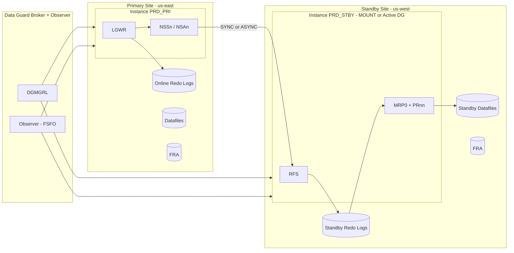
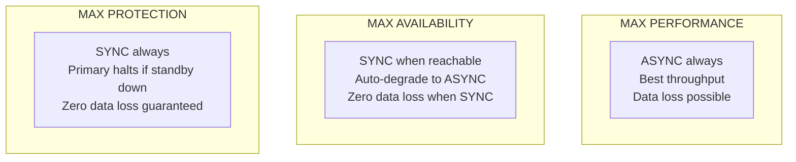
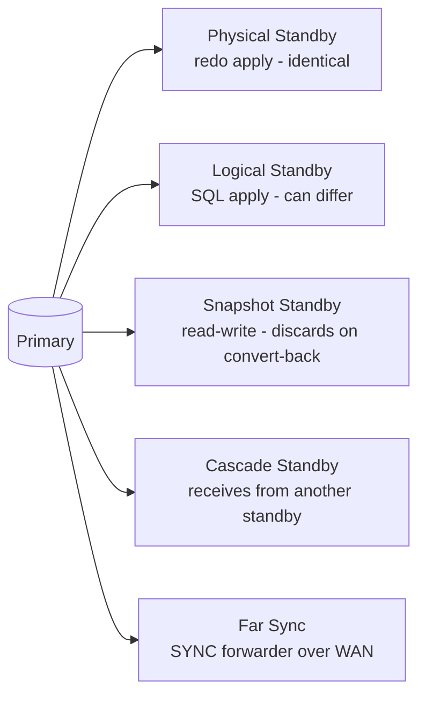
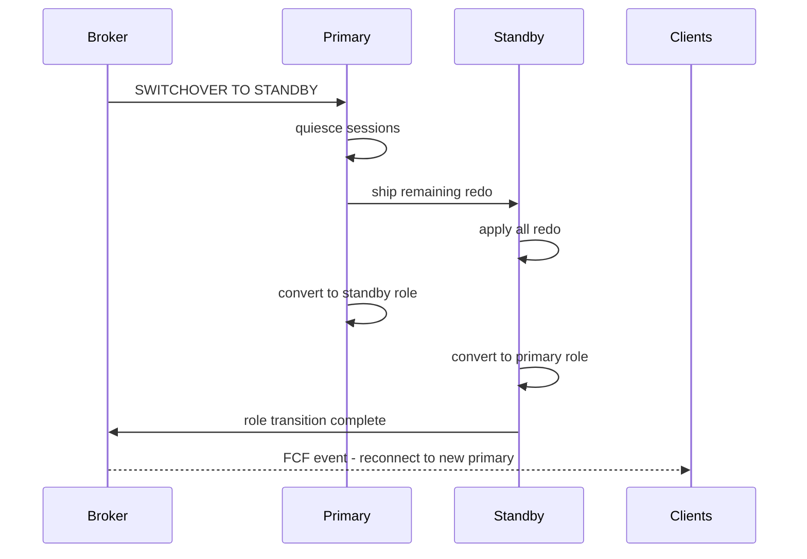
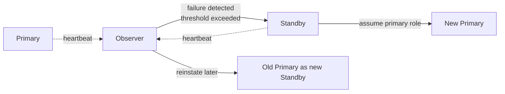

# Data Guard Architecture

## Physical Standby - Reference

```mermaid
flowchart LR
    subgraph Primary[Primary Site - us-east]
        subgraph P_Inst[Instance PRD_PRI]
            LGWR_P[LGWR]
            NSSn[NSSn / NSAn]
        end
        P_ORL[(Online Redo Logs)]
        P_DF[(Datafiles)]
        P_FRA[(FRA)]
    end
    subgraph Standby[Standby Site - us-west]
        subgraph S_Inst[Instance PRD_STBY - MOUNT or Active DG]
            RFS[RFS]
            MRP0[MRP0 + PRnn]
        end
        S_SRL[(Standby Redo Logs)]
        S_DF[(Standby Datafiles)]
        S_FRA[(FRA)]
    end
    subgraph Broker[Data Guard Broker + Observer]
        DGMGRL[DGMGRL]
        OBS[Observer - FSFO]
    end
    LGWR_P --> P_ORL
    LGWR_P --> NSSn
    NSSn -->|SYNC or ASYNC| RFS
    RFS --> S_SRL
    S_SRL --> MRP0
    MRP0 --> S_DF
    DGMGRL --> P_Inst
    DGMGRL --> S_Inst
    OBS --> P_Inst
    OBS --> S_Inst
```

## Protection Modes

```mermaid
flowchart TB
    subgraph MP[MAX PERFORMANCE]
        MPd[ASYNC always<br/>Best throughput<br/>Data loss possible]
    end
    subgraph MA[MAX AVAILABILITY]
        MAd[SYNC when reachable<br/>Auto-degrade to ASYNC<br/>Zero data loss when SYNC]
    end
    subgraph MPro[MAX PROTECTION]
        MPd2[SYNC always<br/>Primary halts if standby down<br/>Zero data loss guaranteed]
    end
```

## Standby Types

```mermaid
flowchart LR
    Primary[(Primary)] --> P[Physical Standby<br/>redo apply - identical]
    Primary --> L[Logical Standby<br/>SQL apply - can differ]
    Primary --> S[Snapshot Standby<br/>read-write - discards on convert-back]
    Primary --> C[Cascade Standby<br/>receives from another standby]
    Primary --> F[Far Sync<br/>SYNC forwarder over WAN]
```

## Switchover

```mermaid
sequenceDiagram
    participant DGB as Broker
    participant P as Primary
    participant S as Standby

    DGB->>P: SWITCHOVER TO STANDBY
    P->>P: quiesce sessions
    P->>S: ship remaining redo
    S->>S: apply all redo
    P->>P: convert to standby role
    S->>S: convert to primary role
    S->>DGB: role transition complete
    DGB-->>Clients: FCF event - reconnect to new primary
```

## FSFO (Fast-Start Failover)

```mermaid
flowchart LR
    P[Primary] -.heartbeat.-> O[Observer]
    S[Standby] -.heartbeat.-> O
    O -->|failure detected<br/>threshold exceeded| S
    S -->|assume primary role| Prim2[New Primary]
    O -->|reinstate later| Old[Old Primary as new Standby]
```
