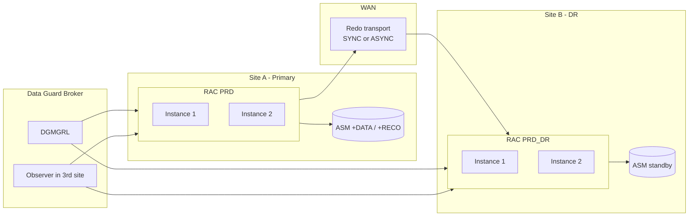
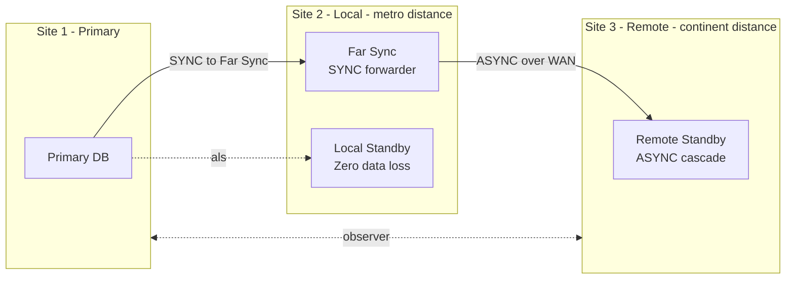
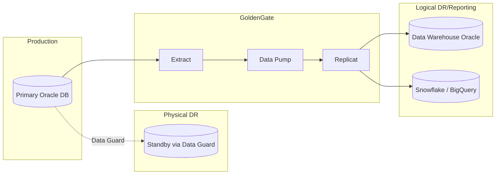
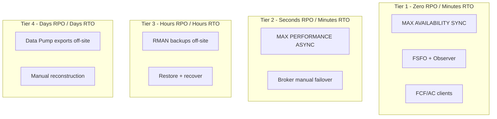
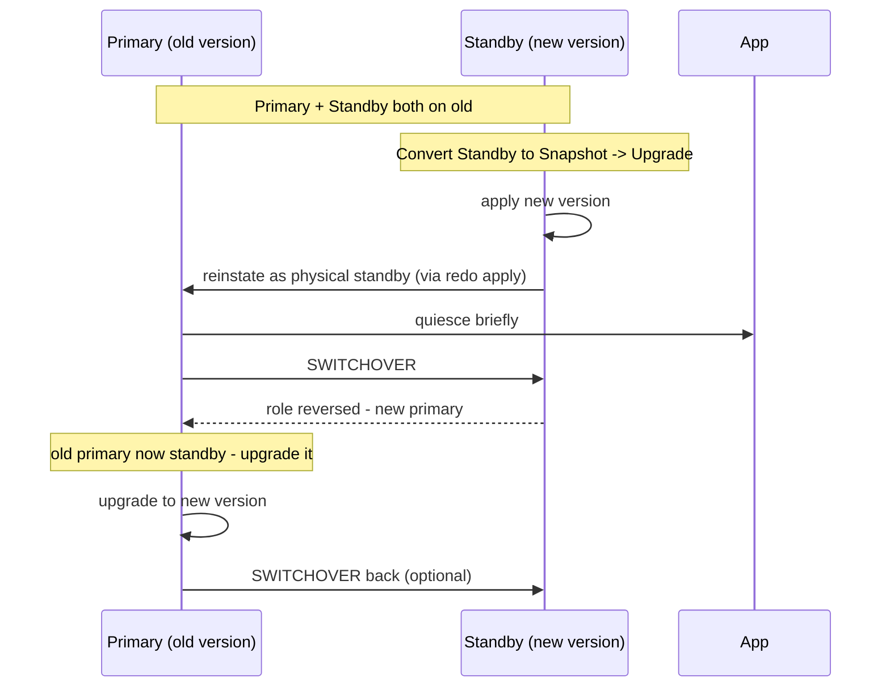

# DR Topology

## Two-Site DR - Primary + Standby

```mermaid
flowchart LR
    subgraph Site_A[Site A - Primary]
        subgraph Cluster_A[RAC PRD]
            InstA1[Instance 1]
            InstA2[Instance 2]
        end
        Store_A[(ASM +DATA / +RECO)]
    end
    subgraph WAN[WAN]
        Link[Redo transport<br/>SYNC or ASYNC]
    end
    subgraph Site_B[Site B - DR]
        subgraph Cluster_B[RAC PRD_DR]
            InstB1[Instance 1]
            InstB2[Instance 2]
        end
        Store_B[(ASM standby)]
    end
    Cluster_A --> Store_A
    Cluster_A --> Link
    Link --> Cluster_B
    Cluster_B --> Store_B
    subgraph Broker[Data Guard Broker]
        DGMGRL
        Obs[Observer in 3rd site]
    end
    DGMGRL --> Cluster_A
    DGMGRL --> Cluster_B
    Obs --> Cluster_A
    Obs --> Cluster_B
```

## Three-Site MAA

```mermaid
flowchart LR
    subgraph Site_1[Site 1 - Primary]
        P[Primary DB]
    end
    subgraph Site_2[Site 2 - Local - metro distance]
        FS[Far Sync<br/>SYNC forwarder]
        LSt[Local Standby<br/>Zero data loss]
    end
    subgraph Site_3[Site 3 - Remote - continent distance]
        RSt[Remote Standby<br/>ASYNC cascade]
    end
    P -->|SYNC to Far Sync| FS
    FS -->|ASYNC over WAN| RSt
    P -.also.-> LSt
    Site_1 <-.observer.-> Site_3
```

## Golden Gate + Data Guard - Hybrid DR

```mermaid
flowchart LR
    subgraph Prod[Production]
        P[(Primary Oracle DB)]
    end
    subgraph Physical[Physical DR]
        S[(Standby via Data Guard)]
    end
    subgraph Logical[Logical DR/Reporting]
        DW[(Data Warehouse Oracle)]
        Snowflake[(Snowflake / BigQuery)]
    end
    P -.Data Guard.-> S
    subgraph GG[GoldenGate]
        Ext[Extract]
        DP[Data Pump]
        Rep[Replicat]
    end
    P --> Ext --> DP --> Rep --> DW
    Rep --> Snowflake
```

## RPO / RTO Design Tiers

```mermaid
flowchart TB
    subgraph T1[Tier 1 - Zero RPO / Minutes RTO]
        T1a[MAX AVAILABILITY SYNC]
        T1b[FSFO + Observer]
        T1c[FCF/AC clients]
    end
    subgraph T2[Tier 2 - Seconds RPO / Minutes RTO]
        T2a[MAX PERFORMANCE ASYNC]
        T2b[Broker manual failover]
    end
    subgraph T3[Tier 3 - Hours RPO / Hours RTO]
        T3a[RMAN backups off-site]
        T3b[Restore + recover]
    end
    subgraph T4[Tier 4 - Days RPO / Days RTO]
        T4a[Data Pump exports off-site]
        T4b[Manual reconstruction]
    end
```

## Rolling Upgrade with DG

```mermaid
sequenceDiagram
    participant P as Primary (old version)
    participant S as Standby (new version)
    participant App
    Note over P,S: Primary + Standby both on old
    Note over S: Convert Standby to Snapshot -> Upgrade
    S->>S: apply new version
    S->>P: reinstate as physical standby (via redo apply)
    P->>App: quiesce briefly
    P->>S: SWITCHOVER
    S-->>P: role reversed - new primary
    Note over P: old primary now standby - upgrade it
    P->>P: upgrade to new version
    P->>S: SWITCHOVER back (optional)
```
