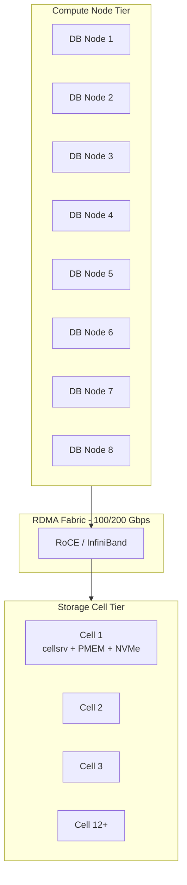
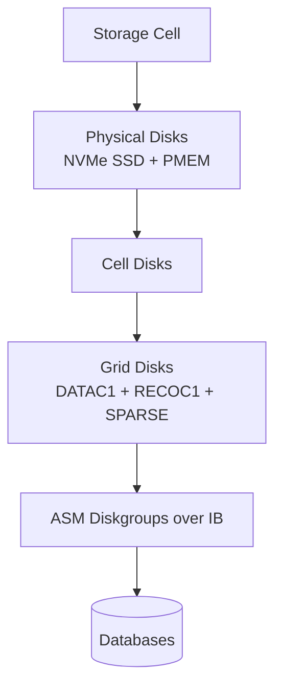
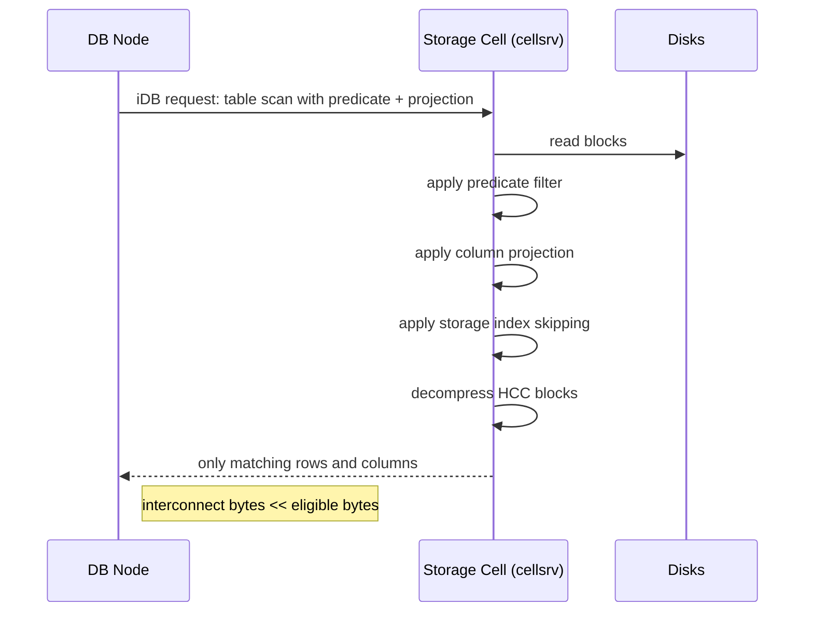
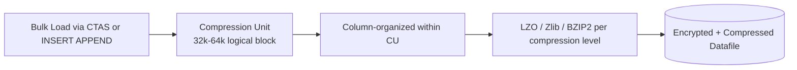
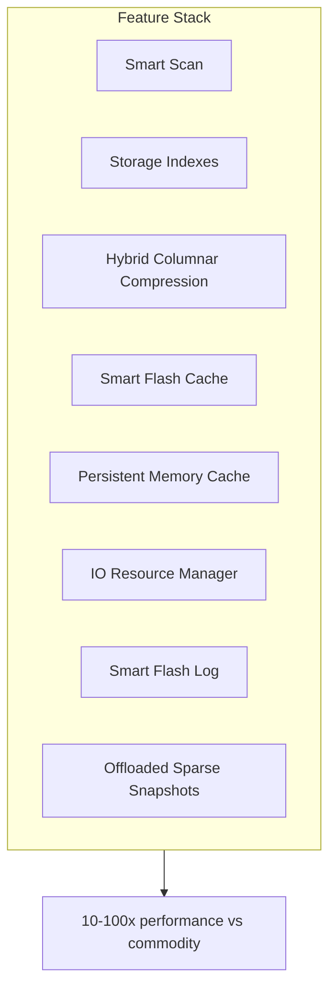

# Exadata Architecture

## Full Rack Reference

```mermaid
flowchart TB
    subgraph Compute[Compute Node Tier]
        DBN1[DB Node 1]
        DBN2[DB Node 2]
        DBN3[DB Node 3]
        DBN4[DB Node 4]
        DBN5[DB Node 5]
        DBN6[DB Node 6]
        DBN7[DB Node 7]
        DBN8[DB Node 8]
    end
    subgraph Fabric[RDMA Fabric - 100/200 Gbps]
        IB[RoCE / InfiniBand]
    end
    subgraph Storage[Storage Cell Tier]
        Cell1[Cell 1<br/>cellsrv + PMEM + NVMe]
        Cell2[Cell 2]
        Cell3[Cell 3]
        CellN[Cell 12+]
    end
    Compute --> IB
    IB --> Storage
```

## Cell Storage Hierarchy

```mermaid
flowchart TB
    Cell[Storage Cell] --> PD[Physical Disks<br/>NVMe SSD + PMEM]
    PD --> CD[Cell Disks]
    CD --> GD[Grid Disks<br/>DATAC1 + RECOC1 + SPARSE]
    GD --> ASM[ASM Diskgroups over IB]
    ASM --> DB[(Databases)]
```

## Smart Scan Path

```mermaid
sequenceDiagram
    participant DB as DB Node
    participant Cell as Storage Cell (cellsrv)
    participant Disks

    DB->>Cell: iDB request: table scan with predicate + projection
    Cell->>Disks: read blocks
    Cell->>Cell: apply predicate filter
    Cell->>Cell: apply column projection
    Cell->>Cell: apply storage index skipping
    Cell->>Cell: decompress HCC blocks
    Cell-->>DB: only matching rows and columns
    Note right of DB: interconnect bytes << eligible bytes
```

## HCC Compression Path

```mermaid
flowchart LR
    Load[Bulk Load via CTAS or INSERT APPEND] --> CU[Compression Unit<br/>32k-64k logical block]
    CU --> Cols[Column-organized within CU]
    Cols --> Compress[LZO / Zlib / BZIP2 per compression level]
    Compress --> DF[(Encrypted + Compressed Datafile)]
```

## Exadata Feature Stack

```mermaid
flowchart TB
    subgraph Features[Feature Stack]
        SS[Smart Scan]
        SI[Storage Indexes]
        HCC[Hybrid Columnar Compression]
        FC[Smart Flash Cache]
        PMEM[Persistent Memory Cache]
        IORM[IO Resource Manager]
        SFL[Smart Flash Log]
        OSPS[Offloaded Sparse Snapshots]
    end
    Features --> Perf[10-100x performance vs commodity]
```
