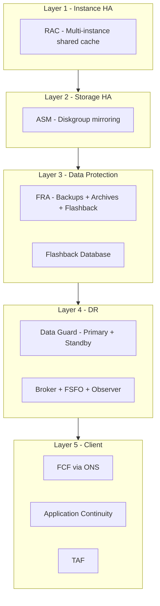
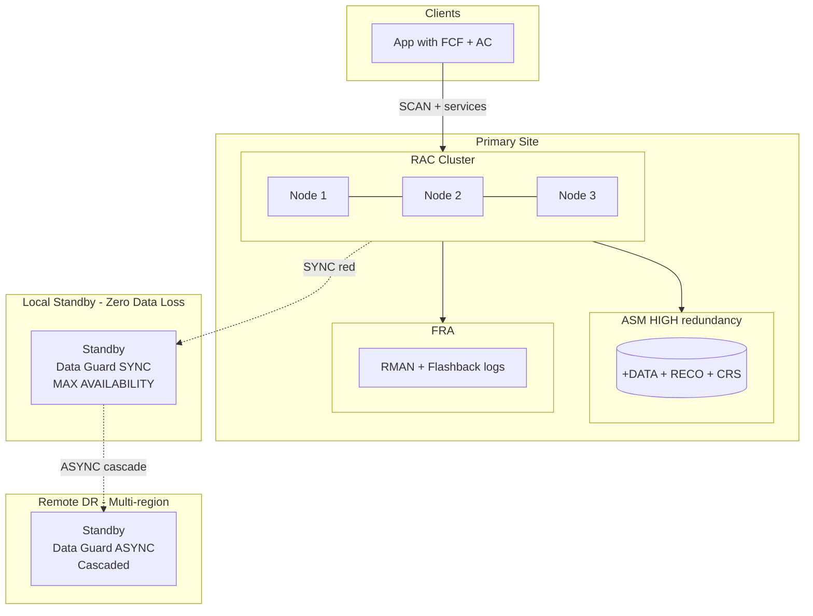
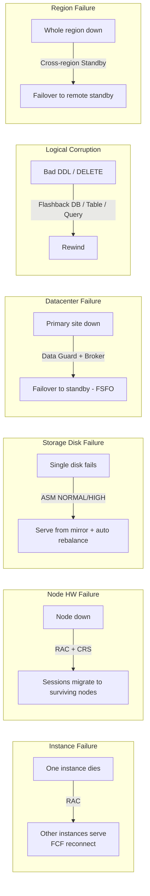
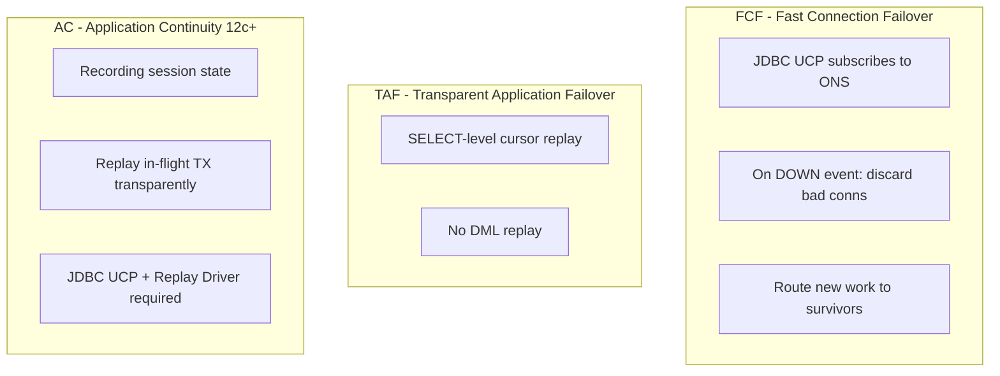

# High Availability Architecture

## HA Stack Composition

```mermaid
flowchart TB
    subgraph Layer1[Layer 1 - Instance HA]
        RAC[RAC - Multi-instance shared cache]
    end
    subgraph Layer2[Layer 2 - Storage HA]
        ASM[ASM - Diskgroup mirroring]
    end
    subgraph Layer3[Layer 3 - Data Protection]
        FRA[FRA - Backups + Archives + Flashback]
        Flash[Flashback Database]
    end
    subgraph Layer4[Layer 4 - DR]
        DG[Data Guard - Primary + Standby]
        Broker[Broker + FSFO + Observer]
    end
    subgraph Layer5[Layer 5 - Client]
        FCF[FCF via ONS]
        AC[Application Continuity]
        TAF[TAF]
    end
    Layer1 --> Layer2
    Layer2 --> Layer3
    Layer3 --> Layer4
    Layer4 --> Layer5
```

## MAA - Maximum Availability Architecture

```mermaid
flowchart TB
    subgraph Site_Primary[Primary Site]
        subgraph Cluster_P[RAC Cluster]
            N1[Node 1] --- N2[Node 2] --- N3[Node 3]
        end
        subgraph Storage_P[ASM HIGH redundancy]
            DG_P[(+DATA + RECO + CRS)]
        end
        subgraph FRA_P[FRA]
            Backup_P[RMAN + Flashback logs]
        end
        Cluster_P --> Storage_P
        Cluster_P --> FRA_P
    end
    subgraph Site_Local[Local Standby - Zero Data Loss]
        DG_Sync[Standby<br/>Data Guard SYNC<br/>MAX AVAILABILITY]
    end
    subgraph Site_Remote[Remote DR - Multi-region]
        DG_Async[Standby<br/>Data Guard ASYNC<br/>Cascaded]
    end
    Cluster_P -.SYNC redo.-> DG_Sync
    DG_Sync -.ASYNC cascade.-> DG_Async
    subgraph Clients[Clients]
        App1[App with FCF + AC]
    end
    App1 -->|SCAN + services| Cluster_P
```

## Failure Scenarios and Coverage

```mermaid
flowchart LR
    subgraph Instance_Fail[Instance Failure]
        IF[One instance dies]
        IF -->|RAC| Others[Other instances serve<br/>FCF reconnect]
    end
    subgraph Node_Fail[Node HW Failure]
        NF[Node down]
        NF -->|RAC + CRS| Recover[Sessions migrate to surviving nodes]
    end
    subgraph Storage_Fail[Storage Disk Failure]
        SF[Single disk fails]
        SF -->|ASM NORMAL/HIGH| Mirror[Serve from mirror + auto rebalance]
    end
    subgraph Datacenter_Fail[Datacenter Failure]
        DF[Primary site down]
        DF -->|Data Guard + Broker| Failover[Failover to standby - FSFO]
    end
    subgraph Corruption[Logical Corruption]
        CF[Bad DDL / DELETE]
        CF -->|Flashback DB / Table / Query| FlashRec[Rewind]
    end
    subgraph Region_Fail[Region Failure]
        RF[Whole region down]
        RF -->|Cross-region Standby| Remote[Failover to remote standby]
    end
```

## Client HA - FCF vs TAF vs AC

```mermaid
flowchart TB
    subgraph FCF[FCF - Fast Connection Failover]
        FCFa[JDBC UCP subscribes to ONS]
        FCFb[On DOWN event: discard bad conns]
        FCFc[Route new work to survivors]
    end
    subgraph TAF[TAF - Transparent Application Failover]
        TAFa[SELECT-level cursor replay]
        TAFb[No DML replay]
    end
    subgraph AC[AC - Application Continuity 12c+]
        ACa[Recording session state]
        ACb[Replay in-flight TX transparently]
        ACc[JDBC UCP + Replay Driver required]
    end
```
