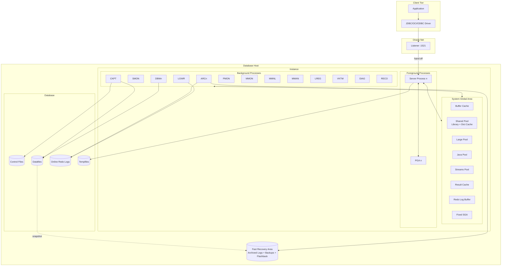

# Instance Architecture

```mermaid
flowchart TB
    subgraph Client[Client Tier]
        App[Application]
        Drv[JDBC/OCI/ODBC Driver]
    end
    subgraph Net[Oracle Net]
        Lsnr[Listener :1521]
    end
    subgraph Host[Database Host]
        subgraph Instance[Instance]
            subgraph SGA[System Global Area]
                BC[Buffer Cache]
                SP[Shared Pool<br/>Library + Dict Cache]
                LP[Large Pool]
                JP[Java Pool]
                STP[Streams Pool]
                RC[Result Cache]
                RB[Redo Log Buffer]
                FSGA[Fixed SGA]
            end
            subgraph BG[Background Processes]
                PMON
                SMON
                DBWn
                LGWR
                CKPT
                ARCn
                MMON
                MMNL
                MMAN
                LREG
                VKTM
                DIAG
                RECO
            end
            subgraph FG[Foreground Processes]
                Snn[Server Process n]
                PGAn[PGA n]
            end
        end
        subgraph DB[Database]
            CF[(Control Files)]
            DF[(Datafiles)]
            RL[(Online Redo Logs)]
            TF[(Tempfiles)]
        end
        FRA[(Fast Recovery Area<br/>Archived Logs + Backups + Flashback)]
    end
    App --> Drv --> Lsnr
    Lsnr -->|hand-off| Snn
    Snn <--> PGAn
    Snn <--> SGA
    BG <--> SGA
    DBWn --> DF
    LGWR --> RL
    CKPT --> CF
    CKPT --> DF
    ARCn --> RL
    ARCn --> FRA
    Snn --> TF
    DF -.snapshot.-> FRA
```
