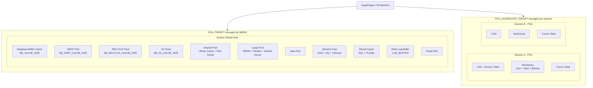
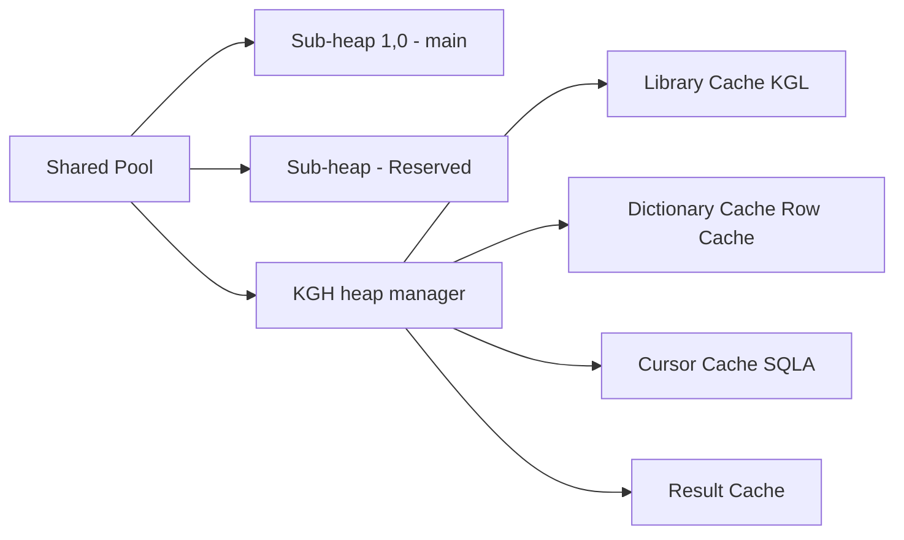
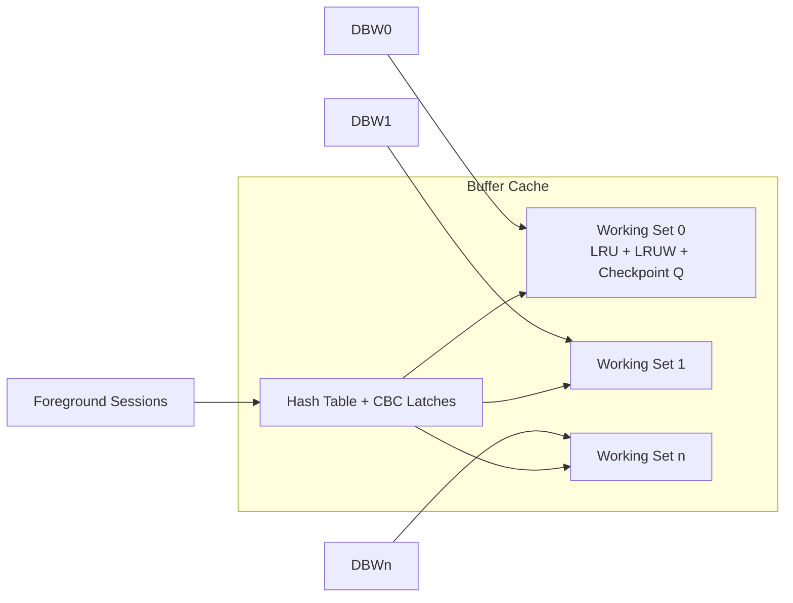

# Memory Architecture

## SGA + PGA

```mermaid
flowchart TB
    subgraph SGA_TARGET[SGA_TARGET managed by MMAN]
        subgraph SGA[System Global Area]
            BC[Database Buffer Cache<br/>DB_CACHE_SIZE]
            KEEP[KEEP Pool<br/>DB_KEEP_CACHE_SIZE]
            RECY[RECYCLE Pool<br/>DB_RECYCLE_CACHE_SIZE]
            NK[nK Pools<br/>DB_nK_CACHE_SIZE]
            SP[Shared Pool<br/>Library Cache + Row Cache]
            LP[Large Pool<br/>RMAN + Parallel + Shared Server]
            JP[Java Pool]
            STP[Streams Pool<br/>OGG + AQ + XStream]
            RC[Result Cache<br/>SQL + PL/SQL]
            RLB[Redo Log Buffer<br/>LOG_BUFFER]
            FSGA[Fixed SGA]
        end
    end
    subgraph PGA_TARGET[PGA_AGGREGATE_TARGET managed per session]
        subgraph SessionA[Session A - PGA]
            UGAA[UGA - Session State]
            WA_A[Workareas<br/>Sort + Hash + Bitmap]
            CS_A[Cursor State]
        end
        subgraph SessionB[Session B - PGA]
            UGAB[UGA]
            WA_B[Workareas]
            CS_B[Cursor State]
        end
    end
    OS[HugePages / OS Memory] --> SGA_TARGET
    OS --> PGA_TARGET
```

## Shared Pool Sub-Heaps

```mermaid
flowchart LR
    SP[Shared Pool] --> SubH1[Sub-heap 1,0 - main]
    SP --> SubH2[Sub-heap - Reserved]
    SP --> KGH[KGH heap manager]
    KGH --> LC[Library Cache KGL]
    KGH --> DC[Dictionary Cache Row Cache]
    KGH --> CC[Cursor Cache SQLA]
    KGH --> RCH[Result Cache]
```

## Buffer Cache Working Sets

```mermaid
flowchart LR
    subgraph BC[Buffer Cache]
        WS0[Working Set 0<br/>LRU + LRUW + Checkpoint Q]
        WS1[Working Set 1]
        WSn[Working Set n]
        Hash[Hash Table + CBC Latches]
    end
    DBW0 --> WS0
    DBW1 --> WS1
    DBWn --> WSn
    FGs[Foreground Sessions] --> Hash
    Hash --> WS0
    Hash --> WS1
    Hash --> WSn
```
