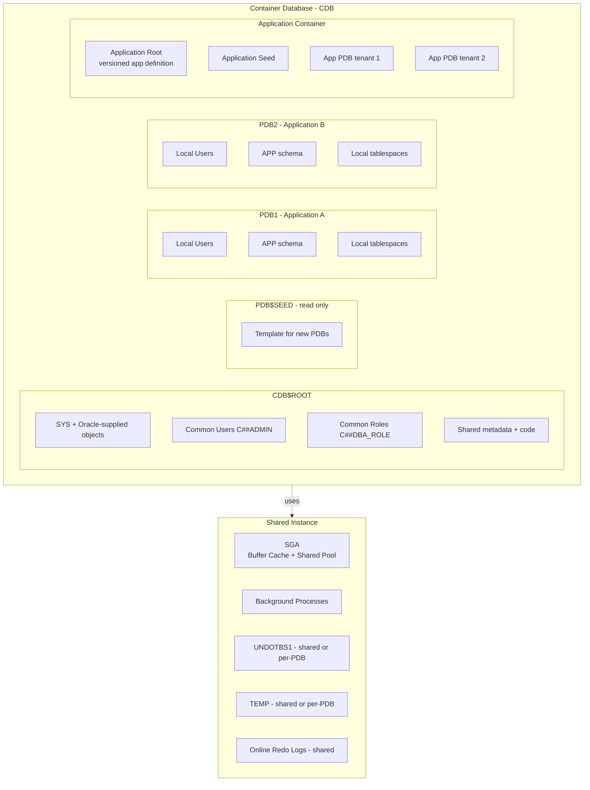
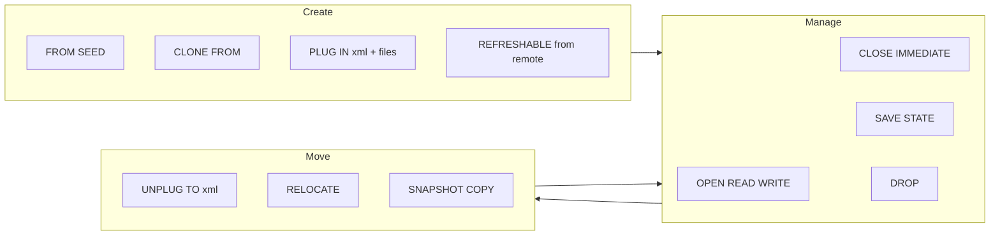
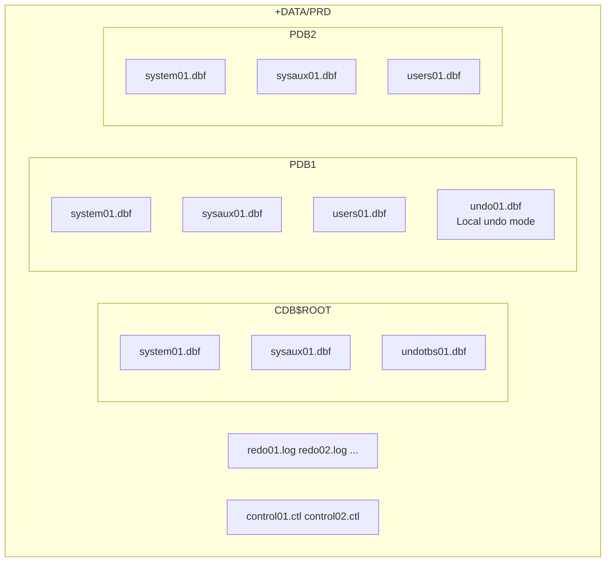

# Multitenant Architecture

## CDB + PDBs

```mermaid
flowchart TB
    subgraph CDB[Container Database - CDB]
        subgraph Root[CDB$ROOT]
            SYS_Root[SYS + Oracle-supplied objects]
            CommonUsers[Common Users C##ADMIN]
            CommonRoles[Common Roles C##DBA_ROLE]
            Metadata[Shared metadata + code]
        end
        subgraph Seed[PDB$SEED - read only]
            Template[Template for new PDBs]
        end
        subgraph PDB1[PDB1 - Application A]
            LU1[Local Users]
            APP1[APP schema]
            LT1[Local tablespaces]
        end
        subgraph PDB2[PDB2 - Application B]
            LU2[Local Users]
            APP2[APP schema]
            LT2[Local tablespaces]
        end
        subgraph AppCon[Application Container]
            AppRoot[Application Root<br/>versioned app definition]
            AppSeed[Application Seed]
            APDB1[App PDB tenant 1]
            APDB2[App PDB tenant 2]
        end
    end
    subgraph Shared[Shared Instance]
        SGA[SGA<br/>Buffer Cache + Shared Pool]
        BG[Background Processes]
        UNDO[UNDOTBS1 - shared or per-PDB]
        TEMP[TEMP - shared or per-PDB]
        REDO[Online Redo Logs - shared]
    end
    CDB -.uses.-> Shared
```

## PDB Lifecycle Operations

```mermaid
flowchart LR
    subgraph Create[Create]
        FromSeed[FROM SEED]
        Clone[CLONE FROM]
        Plug[PLUG IN xml + files]
        Refresh[REFRESHABLE from remote]
    end
    subgraph Move[Move]
        Unplug[UNPLUG TO xml]
        Relocate[RELOCATE]
        SnapClone[SNAPSHOT COPY]
    end
    subgraph Manage[Manage]
        Open[OPEN READ WRITE]
        Close[CLOSE IMMEDIATE]
        SaveState[SAVE STATE]
        Drop[DROP]
    end
    Create --> Manage
    Manage --> Move
    Move --> Manage
    Manage --> Drop
```

## PDB Storage Layout

```mermaid
flowchart TB
    subgraph FS[+DATA/PRD]
        subgraph CDB_files[CDB$ROOT]
            sys[system01.dbf]
            sysaux[sysaux01.dbf]
            undo[undotbs01.dbf]
        end
        subgraph PDB1_files[PDB1]
            sys1[system01.dbf]
            sysaux1[sysaux01.dbf]
            users1[users01.dbf]
            undo1[undo01.dbf<br/>Local undo mode]
        end
        subgraph PDB2_files[PDB2]
            sys2[system01.dbf]
            sysaux2[sysaux01.dbf]
            users2[users01.dbf]
        end
        redo[redo01.log redo02.log ...]
        ctrl[control01.ctl control02.ctl]
    end
```
