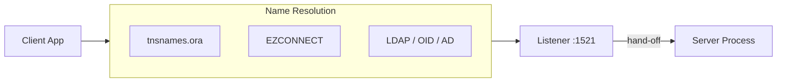
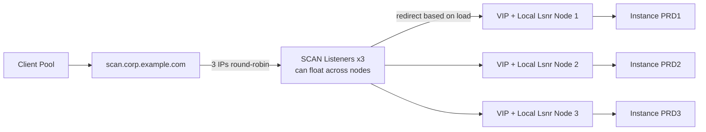
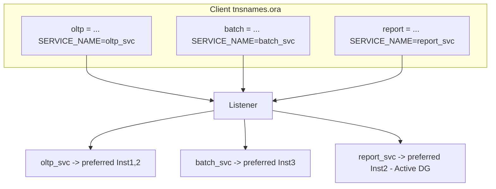
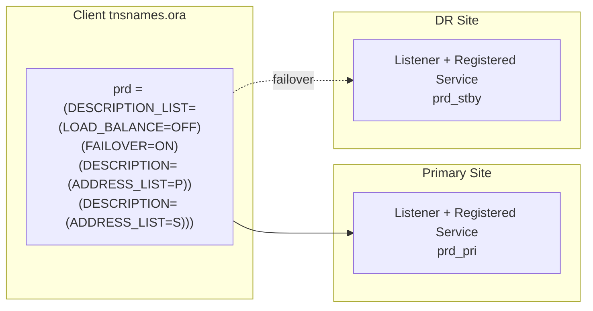
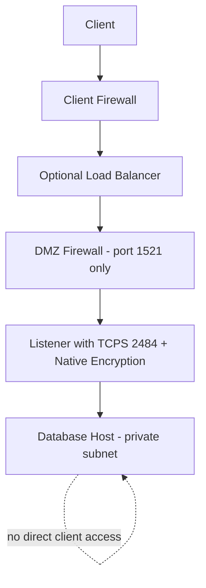

# Network Topology

## Single-Instance Client Connect

```mermaid
flowchart LR
    App[Client App]
    subgraph Resolve[Name Resolution]
        TNS[tnsnames.ora]
        EZ[EZCONNECT]
        LDAP[LDAP / OID / AD]
    end
    L[Listener :1521]
    S[Server Process]
    App --> Resolve
    Resolve --> L
    L -->|hand-off| S
```

## RAC with SCAN Listener

```mermaid
flowchart LR
    Client[Client Pool] --> SCAN_DNS[scan.corp.example.com]
    SCAN_DNS -->|3 IPs round-robin| SCAN_LSNR[SCAN Listeners x3<br/>can float across nodes]
    SCAN_LSNR -->|redirect based on load| VIP1[VIP + Local Lsnr Node 1]
    SCAN_LSNR --> VIP2[VIP + Local Lsnr Node 2]
    SCAN_LSNR --> VIP3[VIP + Local Lsnr Node 3]
    VIP1 --> Inst1[Instance PRD1]
    VIP2 --> Inst2[Instance PRD2]
    VIP3 --> Inst3[Instance PRD3]
```

## Service Routing

```mermaid
flowchart TB
    subgraph Client_TNS[Client tnsnames.ora]
        Alias1[oltp = ... SERVICE_NAME=oltp_svc]
        Alias2[batch = ... SERVICE_NAME=batch_svc]
        Alias3[report = ... SERVICE_NAME=report_svc]
    end
    Alias1 --> L[Listener]
    Alias2 --> L
    Alias3 --> L
    L --> SVC1[oltp_svc -> preferred Inst1,2]
    L --> SVC2[batch_svc -> preferred Inst3]
    L --> SVC3[report_svc -> preferred Inst2 - Active DG]
```

## Data Guard TNS Configuration

```mermaid
flowchart LR
    subgraph Primary_Site[Primary Site]
        P_Lsnr[Listener + Registered Service<br/>prd_pri]
    end
    subgraph DR_Site[DR Site]
        S_Lsnr[Listener + Registered Service<br/>prd_stby]
    end
    subgraph tnsnames_ora[Client tnsnames.ora]
        PRD["prd = (DESCRIPTION_LIST=<br/>(LOAD_BALANCE=OFF)(FAILOVER=ON)<br/>(DESCRIPTION= (ADDRESS_LIST=P))<br/>(DESCRIPTION= (ADDRESS_LIST=S)))"]
    end
    PRD --> P_Lsnr
    PRD -.failover.-> S_Lsnr
```

## Secure Network Layers

```mermaid
flowchart TB
    Client --> FW1[Client Firewall]
    FW1 --> LB[Optional Load Balancer]
    LB --> FW2[DMZ Firewall - port 1521 only]
    FW2 --> L[Listener with TCPS 2484 + Native Encryption]
    L --> DB[Database Host - private subnet]
    DB -.no direct client access.-> DB
```
