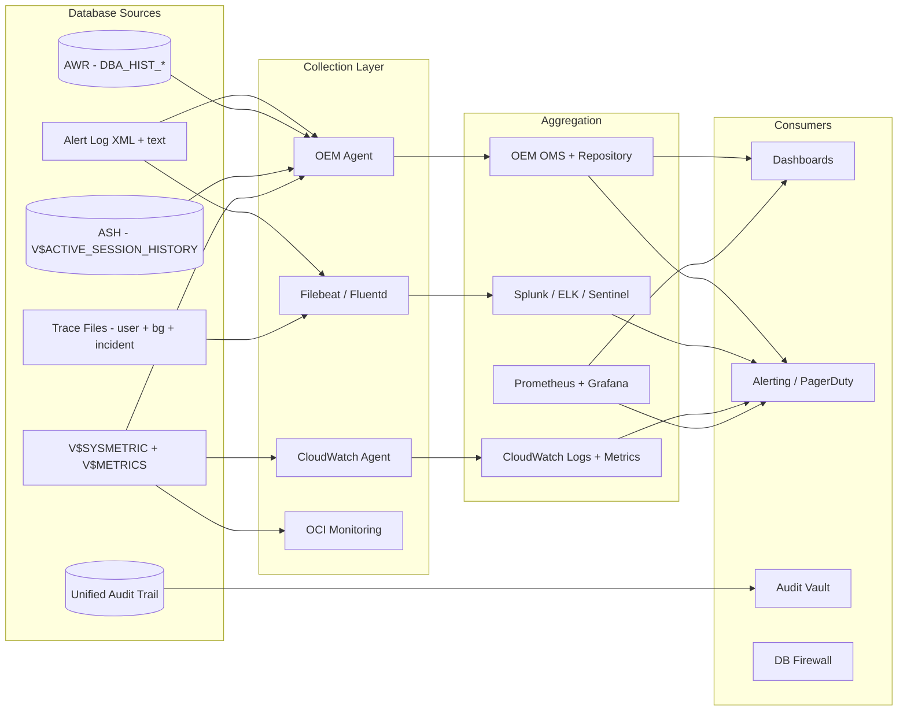
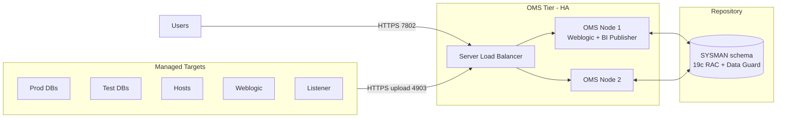
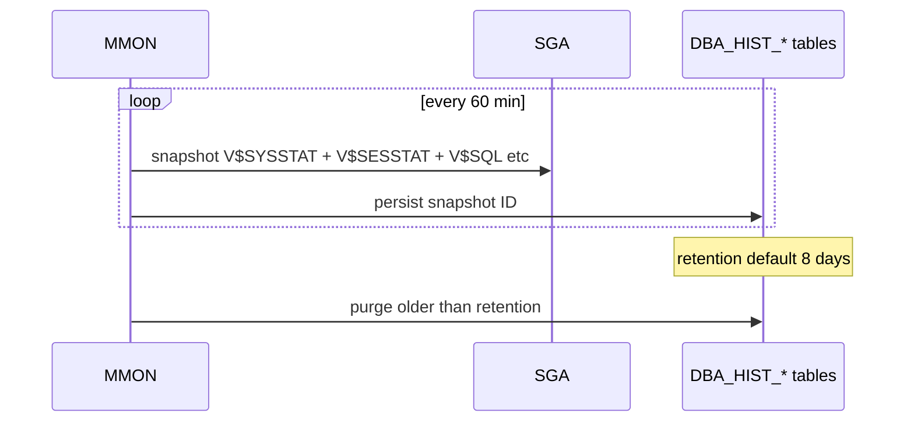
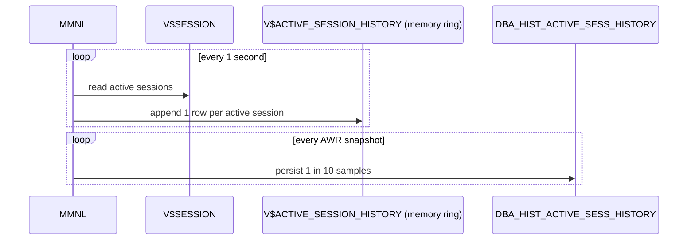
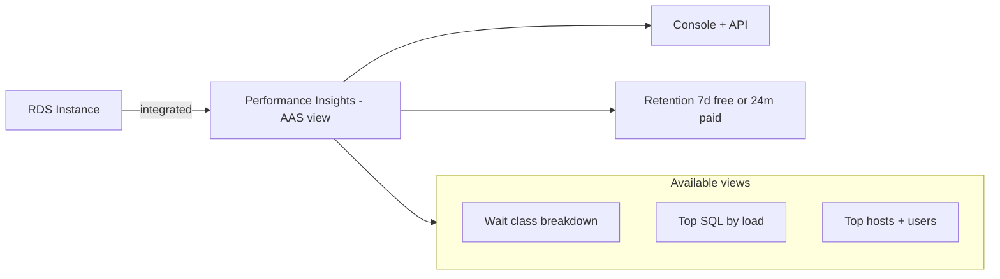

# Observability Architecture

## Signal Sources and Sinks

```mermaid
flowchart LR
    subgraph DB[Database Sources]
        AL[Alert Log XML + text]
        TR[Trace Files - user + bg + incident]
        AWR[(AWR - DBA_HIST_*)]
        ASH[(ASH - V$ACTIVE_SESSION_HISTORY)]
        Audit[(Unified Audit Trail)]
        Metrics[V$SYSMETRIC + V$METRICS]
    end
    subgraph Collection[Collection Layer]
        OEM_Agent[OEM Agent]
        Log_Ship[Filebeat / Fluentd]
        CloudWatch[CloudWatch Agent]
        OCI_Mon[OCI Monitoring]
    end
    subgraph Aggregation[Aggregation]
        OMS[OEM OMS + Repository]
        SIEM[Splunk / ELK / Sentinel]
        CW[CloudWatch Logs + Metrics]
        Prom[Prometheus + Grafana]
    end
    subgraph Consumers[Consumers]
        Dash[Dashboards]
        Alert[Alerting / PagerDuty]
        AV[Audit Vault]
        DBFire[DB Firewall]
    end
    AL --> OEM_Agent
    AL --> Log_Ship
    TR --> Log_Ship
    AWR --> OEM_Agent
    ASH --> OEM_Agent
    Audit --> AV
    Metrics --> OEM_Agent
    Metrics --> CloudWatch
    Metrics --> OCI_Mon
    OEM_Agent --> OMS
    Log_Ship --> SIEM
    CloudWatch --> CW
    OMS --> Dash
    OMS --> Alert
    SIEM --> Alert
    CW --> Alert
    Prom --> Dash
    Prom --> Alert
```

## OEM 13c Deployment

```mermaid
flowchart LR
    subgraph Targets[Managed Targets]
        T1[Prod DBs]
        T2[Test DBs]
        T3[Hosts]
        T4[Weblogic]
        T5[Listener]
    end
    subgraph OMS_Tier[OMS Tier - HA]
        SLB[Server Load Balancer]
        OMS1[OMS Node 1<br/>Weblogic + BI Publisher]
        OMS2[OMS Node 2]
    end
    subgraph Repo[Repository]
        RepoDB[(SYSMAN schema<br/>19c RAC + Data Guard)]
    end
    Targets -->|HTTPS upload 4903| SLB
    SLB --> OMS1
    SLB --> OMS2
    OMS1 <--> RepoDB
    OMS2 <--> RepoDB
    Users[Users] -->|HTTPS 7802| SLB
```

## AWR Lifecycle

```mermaid
sequenceDiagram
    participant MMON
    participant SGA
    participant DBA_HIST as DBA_HIST_* tables

    loop every 60 min
        MMON->>SGA: snapshot V$SYSSTAT + V$SESSTAT + V$SQL etc
        MMON->>DBA_HIST: persist snapshot ID
    end
    Note over DBA_HIST: retention default 8 days
    MMON->>DBA_HIST: purge older than retention
```

## ASH Lifecycle

```mermaid
sequenceDiagram
    participant MMNL
    participant VSession as V$SESSION
    participant Buffer as V$ACTIVE_SESSION_HISTORY (memory ring)
    participant Persist as DBA_HIST_ACTIVE_SESS_HISTORY

    loop every 1 second
        MMNL->>VSession: read active sessions
        MMNL->>Buffer: append 1 row per active session
    end
    loop every AWR snapshot
        MMNL->>Persist: persist 1 in 10 samples
    end
```

## Performance Insights (AWS RDS)

```mermaid
flowchart LR
    RDS[RDS Instance] -->|integrated| PI[Performance Insights - AAS view]
    PI --> UI[Console + API]
    PI --> Retain[Retention 7d free or 24m paid]
    subgraph Views[Available views]
        Wait[Wait class breakdown]
        Top[Top SQL by load]
        Hosts[Top hosts + users]
    end
    PI --> Views
```
