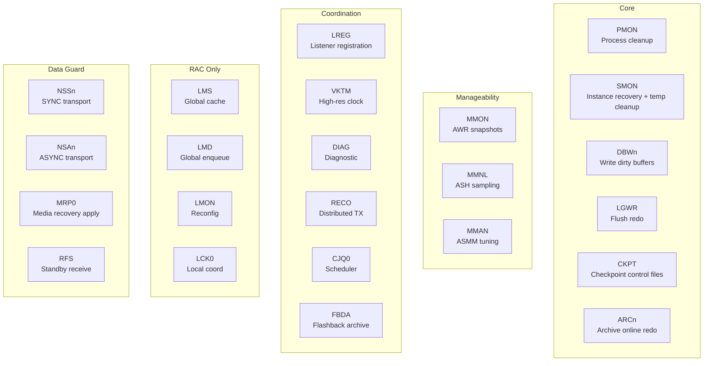
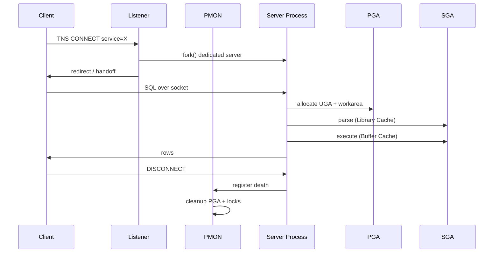
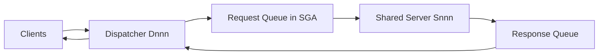

# Process Architecture

## Background Processes

```mermaid
flowchart TB
    subgraph Core[Core]
        PMON[PMON<br/>Process cleanup]
        SMON[SMON<br/>Instance recovery + temp cleanup]
        DBWn[DBWn<br/>Write dirty buffers]
        LGWR[LGWR<br/>Flush redo]
        CKPT[CKPT<br/>Checkpoint control files]
        ARCn[ARCn<br/>Archive online redo]
    end
    subgraph Manageability[Manageability]
        MMON[MMON<br/>AWR snapshots]
        MMNL[MMNL<br/>ASH sampling]
        MMAN[MMAN<br/>ASMM tuning]
    end
    subgraph Coordination[Coordination]
        LREG[LREG<br/>Listener registration]
        VKTM[VKTM<br/>High-res clock]
        DIAG[DIAG<br/>Diagnostic]
        RECO[RECO<br/>Distributed TX]
        CJQ0[CJQ0<br/>Scheduler]
        FBDA[FBDA<br/>Flashback archive]
    end
    subgraph RAC[RAC Only]
        LMS[LMS<br/>Global cache]
        LMD[LMD<br/>Global enqueue]
        LMON[LMON<br/>Reconfig]
        LCK0[LCK0<br/>Local coord]
    end
    subgraph DG[Data Guard]
        NSSn[NSSn<br/>SYNC transport]
        NSAn[NSAn<br/>ASYNC transport]
        MRP0[MRP0<br/>Media recovery apply]
        RFS[RFS<br/>Standby receive]
    end
```

## Foreground / Dedicated Server

```mermaid
sequenceDiagram
    participant C as Client
    participant L as Listener
    participant P as PMON
    participant S as Server Process
    participant PGA as PGA
    participant SGA as SGA

    C->>L: TNS CONNECT service=X
    L->>S: fork() dedicated server
    L->>C: redirect / handoff
    C->>S: SQL over socket
    S->>PGA: allocate UGA + workarea
    S->>SGA: parse (Library Cache)
    S->>SGA: execute (Buffer Cache)
    S->>C: rows
    C->>S: DISCONNECT
    S->>P: register death
    P->>P: cleanup PGA + locks
```

## Foreground / Shared Server

```mermaid
flowchart LR
    Clients[Clients] --> Dnn[Dispatcher Dnnn]
    Dnn --> RQ[Request Queue in SGA]
    RQ --> Snn[Shared Server Snnn]
    Snn --> ReSp[Response Queue]
    ReSp --> Dnn
    Dnn --> Clients
```
