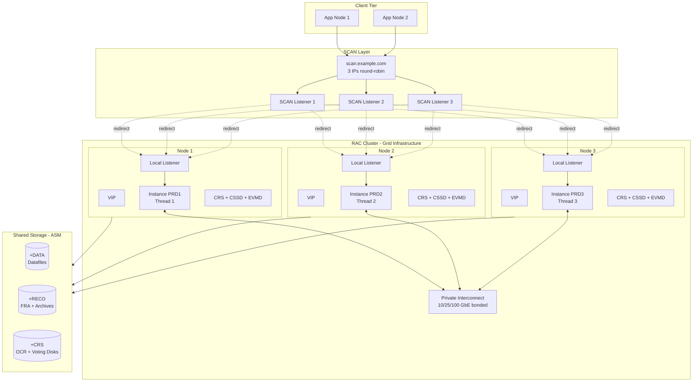
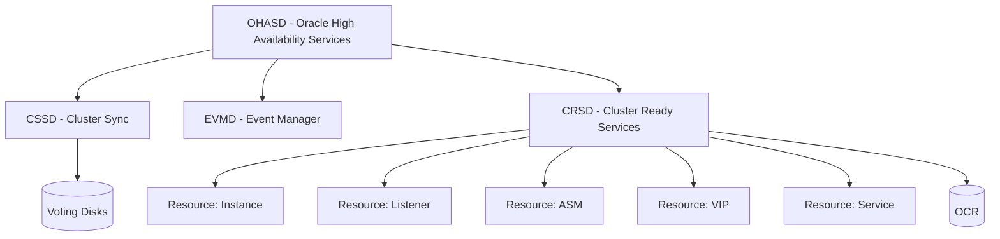
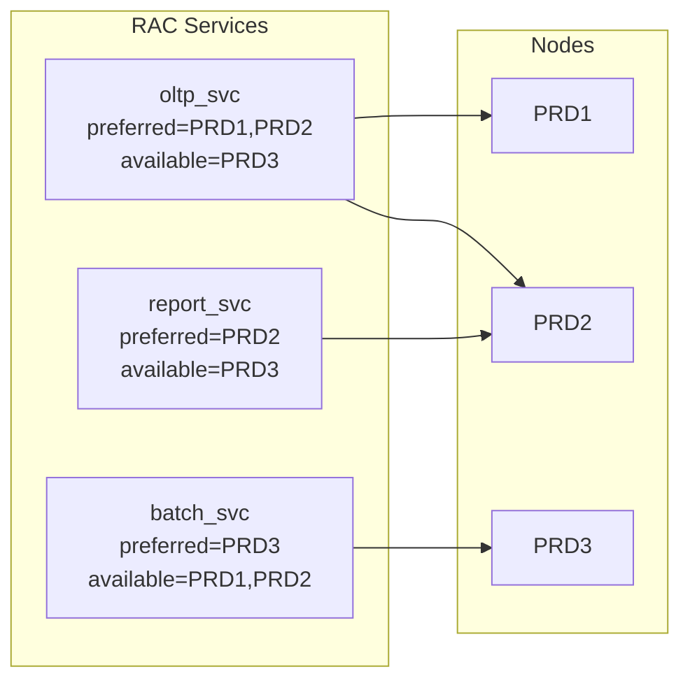

# RAC Architecture

## Reference RAC Topology

```mermaid
flowchart TB
    subgraph Clients[Client Tier]
        App1[App Node 1]
        App2[App Node 2]
    end
    subgraph SCAN[SCAN Layer]
        SCANDNS[scan.example.com<br/>3 IPs round-robin]
        SL1[SCAN Listener 1]
        SL2[SCAN Listener 2]
        SL3[SCAN Listener 3]
    end
    subgraph Cluster[RAC Cluster - Grid Infrastructure]
        subgraph N1[Node 1]
            VIP1[VIP]
            LL1[Local Listener]
            Inst1[Instance PRD1<br/>Thread 1]
            GI1[CRS + CSSD + EVMD]
        end
        subgraph N2[Node 2]
            VIP2[VIP]
            LL2[Local Listener]
            Inst2[Instance PRD2<br/>Thread 2]
            GI2[CRS + CSSD + EVMD]
        end
        subgraph N3[Node 3]
            VIP3[VIP]
            LL3[Local Listener]
            Inst3[Instance PRD3<br/>Thread 3]
            GI3[CRS + CSSD + EVMD]
        end
        IC[Private Interconnect<br/>10/25/100 GbE bonded]
    end
    subgraph ASM[Shared Storage - ASM]
        DATA[(+DATA<br/>Datafiles)]
        RECO[(+RECO<br/>FRA + Archives)]
        CRS[(+CRS<br/>OCR + Voting Disks)]
    end
    App1 --> SCANDNS
    App2 --> SCANDNS
    SCANDNS --> SL1 & SL2 & SL3
    SL1 -.redirect.-> LL1 & LL2 & LL3
    SL2 -.redirect.-> LL1 & LL2 & LL3
    SL3 -.redirect.-> LL1 & LL2 & LL3
    LL1 --> Inst1
    LL2 --> Inst2
    LL3 --> Inst3
    Inst1 <--> IC
    Inst2 <--> IC
    Inst3 <--> IC
    N1 --> ASM
    N2 --> ASM
    N3 --> ASM
```

## Clusterware Daemons Stack

```mermaid
flowchart TB
    OHASD[OHASD - Oracle High Availability Services] --> CSSD[CSSD - Cluster Sync]
    OHASD --> EVMD[EVMD - Event Manager]
    OHASD --> CRSD[CRSD - Cluster Ready Services]
    CRSD --> RES1[Resource: Instance]
    CRSD --> RES2[Resource: Listener]
    CRSD --> RES3[Resource: ASM]
    CRSD --> RES4[Resource: VIP]
    CRSD --> RES5[Resource: Service]
    CSSD --> Voting[(Voting Disks)]
    CRSD --> OCR[(OCR)]
```

## Service Configuration

```mermaid
flowchart LR
    subgraph Services[RAC Services]
        OLTP[oltp_svc<br/>preferred=PRD1,PRD2<br/>available=PRD3]
        BATCH[batch_svc<br/>preferred=PRD3<br/>available=PRD1,PRD2]
        REPORT[report_svc<br/>preferred=PRD2<br/>available=PRD3]
    end
    subgraph Nodes
        Inst1[PRD1]
        Inst2[PRD2]
        Inst3[PRD3]
    end
    OLTP --> Inst1
    OLTP --> Inst2
    BATCH --> Inst3
    REPORT --> Inst2
```
