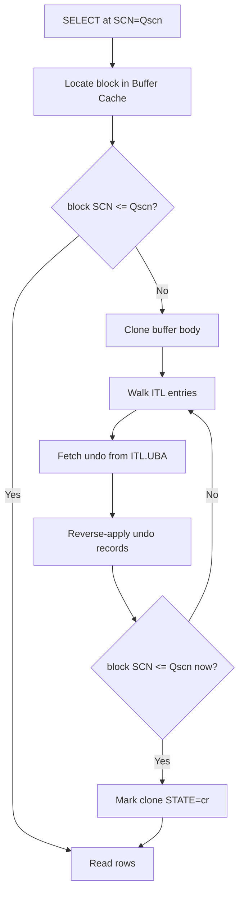
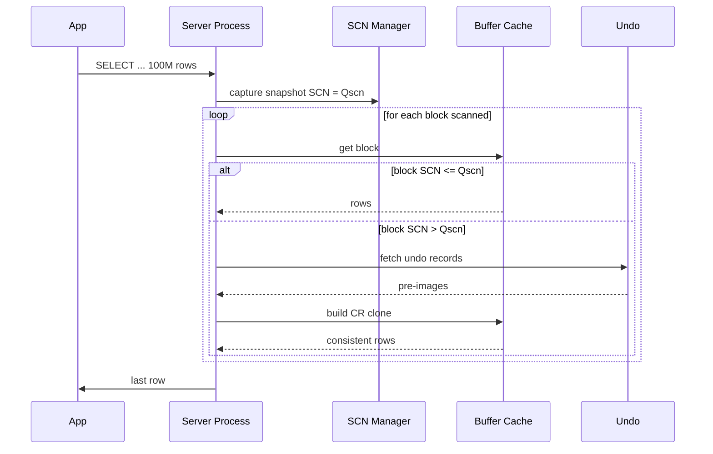
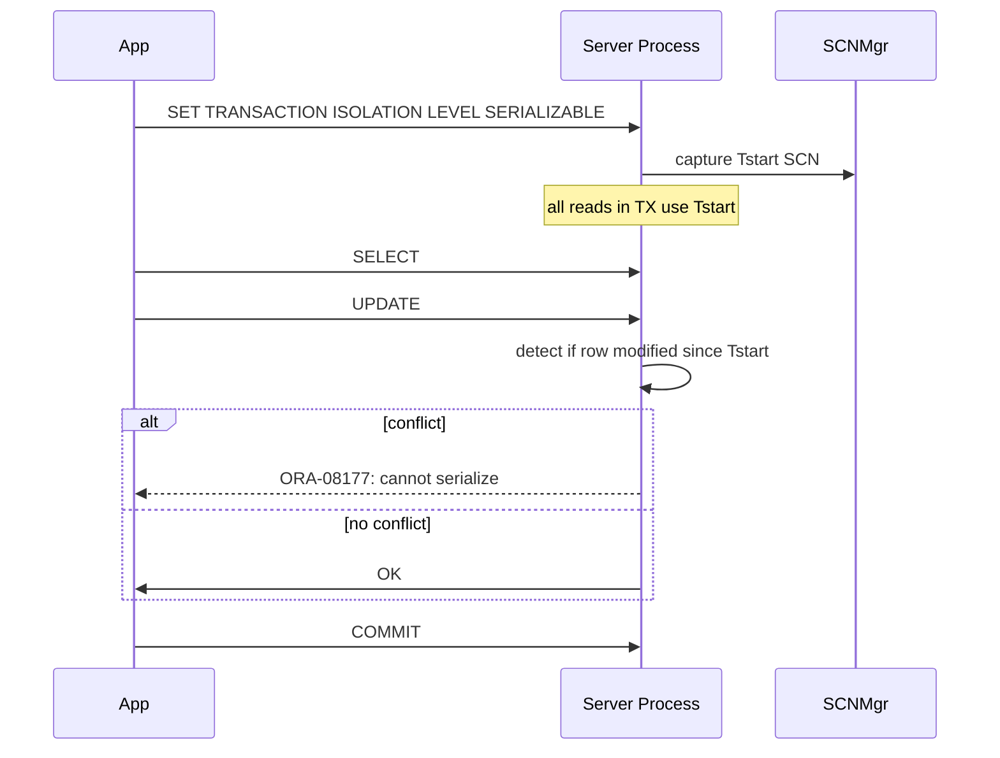

# Read Consistency Flow

## Consistent Read (CR) Block Construction

```mermaid
flowchart TB
    Q[SELECT at SCN=Qscn] --> LB[Locate block in Buffer Cache]
    LB --> CHK{block SCN <= Qscn?}
    CHK -->|Yes| Read[Read rows]
    CHK -->|No| Clone[Clone buffer body]
    Clone --> Walk[Walk ITL entries]
    Walk --> UB[Fetch undo from ITL.UBA]
    UB --> Apply[Reverse-apply undo records]
    Apply --> CHK2{block SCN <= Qscn now?}
    CHK2 -->|No| Walk
    CHK2 -->|Yes| Mark[Mark clone STATE=cr]
    Mark --> Read
```

## Statement-Level Read Consistency

```mermaid
sequenceDiagram
    participant App
    participant S as Server Process
    participant SCNMgr as SCN Manager
    participant BC as Buffer Cache
    participant UND as Undo

    App->>S: SELECT ... 100M rows
    S->>SCNMgr: capture snapshot SCN = Qscn
    loop for each block scanned
        S->>BC: get block
        alt block SCN <= Qscn
            BC-->>S: rows
        else block SCN > Qscn
            S->>UND: fetch undo records
            UND-->>S: pre-images
            S->>BC: build CR clone
            BC-->>S: consistent rows
        end
    end
    S->>App: last row
```

## Serializable Isolation

```mermaid
sequenceDiagram
    participant App
    participant S as Server Process
    participant SCNMgr

    App->>S: SET TRANSACTION ISOLATION LEVEL SERIALIZABLE
    S->>SCNMgr: capture Tstart SCN
    Note over S: all reads in TX use Tstart
    App->>S: SELECT
    App->>S: UPDATE
    S->>S: detect if row modified since Tstart
    alt conflict
        S-->>App: ORA-08177: cannot serialize
    else no conflict
        S->>App: OK
    end
    App->>S: COMMIT
```
