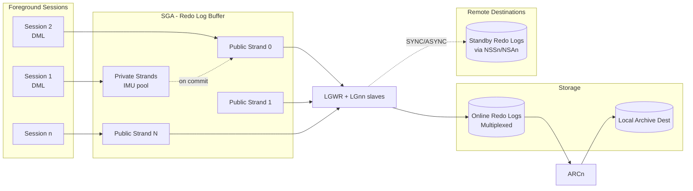
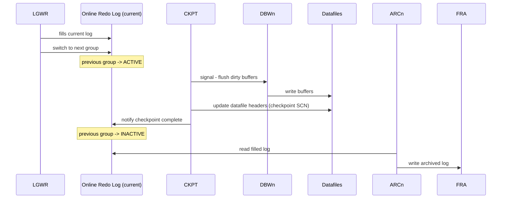
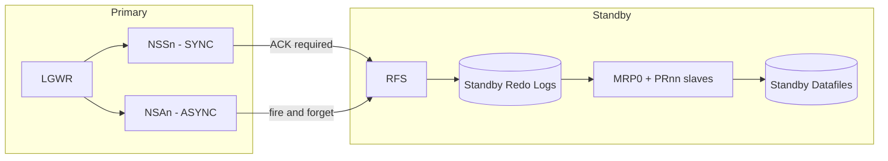

# Redo Flow

## Redo Pipeline End-to-End

```mermaid
flowchart LR
    subgraph FG[Foreground Sessions]
        S1[Session 1<br/>DML]
        S2[Session 2<br/>DML]
        Sn[Session n]
    end
    subgraph SGA[SGA - Redo Log Buffer]
        PS[Private Strands<br/>IMU pool]
        Strand0[Public Strand 0]
        Strand1[Public Strand 1]
        StrandN[Public Strand N]
    end
    LGWR[LGWR + LGnn slaves]
    subgraph Storage[Storage]
        ORL[(Online Redo Logs<br/>Multiplexed)]
        ARC_LOCAL[(Local Archive Dest)]
    end
    subgraph Remote[Remote Destinations]
        STBY[(Standby Redo Logs<br/>via NSSn/NSAn)]
    end
    S1 --> PS
    S2 --> Strand0
    Sn --> StrandN
    PS -.on commit.-> Strand0
    Strand0 --> LGWR
    Strand1 --> LGWR
    StrandN --> LGWR
    LGWR --> ORL
    ORL --> ARCn[ARCn]
    ARCn --> ARC_LOCAL
    LGWR -.SYNC/ASYNC.-> STBY
```

## Log Switch + Checkpoint

```mermaid
sequenceDiagram
    participant LGWR
    participant ORL as Online Redo Log (current)
    participant CKPT
    participant DBWn
    participant DF as Datafiles
    participant ARCn
    participant FRA

    LGWR->>ORL: fills current log
    LGWR->>ORL: switch to next group
    Note over ORL: previous group -> ACTIVE
    CKPT->>DBWn: signal - flush dirty buffers
    DBWn->>DF: write buffers
    CKPT->>DF: update datafile headers (checkpoint SCN)
    CKPT->>ORL: notify checkpoint complete
    Note over ORL: previous group -> INACTIVE
    ARCn->>ORL: read filled log
    ARCn->>FRA: write archived log
```

## Data Guard Redo Transport

```mermaid
flowchart LR
    subgraph Primary
        LGWR_P[LGWR]
        NSS[NSSn - SYNC]
        NSA[NSAn - ASYNC]
    end
    subgraph Standby
        RFS[RFS]
        SRL[(Standby Redo Logs)]
        MRP0[MRP0 + PRnn slaves]
        DF_S[(Standby Datafiles)]
    end
    LGWR_P --> NSS
    LGWR_P --> NSA
    NSS -->|ACK required| RFS
    NSA -->|fire and forget| RFS
    RFS --> SRL
    SRL --> MRP0
    MRP0 --> DF_S
```
