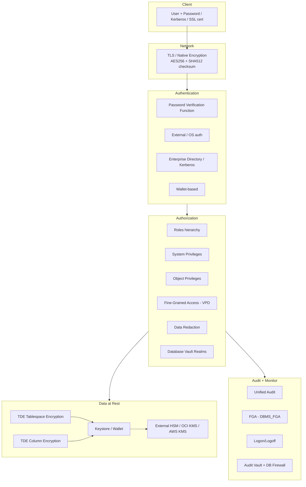
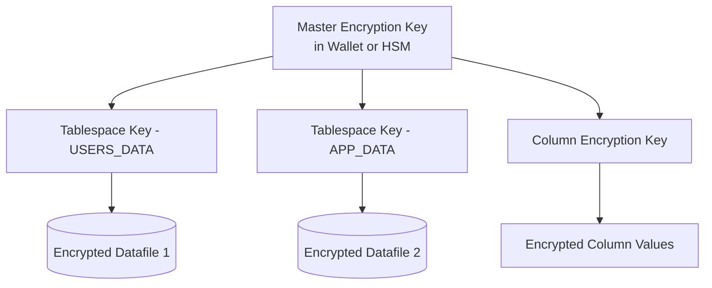
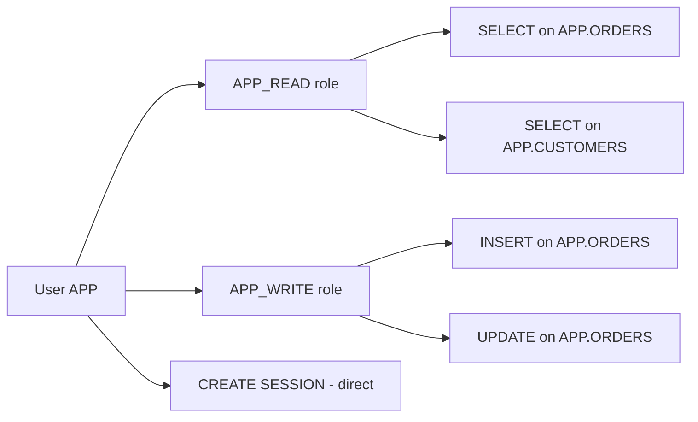
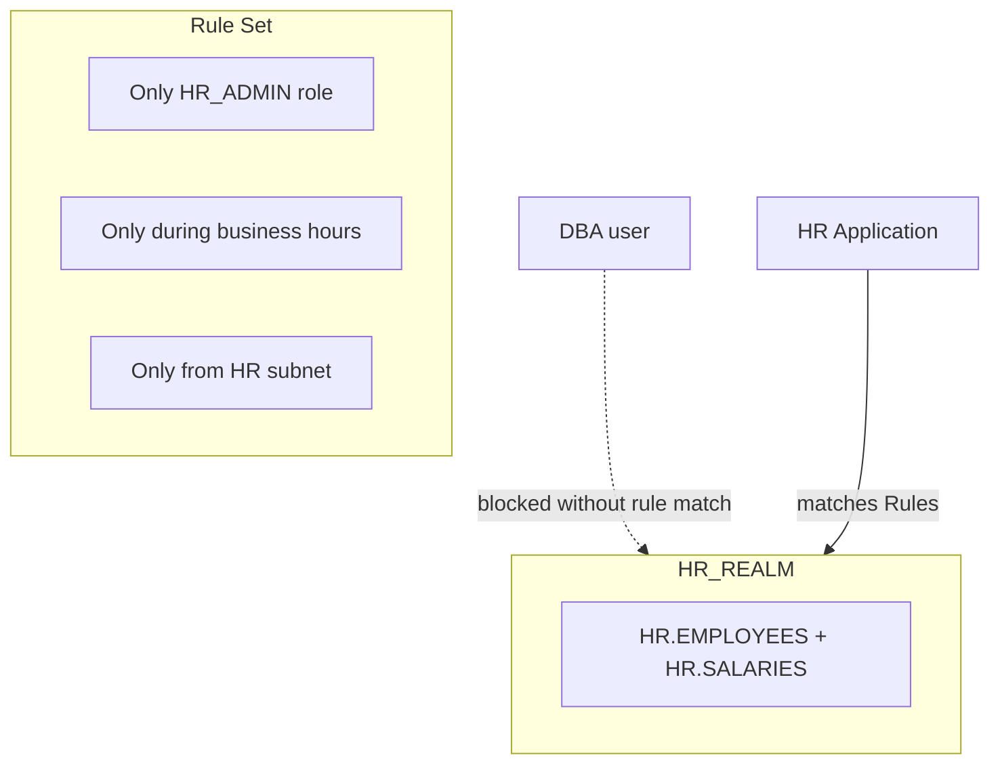

# Security Architecture

## Layered Security Model

```mermaid
flowchart TB
    subgraph Client[Client]
        UserID[User + Password / Kerberos / SSL cert]
    end
    subgraph Wire[Network]
        TLS[TLS / Native Encryption<br/>AES256 + SHA512 checksum]
    end
    subgraph AuthN[Authentication]
        Passwd[Password Verification Function]
        Ext[External / OS auth]
        LDAP[Enterprise Directory / Kerberos]
        Wallet[Wallet-based]
    end
    subgraph AuthZ[Authorization]
        Roles[Roles hierarchy]
        SysPriv[System Privileges]
        ObjPriv[Object Privileges]
        FGA[Fine-Grained Access - VPD]
        Redact[Data Redaction]
        Vault[Database Vault Realms]
    end
    subgraph AtRest[Data at Rest]
        TDE_TS[TDE Tablespace Encryption]
        TDE_Col[TDE Column Encryption]
        WalletTDE[Keystore / Wallet]
        HSM[External HSM / OCI KMS / AWS KMS]
    end
    subgraph Audit[Audit + Monitor]
        UA[Unified Audit]
        FGAudit[FGA - DBMS_FGA]
        LogonAudit[Logon/Logoff]
        AVDF[Audit Vault + DB Firewall]
    end
    UserID --> TLS
    TLS --> AuthN
    AuthN --> AuthZ
    AuthZ --> AtRest
    AuthZ --> Audit
    WalletTDE --> HSM
    TDE_TS --> WalletTDE
    TDE_Col --> WalletTDE
```

## TDE Key Hierarchy

```mermaid
flowchart TB
    Master[Master Encryption Key<br/>in Wallet or HSM]
    TS_Key1[Tablespace Key - USERS_DATA]
    TS_Key2[Tablespace Key - APP_DATA]
    Col_Key[Column Encryption Key]
    Master --> TS_Key1
    Master --> TS_Key2
    Master --> Col_Key
    TS_Key1 --> DF1[(Encrypted Datafile 1)]
    TS_Key2 --> DF2[(Encrypted Datafile 2)]
    Col_Key --> ColData[Encrypted Column Values]
```

## Privilege Model

```mermaid
flowchart LR
    User[User APP] --> Role1[APP_READ role]
    User --> Role2[APP_WRITE role]
    Role1 --> SP1[SELECT on APP.ORDERS]
    Role1 --> SP2[SELECT on APP.CUSTOMERS]
    Role2 --> SP3[INSERT on APP.ORDERS]
    Role2 --> SP4[UPDATE on APP.ORDERS]
    User --> Sys[CREATE SESSION - direct]
```

## Database Vault Realm

```mermaid
flowchart TB
    subgraph Realm[HR_REALM]
        HR_Tables[HR.EMPLOYEES + HR.SALARIES]
    end
    subgraph Rules[Rule Set]
        R1[Only HR_ADMIN role]
        R2[Only during business hours]
        R3[Only from HR subnet]
    end
    DBA[DBA user] -.blocked without rule match.-> Realm
    HR_App[HR Application] -->|matches Rules| Realm
```
