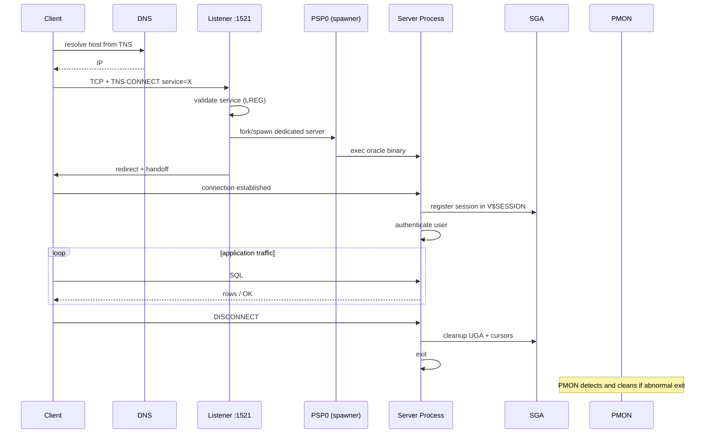
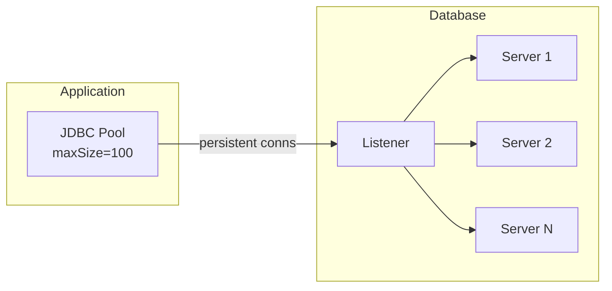
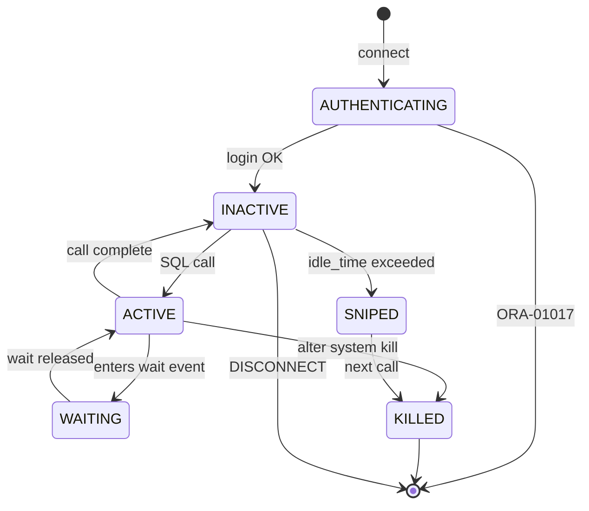

# Session Lifecycle

## Full Session Lifetime

```mermaid
sequenceDiagram
    participant C as Client
    participant DNS
    participant L as Listener :1521
    participant PSP as PSP0 (spawner)
    participant S as Server Process
    participant SGA
    participant P as PMON

    C->>DNS: resolve host from TNS
    DNS-->>C: IP
    C->>L: TCP + TNS CONNECT service=X
    L->>L: validate service (LREG)
    L->>PSP: fork/spawn dedicated server
    PSP->>S: exec oracle binary
    L->>C: redirect + handoff
    C->>S: connection established
    S->>SGA: register session in V$SESSION
    S->>S: authenticate user
    loop application traffic
        C->>S: SQL
        S-->>C: rows / OK
    end
    C->>S: DISCONNECT
    S->>SGA: cleanup UGA + cursors
    S->>S: exit
    Note over P: PMON detects and cleans if abnormal exit
```

## Connection Pool with Multi-Session

```mermaid
flowchart LR
    subgraph App[Application]
        Pool[JDBC Pool<br/>maxSize=100]
    end
    subgraph DB[Database]
        L[Listener]
        S1[Server 1]
        S2[Server 2]
        Sn[Server N]
    end
    Pool -->|persistent conns| L
    L --> S1
    L --> S2
    L --> Sn
```

## Session State Transitions

```mermaid
stateDiagram-v2
    [*] --> AUTHENTICATING: connect
    AUTHENTICATING --> INACTIVE: login OK
    AUTHENTICATING --> [*]: ORA-01017
    INACTIVE --> ACTIVE: SQL call
    ACTIVE --> INACTIVE: call complete
    ACTIVE --> WAITING: enters wait event
    WAITING --> ACTIVE: wait released
    INACTIVE --> SNIPED: idle_time exceeded
    ACTIVE --> KILLED: alter system kill
    SNIPED --> KILLED: next call
    KILLED --> [*]
    INACTIVE --> [*]: DISCONNECT
```
