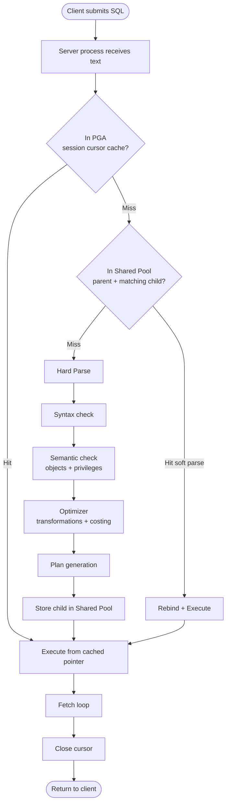
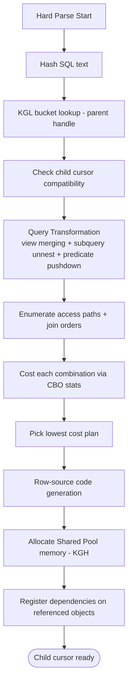
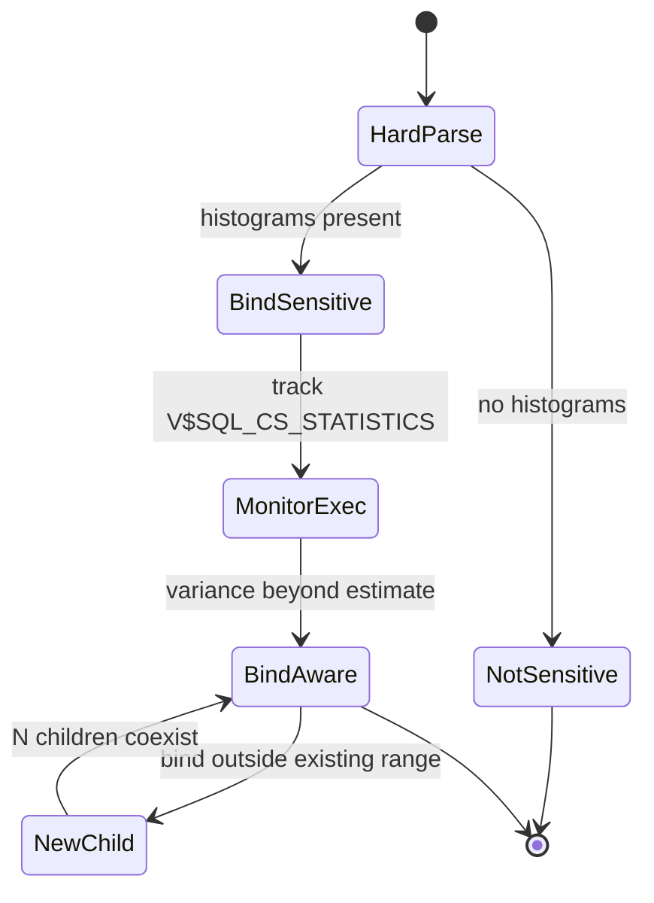

# SQL Execution Flow

## Parse-Execute-Fetch Pipeline

```mermaid
flowchart TB
    Start([Client submits SQL]) --> Recv[Server process receives text]
    Recv --> PGACache{In PGA<br/>session cursor cache?}
    PGACache -->|Hit| Exec[Execute from cached pointer]
    PGACache -->|Miss| SPCache{In Shared Pool<br/>parent + matching child?}
    SPCache -->|Hit soft parse| Rebind[Rebind + Execute]
    SPCache -->|Miss| HardParse[Hard Parse]
    HardParse --> Syntax[Syntax check]
    Syntax --> Semantic[Semantic check<br/>objects + privileges]
    Semantic --> Opt[Optimizer<br/>transformations + costing]
    Opt --> Plan[Plan generation]
    Plan --> Store[Store child in Shared Pool]
    Store --> Exec
    Rebind --> Exec
    Exec --> FetchLoop[Fetch loop]
    FetchLoop --> Close[Close cursor]
    Close --> End([Return to client])
```

## Hard Parse Detail

```mermaid
flowchart TB
    HP[Hard Parse Start] --> HashText[Hash SQL text]
    HashText --> LibLookup[KGL bucket lookup - parent handle]
    LibLookup --> CheckChild[Check child cursor compatibility]
    CheckChild --> Transform[Query Transformation<br/>view merging + subquery unnest + predicate pushdown]
    Transform --> Enum[Enumerate access paths + join orders]
    Enum --> Cost[Cost each combination via CBO stats]
    Cost --> Pick[Pick lowest cost plan]
    Pick --> CodeGen[Row-source code generation]
    CodeGen --> Alloc[Allocate Shared Pool memory - KGH]
    Alloc --> RegDep[Register dependencies on referenced objects]
    RegDep --> Done([Child cursor ready])
```

## Adaptive Cursor Sharing

```mermaid
stateDiagram-v2
    [*] --> HardParse
    HardParse --> BindSensitive: histograms present
    HardParse --> NotSensitive: no histograms
    NotSensitive --> [*]
    BindSensitive --> MonitorExec: track V$SQL_CS_STATISTICS
    MonitorExec --> BindAware: variance beyond estimate
    BindAware --> NewChild: bind outside existing range
    NewChild --> BindAware: N children coexist
    BindAware --> [*]
```
