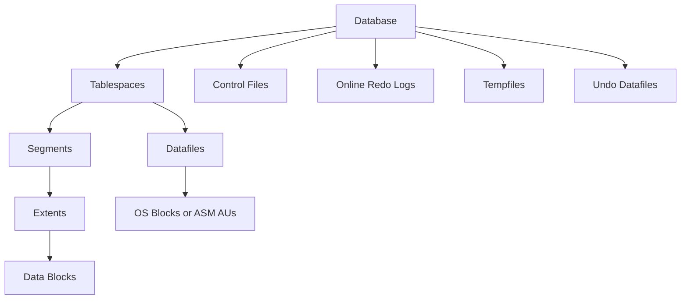
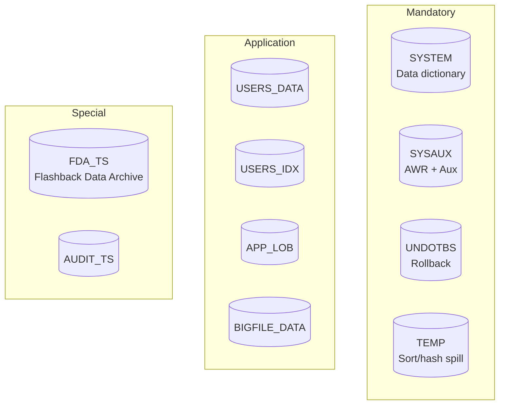
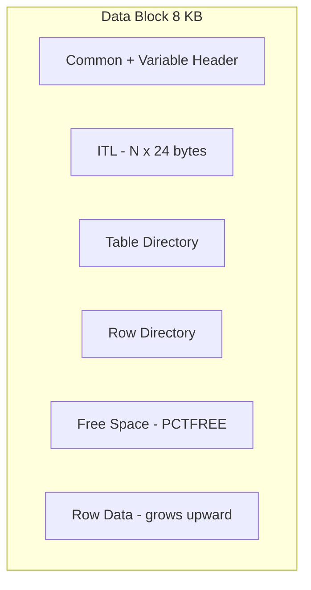
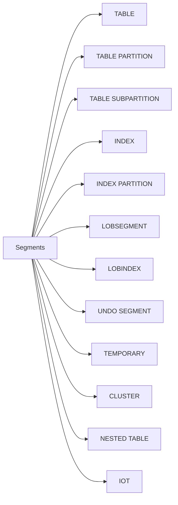

# Storage Architecture

## Logical to Physical

```mermaid
flowchart TB
    DB[Database] --> TS[Tablespaces]
    TS --> SEG[Segments]
    SEG --> EXT[Extents]
    EXT --> BLK[Data Blocks]
    TS --> DF[Datafiles]
    DF --> OS[OS Blocks or ASM AUs]
    DB --> CF[Control Files]
    DB --> RL[Online Redo Logs]
    DB --> TF[Tempfiles]
    DB --> UF[Undo Datafiles]
```

## Tablespace Layout

```mermaid
flowchart TB
    subgraph Mandatory[Mandatory]
        SYSTEM[(SYSTEM<br/>Data dictionary)]
        SYSAUX[(SYSAUX<br/>AWR + Aux)]
        UNDO[(UNDOTBS<br/>Rollback)]
        TEMP[(TEMP<br/>Sort/hash spill)]
    end
    subgraph App[Application]
        USERS[(USERS_DATA)]
        IDX[(USERS_IDX)]
        LOB[(APP_LOB)]
        BIG[(BIGFILE_DATA)]
    end
    subgraph Special[Special]
        FDA[(FDA_TS<br/>Flashback Data Archive)]
        AUD[(AUDIT_TS)]
    end
```

## Block Layout

```mermaid
flowchart TB
    subgraph Block[Data Block 8 KB]
        H[Common + Variable Header]
        ITL[ITL - N x 24 bytes]
        TD[Table Directory]
        RD[Row Directory]
        FS[Free Space - PCTFREE]
        RD2[Row Data - grows upward]
    end
```

## Segment Types

```mermaid
flowchart LR
    S[Segments] --> T[TABLE]
    S --> TP[TABLE PARTITION]
    S --> TSP[TABLE SUBPARTITION]
    S --> I[INDEX]
    S --> IP[INDEX PARTITION]
    S --> LS[LOBSEGMENT]
    S --> LI[LOBINDEX]
    S --> U[UNDO SEGMENT]
    S --> TMP[TEMPORARY]
    S --> C[CLUSTER]
    S --> NT[NESTED TABLE]
    S --> IOT[IOT]
```
