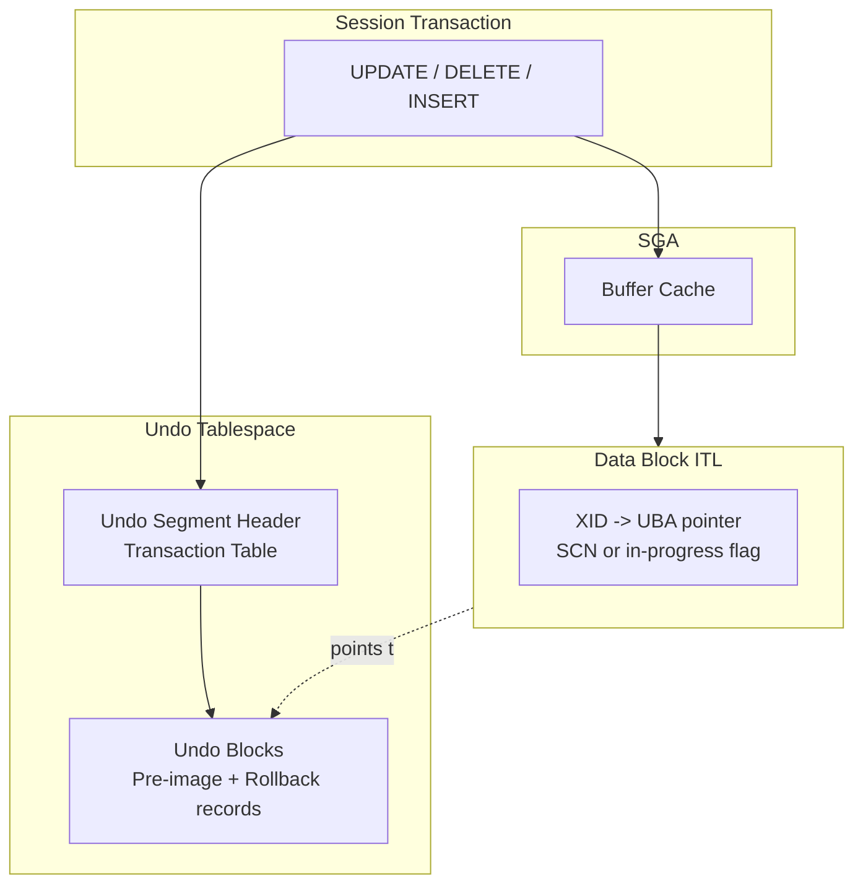
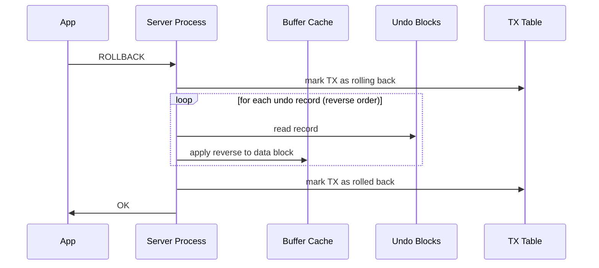
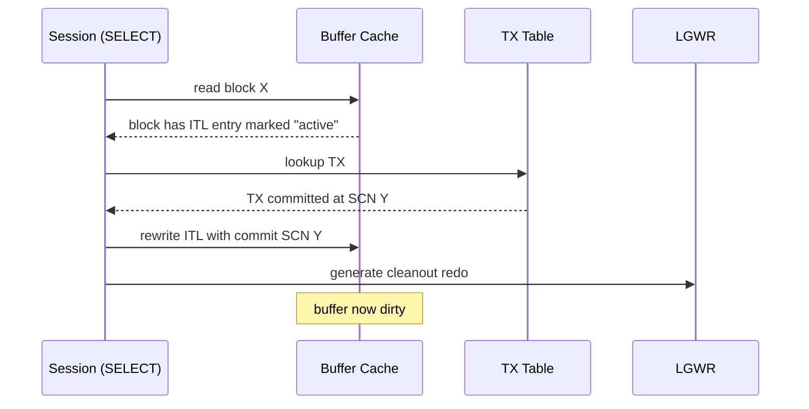

# Undo Flow

## Undo Generation and Consumption

```mermaid
flowchart TB
    subgraph Session[Session Transaction]
        DML[UPDATE / DELETE / INSERT]
    end
    subgraph SGA[SGA]
        BC[Buffer Cache]
    end
    subgraph UNDO[Undo Tablespace]
        UH[Undo Segment Header<br/>Transaction Table]
        UB[Undo Blocks<br/>Pre-image + Rollback records]
    end
    subgraph ITL[Data Block ITL]
        Slot[XID -> UBA pointer<br/>SCN or in-progress flag]
    end
    DML --> BC
    BC --> ITL
    ITL -.points to.-> UB
    DML --> UH
    UH --> UB
```

## Rollback

```mermaid
sequenceDiagram
    participant App
    participant S as Server Process
    participant BC as Buffer Cache
    participant UB as Undo Blocks
    participant TXT as TX Table

    App->>S: ROLLBACK
    S->>TXT: mark TX as rolling back
    loop for each undo record (reverse order)
        S->>UB: read record
        S->>BC: apply reverse to data block
    end
    S->>TXT: mark TX as rolled back
    S->>App: OK
```

## Delayed Block Cleanout

```mermaid
sequenceDiagram
    participant Reader as Session (SELECT)
    participant BC as Buffer Cache
    participant TXT as TX Table
    participant LGWR

    Reader->>BC: read block X
    BC-->>Reader: block has ITL entry marked "active"
    Reader->>TXT: lookup TX
    TXT-->>Reader: TX committed at SCN Y
    Reader->>BC: rewrite ITL with commit SCN Y
    Reader->>LGWR: generate cleanout redo
    Note over BC: buffer now dirty
```
