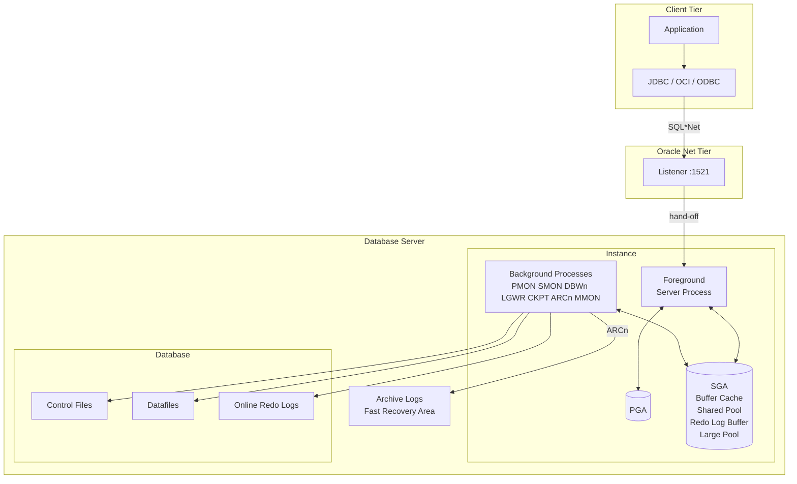

# Architecture Overview

## Overview

Oracle Database is a layered system. Understanding the layers — and where the boundaries between them are — is the difference between fixing a problem in five minutes and paging three teams. This page describes the whole architecture in one diagram and one narrative, then points to the deeper sections for each subsystem.

The layers, from client to disk:

1. **Client** — the application, JDBC driver, or `sqlplus` binary.
2. **Oracle Net** — TCP/1521 transport, with the listener as the acceptor.
3. **Foreground process** — the server process representing your session.
4. **SGA + PGA** — shared and private memory.
5. **Background processes** — PMON, SMON, DBWn, LGWR, CKPT, ARCn, MMON, etc.
6. **Database files** — control files, datafiles, online redo logs.
7. **Archive destination** — where filled online redo logs are copied.

## Architecture



## Internal Working

### 1. Connection

The client resolves a **connect string** (via `tnsnames.ora`, EZCONNECT, LDAP, or JDBC URL) to a host, port, and service name. It opens a TCP connection to the listener. The listener validates the service, then **hands off** the connection to a foreground process (either spawning one — dedicated server — or forwarding to a dispatcher — shared server).

### 2. Session Setup

The foreground process allocates a **PGA** (private memory: cursor state, sort/hash work areas, session variables) and registers itself in the SGA's process table (`V$PROCESS` / `V$SESSION`).

### 3. SQL Execution

1. **Parse** — SQL text is hashed; the shared pool's library cache is searched for an existing cursor. Miss triggers hard parse (syntactic + semantic + optimization).
2. **Bind** — Bind values are attached to the parsed cursor.
3. **Execute** — For a query: identify starting rowids; for DML: latch and modify buffers.
4. **Fetch** — Rows are shipped to the client in array-fetch batches.

Data blocks are pulled from datafiles into the **buffer cache** via `db file sequential read` / `db file scattered read` waits. Modifications generate **change vectors** in the redo log buffer and **undo** in the UNDO tablespace.

### 4. Commit

On `COMMIT`, LGWR **flushes** the redo log buffer to the current online redo log group and waits for the OS to confirm the write (`log file sync` wait event). Only then does the foreground process signal the client. This is the crux of Oracle's durability: **commit = redo persisted**, not "dirty buffers written."

### 5. Background Writes

- **DBWn** writes dirty buffers to datafiles when the buffer cache needs free slots or a checkpoint occurs.
- **CKPT** advances the checkpoint SCN in the control file headers and datafile headers.
- **ARCn** copies filled online redo logs to the archive destination (only in ARCHIVELOG mode).
- **MMON / MMNL** capture AWR snapshots and metrics.
- **PMON** cleans up dead foreground processes and rolls back their transactions.
- **SMON** performs instance recovery on startup and periodic housekeeping.

## Components

Each subsystem has a dedicated section:

- [Memory Architecture](../03-instance-architecture/memory/sga.md)
- [Background Processes](../03-instance-architecture/processes/pmon.md)
- [Foreground Processes](../03-instance-architecture/internals/foreground-processes.md)
- [Control Files](../04-storage/control-files.md)
- [Datafiles](../04-storage/datafiles.md)
- [Redo Logs](../04-storage/redo-logs.md)
- [Archive Logs](../04-storage/archive-logs.md)
- [Listener](../07-networking/listener.md)

## Important Parameters

| Parameter              | Layer        | Purpose                                    |
| ---------------------- | ------------ | ------------------------------------------ |
| `sga_target`           | SGA          | Auto-managed SGA size                      |
| `pga_aggregate_target` | PGA          | Aggregate PGA target                       |
| `db_cache_size`        | Buffer cache | Fixed buffer cache size (if not ASMM)      |
| `shared_pool_size`     | Shared pool  | Fixed shared pool size                     |
| `log_buffer`           | Redo         | Redo log buffer size (fixed at startup)    |
| `db_writer_processes`  | DBWn         | Number of DBWn processes                   |
| `log_archive_dest_n`   | Archive      | Archive destinations                       |
| `processes`            | Server       | Max OS processes (upper bound on sessions) |

## Important Views

| View                       | Purpose                                 |
| -------------------------- | --------------------------------------- |
| `V$INSTANCE`               | Instance identity + status              |
| `V$DATABASE`               | Database identity + log/protection mode |
| `V$SGAINFO`                | SGA subcomponent sizes                  |
| `V$PGASTAT`                | PGA aggregate statistics                |
| `V$SESSION`                | All sessions                            |
| `V$PROCESS`                | All OS processes                        |
| `V$BGPROCESS`              | Background processes and their PIDs     |
| `V$SYSTEM_EVENT`           | Cumulative wait events                  |
| `V$ACTIVE_SESSION_HISTORY` | ASH ring buffer                         |

## Diagnostic Queries

```sql
-- Overall instance health snapshot
SELECT (SELECT instance_name FROM v$instance) AS instance,
       (SELECT status FROM v$instance)       AS status,
       (SELECT open_mode FROM v$database)    AS open_mode,
       (SELECT database_role FROM v$database) AS role,
       (SELECT COUNT(*) FROM v$session WHERE type = 'USER')     AS user_sessions,
       (SELECT COUNT(*) FROM v$session WHERE status = 'ACTIVE') AS active_sessions
FROM   dual;

-- Memory footprint
SELECT name, ROUND(bytes/1024/1024) AS mb, resizeable FROM v$sgainfo;

-- Background processes present
SELECT name, description, paddr
FROM   v$bgprocess
WHERE  paddr <> '00'
ORDER  BY name;

-- Top waits since startup
SELECT event, total_waits, time_waited, average_wait
FROM   v$system_event
WHERE  wait_class <> 'Idle'
ORDER  BY time_waited DESC
FETCH FIRST 10 ROWS ONLY;
```

## Common Issues

- **Cannot connect** — Listener down (`lsnrctl start`), wrong service name, or instance not `OPEN`.
- **Slow parses** — Excessive hard parsing due to unshared SQL (literals instead of binds).
- **`log file sync` waits high** — LGWR slow: check redo I/O latency, log group count and size, CPU pressure.
- **Buffer cache thrashing** — `db file scattered read` heavy; consider larger `db_cache_size` or a caching change (indexing, partition pruning).
- **Wrong service name registered** — Instance registered a different service; check `service_names` parameter and `alter system register`.

## Troubleshooting

Follow the layers top-down:

1. Is the client resolving the connect string correctly? (`tnsping <alias>`)
2. Is the listener accepting? (`lsnrctl status`)
3. Is the instance open? (`SELECT status FROM v$instance;`)
4. Are foreground processes being created? (`ps -ef | grep oracle` on server)
5. Is SQL executing? (`SELECT sql_id, elapsed_time FROM v$sql ORDER BY last_active_time DESC;`)
6. What is the current session waiting on? (`SELECT sid, event, seconds_in_wait FROM v$session WHERE status='ACTIVE';`)

## Best Practices

1. Prefer ASMM (`sga_target > 0`, `memory_target = 0`) for production. AMM (`memory_target`) forces `/dev/shm` on Linux and does not support HugePages.
2. Set `pga_aggregate_limit` (default = 2× `pga_aggregate_target`) as a hard cap.
3. Keep at least 3 online redo log groups per thread (per instance in RAC), each large enough that a log switch happens no more than every 15–20 minutes at peak.
4. Enable HugePages for SGA on Linux; document the required `nr_hugepages` and match `vm.nr_hugepages` to actual SGA size.
5. Enable ARCHIVELOG mode + Flashback for any production database.
6. Register services with `srvctl` (RAC) or `dbms_service` (single instance) — do not rely on `service_names` parameter alone.

## Interview Questions

1. **Q:** Walk me through the lifecycle of a SELECT statement in Oracle.
   **A:** Client → listener → foreground process → parse (library cache lookup) → optimize → execute (buffer cache reads, possibly datafile I/O) → fetch rows in arrays to client.

2. **Q:** What guarantees durability of a committed transaction?
   **A:** LGWR persists the redo log buffer to the online redo log **before** the commit is acknowledged. On crash, SMON replays redo from the last checkpoint SCN.

3. **Q:** Why is the log buffer typically small (default a few MB)?
   **A:** LGWR flushes frequently (every 3 seconds, at commit, at 1 MB threshold, at 1/3 full). A large log buffer just delays the inevitable flush and doesn't help throughput.

4. **Q:** What's the difference between a checkpoint and a log switch?
   **A:** A **checkpoint** advances the SCN up to which all dirty buffers have been written to datafiles — controls instance recovery time. A **log switch** rotates to the next online redo log group. A log switch triggers a checkpoint but they are not the same.

5. **Q:** What does PMON do?
   **A:** Cleans up abnormally-terminated foreground processes, rolls back their transactions, releases resources, and updates the listener via LREG.

6. **Q:** What is the difference between an idle wait and a non-idle wait?
   **A:** Idle waits (`SQL*Net message from client`, `rdbms ipc message`) mean the process has nothing to do. Non-idle waits (`db file sequential read`, `log file sync`) block real work and belong in tuning attention.

## References

- Oracle Database Concepts 19c — Chapters 12, 13, 14, 15
- Cary Millsap, _Optimizing Oracle Performance_ (canonical text on wait interface)
- Jonathan Lewis, _Oracle Core_
- MOS Doc ID 553060.1 — 11gR2/12c/19c Database Architecture Overview
