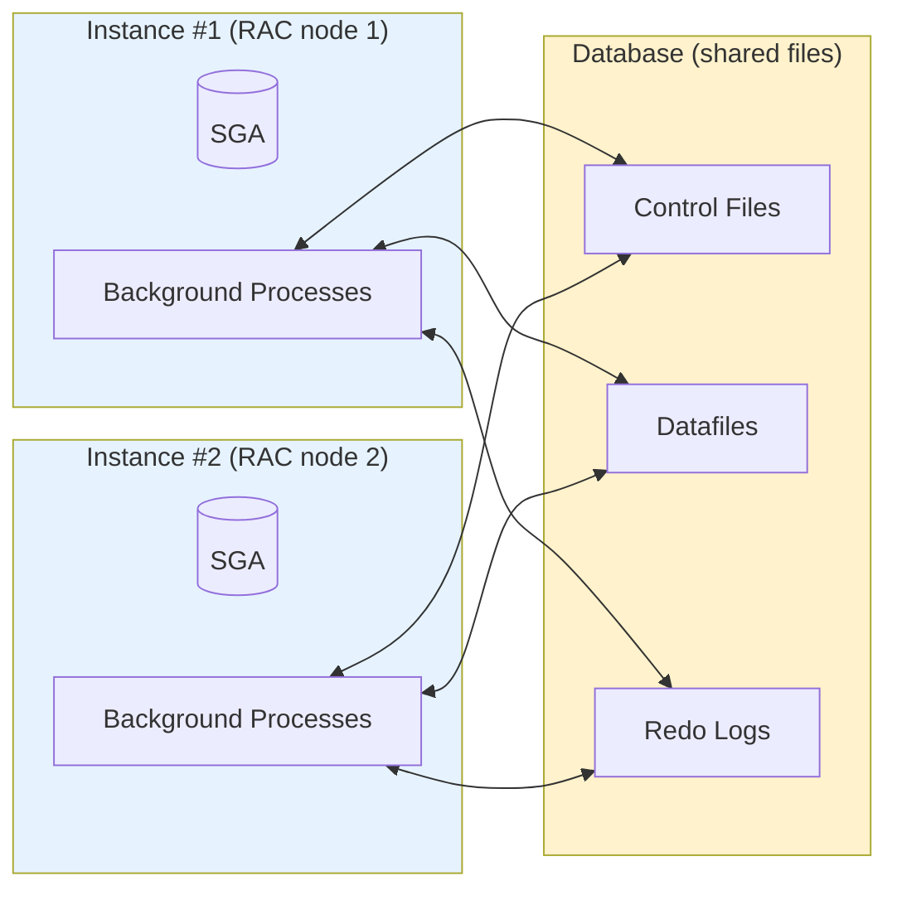

# Database vs Instance

## Overview

This is the single most misunderstood distinction in Oracle. Getting it right unlocks nearly every other topic — RAC, Data Guard, cloning, recovery, and backup all depend on cleanly separating the _files on disk_ from the _memory + processes_ that operate on them.

- A **database** is a set of files on disk: control files, datafiles, and online redo logs. It also _conceptually_ includes the archive logs, backups, and the SPFILE, though those live outside the strict "database" boundary.
- An **instance** is the SGA (shared memory) plus the background and foreground processes that read and write those files. An instance exists only while the database is _started_.

The relationship is many-to-one: **many instances can operate on one database (RAC)**, but a single instance can only operate on one database at a time.

## Architecture



## Internal Working

At startup the instance is _born_ from parameters (`SPFILE` / `PFILE`), _mounts_ the database by reading control files, and _opens_ the database by verifying the datafiles and online redo logs. At shutdown, the reverse: the database is closed, dismounted, and the instance is terminated.

A file-set on disk with no instance attached is just data. It cannot be queried, cannot be backed up online, and cannot be recovered — it must first be mounted or opened by an instance.

Conversely, an instance without a database is only a shared-memory allocation. `STARTUP NOMOUNT` creates an instance but it is idle: you can query `V$INSTANCE` and `V$SGA` but no user data is reachable.

### RAC — Multiple Instances, One Database

In a Real Application Clusters deployment, two or more instances (each on its own server) mount the **same** shared database. Each instance has its own SGA, its own background processes, and its own set of redo threads (each instance writes its own redo stream to its own group of online redo logs). The shared files sit on ASM or on a shared filesystem accessible to all nodes.

### Data Guard — Two Databases, Physical Copy

Data Guard is different: the primary and standby are **separate databases** (separate DBID... no, actually same DBID but distinct `db_unique_name`) with independent copies of the datafiles. Redo is shipped from the primary's LGWR/ARCn to the standby's RFS process and applied by MRP0.

## Components

### Database (on-disk)

- **Control files** — `db_files`, log filenames, log sequence, checkpoint SCN.
- **Datafiles** — user data + SYSTEM/SYSAUX/UNDO tablespaces.
- **Online redo logs** — the change journal.
- **Archive logs** — persisted historical redo (when in ARCHIVELOG mode).
- **Password file** — SYSDBA/SYSOPER remote authentication.
- **SPFILE / PFILE** — instance parameters at startup.

### Instance (in-memory + processes)

- **SGA** — Database Buffer Cache, Shared Pool, Redo Log Buffer, Large Pool, Java Pool, Streams Pool.
- **PGA** — per-process private memory.
- **Background processes** — PMON, SMON, DBWn, LGWR, CKPT, ARCn, MMON, MMNL, RECO, etc.
- **Foreground processes** — one per user session (dedicated server model).

## Important Parameters

| Parameter          | Scope                      | Purpose                                                   |
| ------------------ | -------------------------- | --------------------------------------------------------- |
| `db_name`          | Database (in control file) | Persistent database name                                  |
| `db_unique_name`   | Instance (SPFILE)          | Distinguishes DG copies of the same database              |
| `instance_name`    | Instance (SPFILE)          | Identifier of this instance; usually matches `oracle_sid` |
| `instance_number`  | Instance (RAC)             | 1..n across RAC nodes                                     |
| `thread`           | Instance (RAC)             | Redo thread this instance uses                            |
| `cluster_database` | Instance                   | TRUE for RAC                                              |

## Important Views

| View          | Purpose                                                     |
| ------------- | ----------------------------------------------------------- |
| `V$INSTANCE`  | Current instance identity + status                          |
| `V$DATABASE`  | Database-level attributes (DBID, log mode, protection mode) |
| `GV$INSTANCE` | All RAC instances mounting this database                    |
| `V$THREAD`    | Redo threads (one per instance in RAC)                      |
| `V$DATAFILE`  | Datafiles known to this instance                            |

## Diagnostic Queries

```sql
-- Instance vs database view
SELECT 'INSTANCE' AS scope, instance_name AS name, host_name AS host,
       status, startup_time
FROM   v$instance
UNION ALL
SELECT 'DATABASE', name, NULL, open_mode, created FROM v$database;

-- All instances mounting this database (RAC)
SELECT instance_number, instance_name, host_name, status,
       thread# AS redo_thread
FROM   gv$instance
ORDER  BY instance_number;

-- What is this instance's redo thread?
SELECT thread# AS thread, sequence#, status, enabled
FROM   v$thread;

-- Is the database mounted or open?
SELECT open_mode, database_role, protection_mode FROM v$database;
```

## Common Issues

- **`ORA-01102: cannot mount database in EXCLUSIVE mode`** — Another instance is already mounting this database (or a stale shared-memory segment thinks so). In RAC, ensure the instance is added to the cluster registry with `srvctl add instance`.
- **`ORA-01034: ORACLE not available`** — The instance is not started (or `ORACLE_SID` is wrong).
- **`ORA-01507: database not mounted`** — Instance is at NOMOUNT only.
- **Wrong `ORACLE_SID`** — Points to a non-existent instance; client sees "no such SID."
- **RAC redo thread mismatch** — If `instance_number` and `thread#` don't align, LGWR cannot write redo.

## Troubleshooting

1. `SELECT status FROM v$instance;` — must be `OPEN` for user connections.
2. `SELECT open_mode FROM v$database;` — must be `READ WRITE` for DML (or `READ ONLY WITH APPLY` for ADG).
3. If instance is `STARTED`/`MOUNTED` but not `OPEN`, check alert log for `ORA-01113` / `ORA-01110` (media recovery needed).
4. For RAC: `GV$INSTANCE` shows all instances. `crsctl stat res -t` shows the cluster view.
5. `ps -ef | grep pmon` on the OS lists PMON processes — one per running instance.

## Best Practices

1. Keep `db_name` short (8 chars max, no punctuation). It's baked into the control file forever.
2. Set `db_unique_name` explicitly for every database, especially in Data Guard.
3. Never share `ORACLE_SID` values between logically different databases — even on different hosts.
4. Store the SPFILE inside ASM (or shared storage in RAC) so all instances see the same parameters.
5. Document, for every database in your inventory: `db_name`, `db_unique_name`, `DBID`, `oracle_sid` per instance, `oracle_home`, and `cdb_name` if multitenant.

## Interview Questions

1. **Q:** What is the difference between a database and an instance?
   **A:** A database is the set of files on disk (control files, datafiles, redo logs). An instance is the SGA + processes that operate on those files.

2. **Q:** Can one instance mount two databases?
   **A:** No — one instance mounts exactly one database at a time.

3. **Q:** Can two instances mount one database?
   **A:** Yes — that is Real Application Clusters (RAC). Each instance has its own SGA, background processes, and redo thread.

4. **Q:** What state is the database in after `STARTUP NOMOUNT`?
   **A:** The instance is started (SGA allocated, background processes running), but no control file has been read. Useful for `CREATE DATABASE` and control file restore.

5. **Q:** Which parameter uniquely identifies an instance in RAC?
   **A:** `instance_name` (or `instance_number` for numeric ordering; `thread` selects the redo thread).

6. **Q:** In Data Guard, are primary and standby the _same_ database?
   **A:** They are physical copies with the same DBID but different `db_unique_name`. Logically the same database, physically two.

7. **Q:** If PMON dies, what happens?
   **A:** The instance crashes. SMON then performs instance recovery on next startup.

## References

- Oracle Database Concepts 19c — Chapters 12 (Database Files), 13 (Instance)
- Oracle Real Application Clusters Administration 19c
- Oracle Data Guard Concepts and Administration 19c
- MOS Doc ID 1367435.1 — What is the difference between DB_NAME, INSTANCE_NAME, SERVICE_NAME
