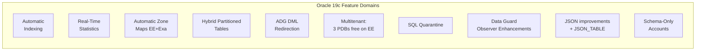

# Oracle 19c Features

## Overview

Oracle 19c is the **long-term support (LTS)** terminal release of the 12.2 code line. It is the version most production Oracle databases run on and the target for the majority of upgrades from 11.2, 12.1, and 12.2. Its feature set is deliberately conservative — 19c is a **stability release**, not an innovation release — but it does include a number of capabilities absent from earlier versions that materially change how you administer, tune, and secure the database.

This page focuses on the 19c-specific features you must know as a DBA. Fundamentals (buffer cache, SCN, redo) are covered in their own sections.

## Architecture



## Internal Working

Rather than a single new subsystem, 19c introduces a series of _automation_ and _hardening_ features. The unifying theme is: **remove human error from routine tuning and DR tasks**.

- **Automatic Indexing** watches the SQL workload, proposes candidate indexes, tests them in the background, and promotes or drops them based on measured benefit.
- **Real-Time Statistics** eliminates a common `dbms_stats.gather_*` scheduling gap by capturing basic column statistics inline with DML.
- **Active Data Guard DML Redirection** silently ships INSERTs / UPDATEs from a read-only standby to the primary, making read-only standby application code simpler.
- **SQL Quarantine** blocks execution of SQL statements that already failed with an `ORA-` error (e.g. hit Resource Manager kill) — preventing repeated resource exhaustion.
- **Schema-Only Accounts** allow schema owners to have no password at all, closing a common attack surface.

## Components

### Automatic Indexing

Applies only to Exadata and Autonomous Database (documented, though). Runs as a scheduler job every 15 minutes.

```sql
-- Enable (documented on Exadata / ADW; runs on EE elsewhere but unsupported)
EXEC dbms_auto_index.configure('AUTO_INDEX_MODE','IMPLEMENT');

-- Report
SELECT dbms_auto_index.report_activity() FROM dual;
```

### Real-Time Statistics

Captures NDV, min, max, and null counts during conventional DML. Not a full replacement for `dbms_stats` but eliminates a large class of stale-stats regressions.

Controlled by `_optimizer_gather_stats_on_conventional_dml` and licensed with EE.

### Active Data Guard DML Redirection

On an ADG standby, incidental DML (a user session that mostly reads but issues an occasional UPDATE) is forwarded to the primary transparently.

```sql
ALTER SESSION ENABLE ADG_REDIRECT_DML;
-- or database-wide
ALTER SYSTEM SET adg_redirect_dml = TRUE;
```

### Hybrid Partitioned Tables

Partitions can be a mix of internal (in-database) and external (Data Pump, ORC, Parquet on OCI Object Storage). Enables ILM tiering to cheap object storage.

```sql
CREATE TABLE sales (
    id NUMBER, sale_date DATE, amount NUMBER
)
EXTERNAL PARTITION ATTRIBUTES (
    TYPE ORACLE_LOADER
    DEFAULT DIRECTORY data_dir
)
PARTITION BY RANGE (sale_date) (
    PARTITION p_hist EXTERNAL LOCATION ('sales_hist.csv'),
    PARTITION p_2024 VALUES LESS THAN (DATE '2025-01-01'),
    PARTITION p_2025 VALUES LESS THAN (DATE '2026-01-01')
);
```

### SQL Quarantine

Once a SQL statement is terminated by Resource Manager or hits an execution error, its plan is quarantined and subsequent executions error out immediately with `ORA-56955: quarantined plan used`.

```sql
SELECT * FROM dba_sql_quarantine;
BEGIN
  dbms_sqlq.drop_quarantine('SQL_QUARANTINE_5XY7...');
END;
/
```

### Multitenant on EE — 3 PDBs Free

Starting 19c, Enterprise Edition includes the right to run up to **3 user-created PDBs** per CDB without the Multitenant Option license. This is a material change: pre-19c, any PDB beyond `PDB$SEED` required Multitenant licensing.

### Schema-Only Accounts

```sql
CREATE USER app_owner NO AUTHENTICATION;
GRANT CREATE SESSION TO app_owner;   -- proxy-only
```

### Data Guard Improvements

- **Simplified Broker CLI** commands.
- **Automatic FSFO Observer** (multiple observers, no manual failover of the observer itself).
- **Real-Time Cascade** for standby cascading without maximum-performance restriction.

## Important Parameters

| Parameter                          | Default                     | Purpose                                                |
| ---------------------------------- | --------------------------- | ------------------------------------------------------ |
| `adg_redirect_dml`                 | FALSE                       | Enable ADG DML redirection on standby                  |
| `heat_map`                         | OFF                         | Track block-level access for ILM                       |
| `enable_automatic_maintenance_pdb` | TRUE                        | Run maintenance windows inside PDBs                    |
| `max_pdbs`                         | 4096 (EE)                   | Cap on PDBs per CDB                                    |
| `wallet_root`                      | none                        | Root path for TDE wallet (replaces sqlnet.ora setting) |
| `tde_configuration`                | KEYSTORE_CONFIGURATION=FILE | TDE keystore type                                      |

## Important Views

| View                                         | Purpose                    |
| -------------------------------------------- | -------------------------- |
| `DBA_AUTO_INDEX_CONFIG`                      | Auto-index configuration   |
| `DBA_AUTO_INDEX_EXECUTIONS`                  | Auto-index run history     |
| `DBA_SQL_QUARANTINE`                         | Quarantined SQL statements |
| `DBA_HYBRID_PART_TABLES`                     | Hybrid partitioned tables  |
| `V$DATAGUARD_STATS`                          | Standby lag statistics     |
| `DBA_USERS` (`authentication_type = 'NONE'`) | Schema-only accounts       |

## Diagnostic Queries

```sql
-- Auto-index activity
SELECT dbms_auto_index.report_last_activity() FROM dual;

-- Any quarantined SQL?
SELECT sql_id, plan_hash_value, name, elapsed_time
FROM   dba_sql_quarantine;

-- Any schema-only accounts?
SELECT username, authentication_type, account_status
FROM   dba_users
WHERE  authentication_type = 'NONE';

-- ADG redirect DML activity
SELECT name, value FROM v$sysstat
WHERE  name LIKE 'ADG%';

-- Confirm 19c version and RU
SELECT banner_full FROM v$version;
SELECT * FROM registry$history ORDER BY action_time DESC;
```

## Common Issues

- **Auto-Index generating too many indexes** — set `AUTO_INDEX_MODE = REPORT ONLY` first; measure benefit.
- **Real-Time Stats confusing baselines** — SPM baselines can flap; consider disabling on volatile columns.
- **ADG redirect DML latency** — every redirected DML is a network round-trip to primary; not a substitute for reader-writer separation.
- **Quarantined SQL blocking legitimate retries** — a killed session's plan quarantine can survive a workload change. Monitor and clear stale quarantines.
- **Hybrid tables + cardinality** — external partitions have no statistics unless collected explicitly.

## Troubleshooting

1. Confirm you are on 19c: `SELECT banner_full FROM v$version;`.
2. Confirm the RU level: `opatch lspatches` and `registry$history`.
3. If a feature "should work" but doesn't, check `v$option` (linked) and `dba_feature_usage_statistics` (previously used).
4. For ADG DML redirect failures, check `v$dataguard_status` and standby alert log.

## Best Practices

1. Stay on the latest 19c RU. New RUs are released quarterly; adopt at least twice yearly.
2. Enable Real-Time Statistics database-wide (default in 19c).
3. Only enable Automatic Indexing after you have a stable AWR baseline.
4. Adopt Schema-Only Accounts for all application schema owners.
5. Migrate from non-CDB to CDB before 21c/23ai — non-CDB is desupported in future releases.
6. Track feature use quarterly for licensing sanity.

## Interview Questions

1. **Q:** What is the significance of 19c being an LTS release?
   **A:** Extended Support runs to April 2027, Market Driven Support to April 2029. It is the recommended target for production databases requiring long support horizons.

2. **Q:** How many free PDBs does 19c EE allow?
   **A:** Three user PDBs per CDB without a Multitenant Option license.

3. **Q:** What does ADG DML Redirection solve?
   **A:** It allows applications connected to a read-only Active Data Guard standby to issue occasional DML that is transparently redirected to the primary.

4. **Q:** How does Real-Time Statistics differ from `dbms_stats`?
   **A:** Real-Time Statistics captures basic column stats _inline with DML_; `dbms_stats` runs as a batch. They are complementary — real-time stats are a stopgap between full stats collections.

5. **Q:** What is SQL Quarantine?
   **A:** A 19c mechanism that blocks re-execution of a plan for a SQL statement that previously failed with an error such as a Resource Manager kill.

6. **Q:** How do you enable a schema-only account?
   **A:** `CREATE USER x NO AUTHENTICATION;` or `ALTER USER x NO AUTHENTICATION;`.

## References

- Oracle Database New Features Guide 19c
- MOS Doc ID 2521164.1 — Oracle Database 19c Important Recommended One-off Patches
- MOS Doc ID 555.1 — Latest Release Update
- Oracle Database Concepts 19c — Feature Overview
- Oracle Database Reference 19c — DBA*AUTO_INDEX*\*, DBA_SQL_QUARANTINE views
