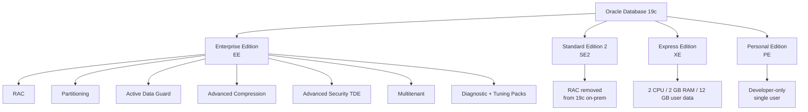

# Oracle Editions

## Overview

Oracle Database ships in multiple **editions** — same core code, different feature sets and license terms. Picking the wrong edition is one of the most expensive mistakes in a database procurement cycle: features unavailable in your edition don't just silently disable, they can trigger multi-million-dollar license audits when used inadvertently. This page describes the four editions that exist for Oracle Database 19c, the feature matrix that matters at 3 AM, and how to detect the edition your instance is running.

## Architecture



## Internal Working

Editions are **not separate binaries** — they are the _same_ installer/binary set with a flag written into the inventory. What differs is which options are:

1. **Linked in** — controlled at install time by `chopt` or the installer response file.
2. **Licensable** — controlled by contract. Using a licensable option is a paperwork violation, not a technical block.
3. **Available at all** — some features are physically absent from SE2/XE binaries.

Oracle enforces this weakly: many EE-only features run fine on SE2 if invoked. Audit compliance is the DBA's responsibility. Use `dbms_feature_usage_report` to detect inadvertent EE-feature usage.

## Components

### Enterprise Edition (EE)

The flagship. All features available. All _options_ (RAC, Partitioning, Advanced Compression, TDE, Multitenant, Advanced Analytics, etc.) are separately licensable. Diagnostic Pack and Tuning Pack are almost universally licensed with EE and are prerequisites for AWR, ASH, ADDM, SQL Tuning Advisor, and SQL Access Advisor.

### Standard Edition 2 (SE2)

Mid-market. Ships with:

- Up to 2 CPU sockets (single server) or 2 sockets across cluster (RAC removed in 19c on-prem, deprecated).
- Automatic memory management, basic partitioning **not included**, basic compression only, no TDE, no OLAP, no Advanced Analytics.
- Data Guard **not included** (SE2 only has manual standby via scripting).
- **Note:** In 19c on-premises, RAC was removed from SE2. Standard Edition High Availability (SEHA) — a cold-failover cluster — is the replacement.

### Express Edition (XE)

Free-to-use. Hard-coded resource caps:

- 2 CPU threads
- 2 GB RAM (SGA + PGA combined)
- 12 GB user data
- 3 PDBs + CDB root (Multitenant enabled by default)
- No support, no patches (community only)

XE is a legitimate choice for training, demos, and small internal tools. Never for production customer data.

### Personal Edition (PE)

Full EE feature set for a **single user** on **desktop OS only**. Licensed per named user. Rarely used outside developer workstations that need EE-parity for testing.

## Important Parameters

| Parameter                      | Edition Impact                                     |
| ------------------------------ | -------------------------------------------------- |
| `cpu_count`                    | XE enforces max 2 threads regardless of hardware   |
| `memory_target` / `sga_target` | XE caps combined at 2 GB; SE2 no explicit cap      |
| `max_pdbs`                     | XE=3; SE2/EE=4096 (Multitenant licensing separate) |
| `enable_ddl_logging`           | Available in all editions                          |

## Important Views

| View                             | Purpose                                             |
| -------------------------------- | --------------------------------------------------- |
| `V$VERSION`                      | Shows base version but not edition on 19c           |
| `V$INSTANCE`                     | `edition` column reveals `XE`, `SE`, `EE`, `PE`     |
| `V$OPTION`                       | Which options are physically linked in              |
| `DBA_FEATURE_USAGE_STATISTICS`   | Which features have been exercised (audit-critical) |
| `DBA_HIGH_WATER_MARK_STATISTICS` | Peak resource use (helps size-up decisions)         |

## Diagnostic Queries

```sql
-- Detect edition (works on 19c)
SELECT edition FROM v$instance;

-- Alternative: version banner reveals edition prior to 19c
SELECT banner_full FROM v$version;

-- Which options are linked in?
SELECT parameter, value
FROM   v$option
WHERE  value = 'TRUE'
ORDER  BY parameter;

-- Which features has this database actually used?
-- Critical for license audits.
SELECT name, detected_usages, first_usage_date, last_usage_date, currently_used
FROM   dba_feature_usage_statistics
WHERE  detected_usages > 0
ORDER  BY last_usage_date DESC;

-- Generate an official feature-usage report
SET LONG 10000000
SELECT dbms_feature_usage_report.display_text FROM dual;
```

## Common Issues

- **Using Partitioning on SE2** — SE2 does not include Partitioning. Creating a partitioned table raises `ORA-00439: feature not enabled: Partitioning`.
- **Using AWR without Diagnostic Pack** — Legal only with a Diagnostic Pack license on EE. On SE2 there is no AWR.
- **Inadvertent Advanced Compression** — `COMPRESS FOR OLTP` requires Advanced Compression Option. Basic table compression on direct-path load is included in EE.
- **XE hitting caps** — Silent throttling, not errors; symptoms are latch contention and PGA memory failures.

## Troubleshooting

1. Check `v$instance.edition` first.
2. Cross-check `v$option` to see what is _linked_.
3. Run `dbms_feature_usage_report` to see what has been _used_.
4. Match against your contract's edition + options.
5. For SE2 environments, verify that any tuning tools (AWR, ADDM, SQL Tuning Advisor) are **not** invoked — they are EE + Diagnostic/Tuning Pack.

## Best Practices

1. Store the edition and licensed options in your CMDB alongside every database.
2. Run `dbms_feature_usage_report` quarterly. Retain evidence for audit defense.
3. Disable options you have not licensed using `chopt disable` where possible (RAC, OLAP, Partitioning, DM_AM — Data Mining/Advanced Analytics).
4. Prefer SE2 → EE upgrades over EE → SE2 downgrades; downgrades usually require export/import.
5. For net-new development, evaluate 19c EE + Multitenant vs Autonomous Database vs PostgreSQL early — edition choice cascades into everything else.

## Interview Questions

1. **Q:** What are the four editions of Oracle 19c?
   **A:** Enterprise (EE), Standard Edition 2 (SE2), Express (XE), Personal (PE).

2. **Q:** Is RAC available in SE2 on 19c?
   **A:** No — RAC was removed from SE2 in 19c on-premises. The replacement is Standard Edition High Availability (SEHA), a cold failover cluster.

3. **Q:** Can I run AWR on Standard Edition 2?
   **A:** No. AWR requires the Diagnostic Pack, which requires Enterprise Edition.

4. **Q:** How do you detect the edition programmatically?
   **A:** `SELECT edition FROM v$instance;` on 19c. Prior versions look at the version banner.

5. **Q:** A developer used `ALTER TABLE ... COMPRESS FOR OLTP` in production. What is the risk?
   **A:** `COMPRESS FOR OLTP` (renamed `ROW STORE COMPRESS ADVANCED`) requires the Advanced Compression Option. Its usage will be captured in `DBA_FEATURE_USAGE_STATISTICS` and can trigger a license claim during an audit.

6. **Q:** What are the XE 21c/19c hard limits?
   **A:** 2 CPU threads, 2 GB RAM, 12 GB user data, up to 3 PDBs.

## References

- Oracle Database Licensing Information User Manual 19c
- MOS Doc ID 2246460.1 — Oracle Database Standard Edition 2 (SE2) Explained
- MOS Doc ID 1309070.1 — Features Available for Oracle Database Editions
- Oracle Database Express Edition Installation Guide 19c/21c
- MOS Doc ID 1317265.1 — DBMS_FEATURE_USAGE_STATISTICS
