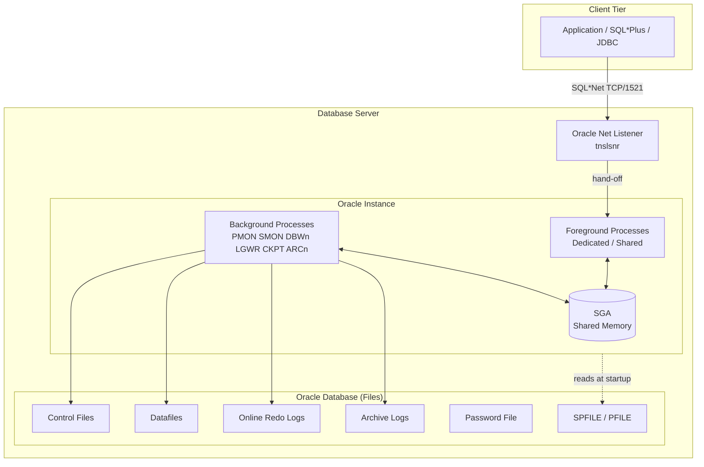

# Oracle Database — Overview

## Overview

Oracle Database is a multi-model, ACID-compliant, transactional relational database management system developed by Oracle Corporation. First released in 1979 (Oracle v2 — there was no v1 shipped to customers), it is one of the oldest continuously developed commercial RDBMSs and remains the market share leader for mission-critical OLTP workloads in banking, telecom, retail, and government.

Oracle Database 19c is the **long-term release (LTS)** of the 12.2 code line and is the target platform for the majority of enterprise Oracle deployments. Extended support runs through **April 2027** and Market Driven Support through **April 2029**. Every page in this encyclopedia assumes 19c unless explicitly noted.

Oracle Database is a _database engine_, not a full data platform: it ships as a set of binaries (`$ORACLE_HOME`) that manage a set of files (control files, datafiles, redo logs) via a set of processes (the _instance_). Everything else — RAC, Data Guard, ASM, Multitenant, RMAN, GoldenGate — is either an option layered on top or a companion product.

## Architecture



## Internal Working

An Oracle **database** is a set of files on disk. An Oracle **instance** is the RAM (SGA) + processes that operate on those files. A database can be mounted by one instance (single instance), by many instances simultaneously (RAC), or by no instance (shut down). A file-set that no instance has mounted is inert data.

At the highest level, a client SQL statement flows through:

1. **Client connect** — TCP to listener on port 1521 (typically).
2. **Listener hand-off** — Listener spawns/routes to a foreground (server) process.
3. **Parse** — Foreground process parses SQL against the library cache in the shared pool.
4. **Execute / Fetch** — Data blocks are read from datafiles into the buffer cache; changes are written to the redo log buffer.
5. **Commit** — LGWR flushes redo to disk; foreground signals client.
6. **Background writes** — DBWn writes dirty buffers to datafiles asynchronously; CKPT advances checkpoints; ARCn archives full online redo logs.

## Components

| Layer    | Component             | Role                                                                   |
| -------- | --------------------- | ---------------------------------------------------------------------- |
| Client   | Oracle Net (SQL\*Net) | TCP-based wire protocol                                                |
| Network  | Listener (`tnslsnr`)  | Accepts connections and hands off to servers                           |
| Instance | SGA                   | Shared memory: buffer cache, shared pool, log buffer, large pool       |
| Instance | PGA                   | Per-process private memory: sort/hash work areas                       |
| Instance | Background processes  | PMON, SMON, DBWn, LGWR, CKPT, ARCn, MMON, MMNL, RECO, LREG, VKTM, DIAG |
| Instance | Foreground processes  | One per session (dedicated) or shared (shared server)                  |
| Database | Control file          | Tiny binary map of the database                                        |
| Database | Datafiles             | Persistent user + system data                                          |
| Database | Online redo logs      | Change vector journal                                                  |
| Database | Archive logs          | Persisted historical redo                                              |
| Database | UNDO tablespace       | Rollback + read-consistency                                            |
| Database | TEMP tablespace       | Sort/hash spill                                                        |

## Important Parameters

| Parameter              | Default         | Purpose                                                    |
| ---------------------- | --------------- | ---------------------------------------------------------- |
| `db_name`              | none (required) | Persistent database name embedded in control file          |
| `db_unique_name`       | `db_name`       | Unique identifier — different per Data Guard site          |
| `compatible`           | 19.0.0          | Feature version floor; irreversible upgrade knob           |
| `sga_target`           | 0               | Enables ASMM (auto-managed SGA components)                 |
| `memory_target`        | 0               | Enables AMM (auto-managed SGA + PGA) — deprecated for prod |
| `pga_aggregate_target` | derived         | PGA sizing target                                          |
| `processes`            | 300             | Max concurrent OS processes                                |
| `sessions`             | derived         | Max concurrent user sessions                               |
| `open_cursors`         | 300             | Per-session cursor limit                                   |

## Important Views

| View           | Purpose                                               |
| -------------- | ----------------------------------------------------- |
| `V$INSTANCE`   | Instance name, host, startup time, status             |
| `V$DATABASE`   | Database name, DBID, log mode, protection mode        |
| `V$VERSION`    | Component versions                                    |
| `V$PARAMETER`  | Runtime parameter values                              |
| `V$OPTION`     | Which options (RAC, Partitioning, etc.) are linked in |
| `V$SGAINFO`    | SGA components and sizes                              |
| `V$PGASTAT`    | PGA aggregate statistics                              |
| `DBA_REGISTRY` | Installed components (JVM, APEX, XDB, ...)            |

## Diagnostic Queries

```sql
-- Confirm version and edition
SELECT banner_full FROM v$version;

SELECT dbid, name, db_unique_name, log_mode, open_mode,
       database_role, protection_mode, force_logging, flashback_on
FROM   v$database;

-- Instance identity and uptime
SELECT instance_name, host_name, version, startup_time,
       status, database_status, instance_role, active_state
FROM   v$instance;

-- Which options are linked into the binary?
SELECT parameter, value FROM v$option ORDER BY parameter;

-- Installed components
SELECT comp_id, comp_name, version, status FROM dba_registry;
```

## Common Issues

- **"Which release am I on?"** — Confusing base + RU. `v$version` shows base (19.0.0.0.0). Use `SELECT * FROM registry$history` and `opatch lspatches` for the applied RU.
- **Wrong `compatible`** — Once raised, `compatible` cannot be lowered without restoring from backup.
- **License audit surprises** — Any option enabled in `v$option` that shows `TRUE` may be licensable. Use `dbms_feature_usage_internal` reports.
- **`db_unique_name` mismatch** — Data Guard breaks if `db_unique_name` collides across sites.

## Troubleshooting

1. Cannot connect: verify listener up (`lsnrctl status`), listener registration (`SERVICES`), `tnsping`, and instance status (`v$instance.status = 'OPEN'`).
2. Database mounted but not open: check alert log for `ORA-01113` (media recovery needed) or `ORA-00600`.
3. Wrong version reported: check `$ORACLE_HOME/inventory` and `opatch lsinventory`.
4. Feature not working: confirm via `v$option`, `dba_feature_usage_statistics`, and `dbms_feature_usage_report`.

## Best Practices

1. Standardize `db_name` and `db_unique_name` conventions across DEV / TEST / PROD.
2. Keep `compatible` explicit in the SPFILE — never let it default silently.
3. Run `dbms_feature_usage_internal.exec_db_usage_sampling` monthly; review `DBA_FEATURE_USAGE_STATISTICS` to catch inadvertent option use.
4. Bind `oracle_home`, `oracle_sid`, `path`, `ld_library_path` in a well-known env file (`/etc/oratab` + `oraenv`).
5. Enable `force_logging` when in Data Guard or if using nologging batch loads that should be recoverable.

## Interview Questions

1. **Q:** What is the difference between an Oracle database and an Oracle instance?
   **A:** The _database_ is the persistent set of files (control files, datafiles, redo logs). The _instance_ is the SGA + background processes that operate on them at runtime.

2. **Q:** Is Oracle 19c the same as Oracle 12.2?
   **A:** Yes and no. Internally 19c is the terminal patchset of the 12.2 code line (previously 12.2.0.3), but it is marketed as its own LTS release.

3. **Q:** What are the LTS and innovation release types?
   **A:** LTS releases (e.g. 19c, 23ai) get long-term Extended Support. Innovation releases (e.g. 20c, 21c) have short (~2 year) support windows and are meant for early adopters.

4. **Q:** How do you check applied RU and one-off patches?
   **A:** `$ORACLE_HOME/OPatch/opatch lsinventory -detail` and `SELECT * FROM registry$history;` inside SQL\*Plus.

5. **Q:** What does the `compatible` parameter do?
   **A:** It sets the minimum feature version the database can run. Raising it enables features but cannot be reversed without a restore.

6. **Q:** How can you tell whether Partitioning or RAC options are actually used?
   **A:** `V$OPTION` shows what's linked; `DBA_FEATURE_USAGE_STATISTICS` shows what has actually been exercised.

## References

- Oracle Database Concepts 19c — Chapter 13, "Oracle Database Instance"
- MOS Doc ID 742060.1 — Release Schedule of Current Database Releases
- MOS Doc ID 2521164.1 — Oracle Database 19c Important Recommended One-off Patches
- Oracle Database Licensing Information User Manual 19c
