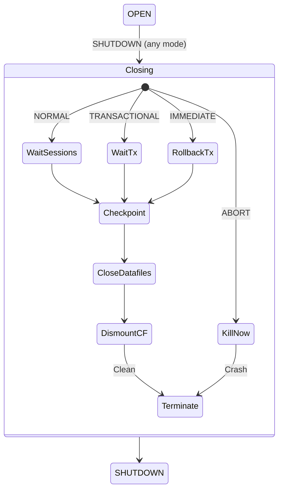

# Shutdown Process

## Overview

Oracle offers four shutdown modes: **NORMAL**, **TRANSACTIONAL**, **IMMEDIATE**, and **ABORT**. They differ in how they treat in-progress transactions and how much work SMON must do on the next startup. Picking the right mode matters — an `ABORT` in a busy OLTP database can cost minutes of downtime as SMON replays redo and rolls back transactions.

Rule of thumb:

| Mode          | Waits for                                   | Rollback on next startup? | Typical use                    |
| ------------- | ------------------------------------------- | :-----------------------: | ------------------------------ |
| NORMAL        | All sessions to disconnect voluntarily      |            No             | Almost never in production     |
| TRANSACTIONAL | Current transactions to commit or roll back |            No             | Draining a database gracefully |
| IMMEDIATE     | Nothing — rolls back live transactions      |            No             | Standard planned shutdown      |
| ABORT         | Nothing — kills instance                    | **Yes** (crash recovery)  | Emergency only                 |

## Architecture



## Internal Working

### SHUTDOWN NORMAL (default)

`SHUTDOWN` with no argument means NORMAL. The database:

1. Prevents new connections.
2. Waits for all existing sessions to disconnect **voluntarily** (`SQL*Net message from client` idle waits get ignored, but a session sitting in a transaction or busy will block shutdown indefinitely).
3. Once all sessions gone: performs a checkpoint, closes datafiles, dismounts control files, terminates the instance.

Because it waits forever for user sessions, NORMAL is almost never usable in production. Use TRANSACTIONAL or IMMEDIATE.

### SHUTDOWN TRANSACTIONAL

1. Prevents new connections.
2. Prevents new transactions (existing sessions can complete current transactions).
3. When a session commits or rolls back, its connection is dropped.
4. Once all sessions gone: checkpoint + close + dismount + terminate.

The maximum time to wait for transactions to complete can be bounded per session by `local` option.

### SHUTDOWN IMMEDIATE

The standard planned-shutdown mode:

1. Prevents new connections.
2. **Rolls back** all active transactions.
3. Disconnects all sessions.
4. Performs a checkpoint (final full checkpoint — all dirty buffers to disk).
5. Closes datafiles, dismounts control files, terminates instance.

On restart, no crash recovery is needed. This is the safe "planned outage" mode.

### SHUTDOWN ABORT

Last resort:

1. Terminates the instance immediately — no checkpoint, no rollback, no clean file close.
2. Sessions are killed at the OS level.
3. On next STARTUP, SMON performs **instance recovery**: rolls forward from the last checkpoint SCN using online redo, then rolls back uncommitted transactions using undo.

`ABORT` is safe (no data loss for committed transactions — Oracle's durability guarantee holds via redo), but the next startup is longer.

### Multitenant Considerations

In a CDB, `SHUTDOWN` on the CDB shuts everything down. To shut down only a PDB:

```sql
ALTER PLUGGABLE DATABASE hrpdb CLOSE IMMEDIATE;
-- or from within the PDB after ALTER SESSION SET CONTAINER
SHUTDOWN IMMEDIATE;
```

### RAC Considerations

Use `srvctl stop database -d <db>` (default = IMMEDIATE) or `srvctl stop database -d <db> -stopoption ABORT` for emergency. Never mix `srvctl` and `sqlplus shutdown` — the cluster registry becomes inconsistent.

## Components

| Step                               |    NORMAL    | TRANSACTIONAL |  IMMEDIATE  |     ABORT     |
| ---------------------------------- | :----------: | :-----------: | :---------: | :-----------: |
| Prevent new connections            |      ✅      |      ✅       |     ✅      |      ✅       |
| Wait for sessions                  |      ✅      | ✅ (bounded)  |     ❌      |      ❌       |
| Wait for transactions              |      ✅      |      ✅       |     ❌      |      ❌       |
| Rollback active txns               | ✅ (natural) | ✅ (natural)  | ✅ (forced) | ❌ (deferred) |
| Final checkpoint                   |      ✅      |      ✅       |     ✅      |      ❌       |
| Clean file close                   |      ✅      |      ✅       |     ✅      |      ❌       |
| Requires crash recovery on restart |      ❌      |      ❌       |     ❌      |      ✅       |

## Important Parameters

| Parameter                     | Purpose                                                       |
| ----------------------------- | ------------------------------------------------------------- |
| `shutdown_pluggable_database` | (implicit) shutdown behavior for PDBs during CDB shutdown     |
| `resource_manager_plan`       | Governs kill-on-idle policies that may accelerate shutdown    |
| `distributed_lock_timeout`    | Timeout for in-doubt distributed transactions during shutdown |

## Important Views

| View                | Purpose                                          |
| ------------------- | ------------------------------------------------ |
| `V$SESSION`         | Active sessions blocking shutdown                |
| `V$TRANSACTION`     | Active transactions blocking TRANSACTIONAL       |
| `V$SHUTDOWN` (rare) | Shutdown progress markers                        |
| `V$INSTANCE.STATUS` | Progressively transitions: OPEN → SHUTDOWN → ... |
| `V$DIAG_ALERT_EXT`  | Shutdown messages in alert log                   |

## Diagnostic Queries

```sql
-- Before shutdown: who is connected and what are they doing?
SELECT sid, serial#, username, machine, program, status,
       LAST_CALL_ET AS idle_secs
FROM   v$session
WHERE  type = 'USER'
ORDER  BY status, last_call_et DESC;

-- Any long-running transactions?
SELECT s.sid, s.username, t.used_ublk AS undo_blocks,
       (SYSDATE - t.start_date) * 86400 AS txn_secs
FROM   v$transaction t
JOIN   v$session s ON s.taddr = t.addr
ORDER  BY txn_secs DESC;

-- Post-abort: what did SMON recover on startup?
SELECT * FROM v$diag_alert_ext
WHERE  message_text LIKE '%SMON%'
   OR  message_text LIKE '%recovery%'
ORDER  BY originating_timestamp DESC
FETCH FIRST 20 ROWS ONLY;
```

## Common Issues

- **`SHUTDOWN IMMEDIATE` hangs** — Usually a large `INSERT /*+ APPEND */` or a distributed transaction in-doubt. Check `V$TRANSACTION` for large `used_ublk`.
- **`ORA-01031: insufficient privileges` on shutdown** — Not connected `AS SYSDBA` or `AS SYSOPER`.
- **After ABORT, startup slow** — Instance recovery replaying redo. Monitor `V$INSTANCE_RECOVERY` and `V$RECOVERY_PROGRESS`.
- **PDBs stay in MOUNTED after CDB restart** — No `SAVE STATE` was executed. Fix: `ALTER PLUGGABLE DATABASE <name> SAVE STATE;`.
- **RAC one node stuck in shutdown** — `crsctl stop crs -f` on the stuck node; investigate `alert.log` and `ocssd.log`.

## Troubleshooting

### `SHUTDOWN IMMEDIATE` doesn't return

1. In another SQL\*Plus, `SELECT status FROM v$instance;` — likely `SHUTDOWN PENDING`.
2. Check active transactions with `V$TRANSACTION.USED_UBLK`. A large undo footprint means rollback is in progress.
3. Wait — do **not** immediately `ABORT`. Rolling back and then crash-recovering the same transaction is slower than waiting.
4. If truly stuck (>30 minutes with no progress), `SHUTDOWN ABORT` and let SMON handle it on restart.

### Instance recovery taking too long

- Symptom: startup pauses at "Successfully onlined Undo Tablespace" or "Beginning crash recovery."
- Bound by size of redo since last checkpoint × log apply rate.
- Reduce by tuning `fast_start_mttr_target` — a smaller value forces more frequent DBWn writes but yields faster recovery.

### RAC node hangs on shutdown

- Check GES/GCS state: `SELECT * FROM gv$ges_statistics;`.
- Voting disk / OCR issues: `crsctl check css`.
- Force with `crsctl stop crs -f`. Then investigate cluster logs.

## Best Practices

1. **Default to IMMEDIATE** for planned shutdowns.
2. Use TRANSACTIONAL when you must let critical batches complete.
3. Never use NORMAL unattended — it hangs.
4. Use ABORT only after a confirmed hung IMMEDIATE, or in true emergencies.
5. **Always take a fresh backup** or checkpoint before a planned shutdown of significant duration.
6. In RAC: use `srvctl`, not `sqlplus shutdown`.
7. In multitenant: `SAVE STATE` PDBs so they auto-open in the correct state on next startup.
8. Alert on any shutdown followed by `Instance recovery` in the alert log — it's a signal of an ABORT event.

## Interview Questions

1. **Q:** What are the four shutdown modes?
   **A:** NORMAL, TRANSACTIONAL, IMMEDIATE, ABORT.

2. **Q:** Which mode does not require crash recovery on next startup?
   **A:** All except ABORT. NORMAL, TRANSACTIONAL, and IMMEDIATE all perform a final checkpoint and clean file close.

3. **Q:** Is data lost after `SHUTDOWN ABORT`?
   **A:** No — committed transactions are recovered from redo. Uncommitted ones are rolled back from undo. The durability guarantee is preserved by LGWR's synchronous commit writes.

4. **Q:** When would you use TRANSACTIONAL?
   **A:** When you want to drain a database gracefully — no new transactions, but let existing ones finish.

5. **Q:** How do you shut down a single PDB?
   **A:** `ALTER PLUGGABLE DATABASE <name> CLOSE IMMEDIATE;` from the CDB root, or `SHUTDOWN IMMEDIATE` from within the PDB.

6. **Q:** In RAC, why not use `sqlplus shutdown`?
   **A:** `srvctl` updates the cluster resource state. `sqlplus` shutdown leaves the cluster registry thinking the instance should be running, causing `crs` to try to restart it.

7. **Q:** What does `V$INSTANCE.STATUS` show during shutdown?
   **A:** Transitions through `OPEN` → `OPEN MIGRATE` (if upgrade) → `SHUTDOWN PENDING` → `SHUTDOWN` → instance terminates.

## References

- Oracle Database Administrator's Guide 19c — "Starting Up and Shutting Down"
- Oracle Real Application Clusters Administration 19c — SRVCTL reference
- MOS Doc ID 375935.1 — SHUTDOWN IMMEDIATE Hangs or Takes Long Time
- MOS Doc ID 452468.1 — What to Check When Shutdown Immediate Hangs
