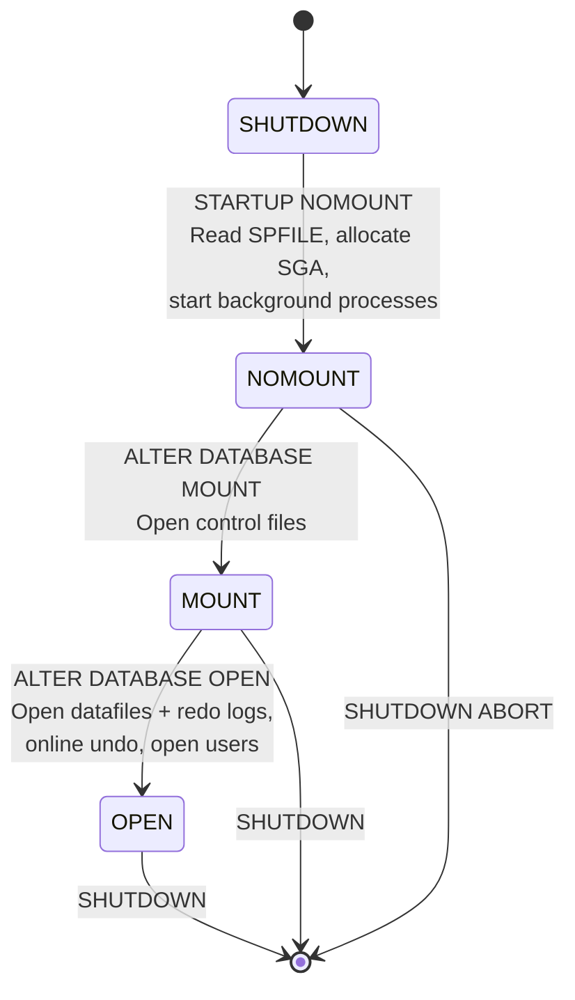

# Startup Process

## Overview

An Oracle database transitions through three states on startup: **NOMOUNT**, **MOUNT**, and **OPEN**. Each state unlocks a specific set of capabilities. Knowing what is available at each stage is essential for recovery scenarios — for example, restoring a control file requires the database to be in NOMOUNT, while renaming a datafile requires MOUNT.

The startup command is `STARTUP` (from `sqlplus / as sysdba` or `srvctl start database` for RAC).

## Architecture



## Internal Working

### NOMOUNT

`STARTUP NOMOUNT` does exactly three things:

1. **Locate parameter file** — Oracle searches `$ORACLE_HOME/dbs/spfile<SID>.ora`, then `spfile.ora`, then `init<SID>.ora`. If none found: `ORA-01078: failure in processing system parameters`.
2. **Allocate SGA** — Based on `sga_target` / `memory_target` / individual pool sizes. On Linux this attaches a large shared-memory segment (or HugePages).
3. **Start background processes** — PMON, SMON, DBWn, LGWR, CKPT, MMON, MMNL, RECO, LREG, VKTM, DIAG, and others.

At this point the instance exists but knows _nothing_ about a database. `V$INSTANCE.STATUS = 'STARTED'`. `V$DATABASE` returns no rows.

**Why start in NOMOUNT?**

- `CREATE DATABASE` (fresh installs)
- Restoring a control file from RMAN backup
- Recreating the control file with `CREATE CONTROLFILE`

### MOUNT

`ALTER DATABASE MOUNT` (or `STARTUP MOUNT`) reads the **control files** listed in the `control_files` parameter. From the control files Oracle learns:

- Database name and DBID
- Location of every datafile and online redo log
- Current log sequence number
- Last checkpoint SCN
- Backup metadata (if RMAN)

`V$INSTANCE.STATUS = 'MOUNTED'`. `V$DATABASE`, `V$DATAFILE`, `V$LOG`, `V$CONTROLFILE`, `V$BACKUP` are queryable.

**Why start in MOUNT?**

- Enabling ARCHIVELOG mode (`ALTER DATABASE ARCHIVELOG`)
- Renaming or moving datafiles (`ALTER DATABASE RENAME FILE`)
- Restoring datafiles with RMAN
- Media recovery (`RECOVER DATABASE`)
- Data Guard: standby databases sit in MOUNT (or OPEN read-only for ADG)
- Flashback: `FLASHBACK DATABASE TO SCN` requires MOUNT

### OPEN

`ALTER DATABASE OPEN` (or `STARTUP OPEN`, the default of `STARTUP`) performs:

1. **File header check** — verify every datafile is at the correct SCN.
2. **Instance recovery** if needed — if the previous shutdown was `ABORT` or a crash, SMON rolls forward from the last checkpoint using redo, then rolls back uncommitted transactions from undo.
3. **Online redo log verification** — confirm the current log group is writable.
4. **Open the undo tablespace** — bind `undo_tablespace` to actual segments.
5. **PDB startup (multitenant)** — PDBs marked `save state` are auto-opened; others remain MOUNTED.

`V$INSTANCE.STATUS = 'OPEN'`. User sessions can now connect.

### OPEN Variants

| Command                          | Effect                                               |
| -------------------------------- | ---------------------------------------------------- |
| `ALTER DATABASE OPEN`            | Read-write, normal use                               |
| `ALTER DATABASE OPEN READ ONLY`  | No DML, no online redo generation                    |
| `ALTER DATABASE OPEN RESETLOGS`  | After incomplete recovery — starts new incarnation   |
| `ALTER DATABASE OPEN UPGRADE`    | For catalog upgrade after patchset                   |
| `ALTER DATABASE OPEN RESTRICTED` | Only users with RESTRICTED SESSION privilege connect |

### FORCE

`STARTUP FORCE` is `SHUTDOWN ABORT` + `STARTUP`. Use only to break a hung startup or shutdown.

## Components

| Component                    | NOMOUNT | MOUNT | OPEN |
| ---------------------------- | :-----: | :---: | :--: |
| SGA allocated                |   ✅    |  ✅   |  ✅  |
| Background processes running |   ✅    |  ✅   |  ✅  |
| Control files open           |   ❌    |  ✅   |  ✅  |
| Datafiles verified           |   ❌    |  ❌   |  ✅  |
| Online redo logs verified    |   ❌    |  ❌   |  ✅  |
| User connections allowed     |   ❌    |  ❌   |  ✅  |
| DBA connections via `sysdba` |   ✅    |  ✅   |  ✅  |

## Important Parameters

| Parameter                  | Startup Impact                             |
| -------------------------- | ------------------------------------------ |
| `spfile` / `init<SID>.ora` | Source of all other parameters             |
| `control_files`            | Read at MOUNT                              |
| `db_name`                  | Must match control file's stored name      |
| `db_recovery_file_dest`    | Fast Recovery Area — flashback and archive |
| `undo_tablespace`          | Bound at OPEN                              |
| `startup_mode` (PDB)       | AUTO opens PDBs matching last-save state   |

## Important Views

| View                                     | Available After |
| ---------------------------------------- | --------------- |
| `V$INSTANCE`                             | NOMOUNT         |
| `V$SGA`, `V$SGAINFO`, `V$PARAMETER`      | NOMOUNT         |
| `V$DATABASE`, `V$CONTROLFILE`            | MOUNT           |
| `V$DATAFILE`, `V$LOG`, `V$LOGFILE`       | MOUNT           |
| `V$RECOVERY_LOG`, `V$RECOVER_FILE`       | MOUNT           |
| `V$SESSION`, `V$PROCESS` (user sessions) | OPEN            |
| `DBA_*` views                            | OPEN            |

## Diagnostic Queries

```sql
-- What state is the database in?
SELECT status, database_status, instance_role FROM v$instance;
SELECT open_mode, database_role FROM v$database;

-- If a startup is failing, check the alert log via V$DIAG_ALERT_EXT
SELECT originating_timestamp, message_text
FROM   v$diag_alert_ext
WHERE  originating_timestamp > SYSDATE - 1/24
ORDER  BY originating_timestamp DESC
FETCH FIRST 20 ROWS ONLY;

-- Any datafile needing media recovery?
SELECT file#, error, change# AS chg, time FROM v$recover_file;

-- PDB states (multitenant)
SELECT name, open_mode, restricted FROM v$pdbs ORDER BY con_id;
```

## Common Issues

- **`ORA-01078: failure in processing system parameters`** — SPFILE/PFILE not found or unreadable. Check `$ORACLE_HOME/dbs/`.
- **`ORA-27100: shared memory realm already exists`** — Instance is already up; check `ps -ef | grep pmon`.
- **`ORA-00845: MEMORY_TARGET not supported on this system`** — On Linux, `/dev/shm` too small. Either enlarge `/dev/shm` or move to ASMM.
- **`ORA-01102: cannot mount database in EXCLUSIVE mode`** — Another instance holds the mount lock (stale semaphore or a rogue instance).
- **`ORA-01157: cannot identify/lock datafile N`** — Datafile missing/permission denied at OPEN.
- **`ORA-01113: file N needs media recovery`** — Datafile older than expected SCN; recover before OPEN.
- **`ORA-01547: warning: RECOVER succeeded but OPEN RESETLOGS would get error below`** — Recovery incomplete; another log/backup needed.

## Troubleshooting

### Startup hangs

1. Check alert log for the last message.
2. `ps -ef | grep <SID>` — is PMON/SMON alive?
3. `sqlplus / as sysdba` in another window — can you query `V$INSTANCE`?
4. If MOUNT hangs, check control file paths (`ls -l`) and permissions.
5. If OPEN hangs, look for `Waiting for smon to disable tx recovery` — a large uncommitted transaction is being rolled back.

### `STARTUP` fails at NOMOUNT

- Wrong `ORACLE_SID` or `ORACLE_HOME`.
- SPFILE / PFILE missing or unreadable.
- SGA too large for OS shared memory (`kernel.shmmax`).
- HugePages misconfigured — check `/proc/meminfo`.

### `STARTUP` fails at MOUNT

- Control file missing or corrupt. Restore from RMAN backup.
- `db_name` in SPFILE does not match control file.

### `STARTUP` fails at OPEN

- Datafile needs recovery: `RECOVER DATABASE` then `ALTER DATABASE OPEN`.
- ORA-00600: engage Oracle Support with the trace file.
- `resetlogs` needed: `ALTER DATABASE OPEN RESETLOGS`.

## Best Practices

1. Use SPFILE, not PFILE. Store SPFILE on ASM in RAC or shared storage.
2. Multiplex control files (minimum 2, ideally 3, on separate disks).
3. Always take a fresh RMAN control file autobackup after structural changes.
4. In RAC, use `srvctl start database -d <db>` — never start instances manually except for troubleshooting.
5. Automate PDB save-state so `startup` restores the expected open mode.
6. Alert on any startup that goes to OPEN RESETLOGS unexpectedly — usually indicates a recovery event.

## Interview Questions

1. **Q:** What are the three startup states?
   **A:** NOMOUNT (instance only), MOUNT (control files open), OPEN (datafiles + redo verified, users can connect).

2. **Q:** In which state do you restore a control file from backup?
   **A:** NOMOUNT.

3. **Q:** In which state do you restore a datafile?
   **A:** MOUNT (or leave the datafile offline while OPEN and restore selectively).

4. **Q:** What is `STARTUP FORCE`?
   **A:** `SHUTDOWN ABORT` followed by `STARTUP`. Use only when a normal startup or shutdown is stuck.

5. **Q:** What is `ALTER DATABASE OPEN RESETLOGS` for?
   **A:** After incomplete recovery, it resets the log sequence to 1 and starts a new incarnation.

6. **Q:** In a Data Guard standby, what is the normal open state?
   **A:** MOUNT (physical standby) or OPEN READ ONLY WITH APPLY (Active Data Guard).

7. **Q:** What happens if PMON fails to start during NOMOUNT?
   **A:** The instance startup aborts. Check parameter file and OS limits.

## References

- Oracle Database Administrator's Guide 19c — Chapter "Starting Up and Shutting Down a Database"
- Oracle Database Concepts 19c — Instance lifecycle
- MOS Doc ID 220970.1 — Common Startup Problems
