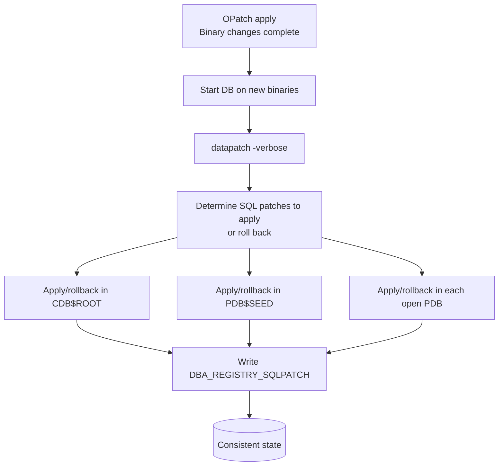

# Datapatch

## Overview

**Datapatch** applies the _SQL_ portion of an Oracle patch to a database. Every Release Update (RU) has two parts: a binary component installed by [OPatch](opatch.md), and a SQL component (PL/SQL package rebuilds, dictionary changes, JVM updates) that must be run **inside each database** running on the patched binaries. `datapatch` is that runner.

Rules of thumb:

- Skip datapatch and your database will hit unpredictable failures — often invalid PL/SQL, missing dictionary changes, or `ORA-01722` from mismatched types.
- Run datapatch after every patch apply and every patch rollback.
- Run datapatch inside every PDB, not just the CDB root.

## Architecture



## Internal Working

### What Datapatch Does

1. Reads `DBA_REGISTRY_SQLPATCH` to determine what SQL patches are already applied.
2. Reads the binary inventory (`opatch lspatches`) to determine what SQL patches _should_ be applied.
3. Computes the delta: patches to apply, patches to roll back.
4. For each pending patch, runs the corresponding SQL scripts under `$ORACLE_HOME/sqlpatch/<patch_id>/`.
5. Updates `DBA_REGISTRY_SQLPATCH` and `REGISTRY$SQLPATCH`.
6. Recompiles invalidated objects via `utlrp` at the end.

Datapatch operates on **all open PDBs plus CDB$ROOT plus PDB$SEED**. Closed PDBs are skipped; you must open them and rerun datapatch, or use `datapatch -pdbs <pdb_list>`.

### Running Datapatch

```bash
# Standard invocation — must run as oracle after DB startup
$ORACLE_HOME/OPatch/datapatch -verbose
```

Options:

| Flag                  | Purpose                                             |
| --------------------- | --------------------------------------------------- |
| `-verbose`            | Detailed output                                     |
| `-force`              | Rerun patches already marked applied                |
| `-pdbs <list>`        | Limit to specific PDBs (comma-separated)            |
| `-skip_upgrade_check` | Skip the "must complete upgrade first" check (rare) |
| `-db <alias>`         | Non-default connection (needs TNS alias)            |

### Output Interpretation

```
$ datapatch -verbose
SQL Patching tool version 19.20.0.0.0 Production on Fri Aug 6 10:00:00 2026
Copyright (c) 2012, 2023, Oracle. All rights reserved.

Log file for this invocation:
  /u01/app/oracle/cfgtoollogs/sqlpatch/sqlpatch_1234_20260806_100000/
  sqlpatch_invocation.log

Connecting to database...OK
Gathering database info...done

Note:  Datapatch will only apply or rollback SQL fixes for PDBs
       that are in an open state, no patches will be applied to closed PDBs.
       Please refer to Note: Datapatch: Database 12c Post Patch SQL
       Automation (Doc ID 1585822.1)

Bootstrapping registry and package to current versions...done
Determining current state...done

Current state of interim SQL patches:
  Interim patch 35320081 (DATABASE RELEASE UPDATE : 19.20.0.0.230717...):
    Binary registry: Installed
    PDB CDB$ROOT: Not installed
    PDB PDB$SEED: Not installed
    PDB HRPDB: Not installed

Current state of release update SQL patches:
  Binary registry:
    19.20.0.0.0 Release_Update 230601181413: Installed
  PDB CDB$ROOT:
    Applied 19.19.0.0.0 Release_Update 230329151751 successfully on ...
  ...

Adding patches to installation queue and performing prereq checks...done
Installation queue:
  For the following PDBs: CDB$ROOT PDB$SEED HRPDB
    No interim patches need to be rolled back
    Patch 35320081 (DATABASE RELEASE UPDATE : 19.20.0.0.230717 ...):
      Apply from 19.19.0.0.0 Release_Update 230329151751 to 19.20.0.0.0 Release_Update 230601181413

Installing patches...
Patch installation complete.  Total patches installed: 3

Validating logfiles...done
Patch 35320081 apply (pdb CDB$ROOT): SUCCESS
Patch 35320081 apply (pdb PDB$SEED): SUCCESS
Patch 35320081 apply (pdb HRPDB): SUCCESS
SQL Patching tool complete on Fri Aug 6 10:15:00 2026
```

### After Datapatch

Compile invalid objects and verify:

```sql
-- Recompile any leftover invalids
@?/rdbms/admin/utlrp.sql

-- Confirm no INVALID objects in dictionary schemas
SELECT owner, COUNT(*) FROM dba_objects
WHERE  status = 'INVALID'
GROUP  BY owner
ORDER  BY 2 DESC;

-- Confirm registry
SELECT patch_id, action, status, action_time
FROM   dba_registry_sqlpatch
ORDER  BY action_time DESC
FETCH FIRST 5 ROWS ONLY;
```

## Components

| Component                            | Purpose                     |
| ------------------------------------ | --------------------------- |
| `$ORACLE_HOME/OPatch/datapatch`      | Perl wrapper                |
| `$ORACLE_HOME/sqlpatch/<patch_id>/`  | Per-patch SQL scripts       |
| `$ORACLE_BASE/cfgtoollogs/sqlpatch/` | Datapatch logs              |
| `DBA_REGISTRY_SQLPATCH`              | Applied SQL patches per PDB |
| `REGISTRY$SQLPATCH`                  | Underlying table            |

## Important Parameters

| Parameter                       | Effect                                                   |
| ------------------------------- | -------------------------------------------------------- |
| `_disable_directory_link_check` | Rare — some datapatch runs need it for filesystem quirks |
| `job_queue_processes`           | Must be > 0 for datapatch to use parallel recompile      |

## Important Views

| View                    | Purpose                         |
| ----------------------- | ------------------------------- |
| `DBA_REGISTRY_SQLPATCH` | SQL patch history per container |
| `CDB_REGISTRY_SQLPATCH` | Multi-container view            |
| `REGISTRY$HISTORY`      | Broader registry history        |
| `V$PATCHES`             | Binary + SQL patches (12.2+)    |

## Diagnostic Queries

```sql
-- Which patches has this container seen?
SELECT patch_id, patch_uid, version, action, status, action_time,
       description
FROM   dba_registry_sqlpatch
ORDER  BY action_time DESC;

-- All containers view (from CDB$ROOT)
SELECT con_id, patch_id, action, status, action_time
FROM   cdb_registry_sqlpatch
ORDER  BY con_id, action_time DESC;

-- Invalid objects post-datapatch
SELECT owner, object_type, COUNT(*) FROM dba_objects
WHERE  status = 'INVALID'
GROUP  BY owner, object_type
ORDER  BY 3 DESC;

-- Confirm all PDBs are open (unopen PDBs miss datapatch)
SELECT name, open_mode FROM v$pdbs;
```

## Common Issues

- **PDBs closed at datapatch time** — Skipped silently. Open PDBs first, rerun datapatch. Alert log will not warn you.
- **`ORA-01031` while running datapatch** — Not connected `AS SYSDBA` or wrong environment. Check `ORACLE_SID`.
- **`ORA-20001` from Sqlpatch** — Common with mixed binary/SQL states. Check `sqlpatch_invocation.log`.
- **Invalid objects after datapatch** — Run `@?/rdbms/admin/utlrp.sql`. If still invalid, look at specific compile errors: `SELECT * FROM dba_errors ORDER BY sequence`.
- **`ORA-04021` timeout during datapatch** — Blocking session held a library cache lock; kill blocker or wait.
- **Datapatch reports success but registry shows nothing applied** — 21c corner case; upgrade Datapatch.

## Troubleshooting

1. Log dir: `$ORACLE_BASE/cfgtoollogs/sqlpatch/sqlpatch_<pid>_<timestamp>/`. Each PDB has its own subdir.
2. Master log: `sqlpatch_invocation.log`. Per-patch logs follow the pattern `<patch_id>_apply_<pdb>.log`.
3. `datapatch -verbose -force` reruns everything — use if the registry got out of sync.
4. If datapatch keeps failing on a specific PDB, close it, rerun for other PDBs, then troubleshoot that PDB in isolation.
5. For truly broken registry state, refer to MOS Doc ID 2680521.1 (Master Datapatch troubleshooting note).

## Best Practices

1. **Always run datapatch after OPatch apply.** Add it to your patching runbook.
2. **Open all PDBs first.** `ALTER PLUGGABLE DATABASE ALL OPEN;` then `datapatch -verbose`.
3. Run `utlrp.sql` at the end even if datapatch reports success — cheap insurance.
4. In RAC, run datapatch from **one node only** — it's cluster-aware.
5. Take a **guaranteed restore point** before major RUs so you can flashback:
   ```sql
   CREATE RESTORE POINT before_ru_1920 GUARANTEE FLASHBACK DATABASE;
   ```
6. Save the `sqlpatch_invocation.log` for audit purposes — it's a legal record of when the patch was applied.
7. Automate datapatch into a startup trigger only if you have very disciplined patching — otherwise you may run datapatch mid-shift.

## Interview Questions

1. **Q:** What is Datapatch?
   **A:** The tool that applies the SQL/PL-SQL portion of an Oracle patch (RU or one-off) to a database, after the binary component has been installed by OPatch.

2. **Q:** When do you run Datapatch?
   **A:** After every `opatch apply` or `opatch rollback`, after the database is started up on the new binaries.

3. **Q:** Does Datapatch touch closed PDBs?
   **A:** No — closed PDBs are skipped. Open them and rerun.

4. **Q:** How do you verify what SQL patches are applied?
   **A:** `SELECT * FROM dba_registry_sqlpatch ORDER BY action_time DESC;`.

5. **Q:** Do you need to run Datapatch on each RAC node?
   **A:** No — Datapatch is cluster-aware. Run once from any node.

6. **Q:** Where does Datapatch log?
   **A:** `$ORACLE_BASE/cfgtoollogs/sqlpatch/sqlpatch_<pid>_<timestamp>/`.

7. **Q:** What is the safety net before applying a major RU?
   **A:** `CREATE RESTORE POINT ... GUARANTEE FLASHBACK DATABASE;` + full RMAN L0 backup + copy of `$ORACLE_HOME`.

## References

- MOS Doc ID 1585822.1 — Datapatch: Database 12c/19c Post Patch SQL Automation
- MOS Doc ID 2680521.1 — Master Note for Datapatch Troubleshooting
- MOS Doc ID 555.1 — Latest Release Update / Datapatch usage
- Oracle Database Patching Concepts 19c
