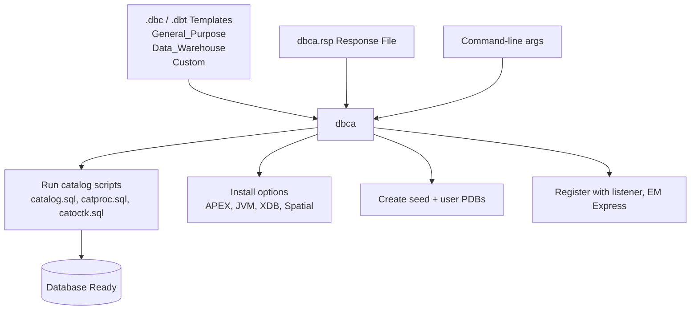

# DBCA — Database Configuration Assistant

## Overview

**DBCA** (Database Configuration Assistant) is Oracle's utility to create, delete, and reconfigure databases. It is the recommended alternative to running `CREATE DATABASE` by hand: DBCA handles catalog scripts, EM, DBSNMP, options, and Multitenant boilerplate consistently and correctly.

DBCA supports:

- Interactive GUI mode
- Silent mode with a response file
- Templated creation (DBT, DBC files)
- Duplicate database creation (limited use — RMAN duplicate is preferred)
- PDB operations (create, plug, unplug, clone)
- Database deletion

## Architecture



## Internal Working

### DBCA Commands

```bash
dbca -help                      # Full help
dbca -silent -createDatabase    # Create with parameters or response file
dbca -silent -deleteDatabase    # Drop database
dbca -silent -createTemplateFromDB  # Snapshot existing DB structure
dbca -silent -createPluggableDatabase
dbca -silent -unpluggableDatabase
dbca -silent -pluggableDatabase -plugDatabase
```

### Creating a Database — Silent Mode

Minimal command-line invocation (no response file):

```bash
dbca -silent -createDatabase \
    -templateName General_Purpose.dbc \
    -gdbName orcl \
    -sid orcl \
    -createAsContainerDatabase true \
    -numberOfPDBs 1 \
    -pdbName orclpdb \
    -sysPassword <pw> \
    -systemPassword <pw> \
    -pdbAdminPassword <pw> \
    -datafileDestination /u02/oradata \
    -recoveryAreaDestination /u03/fast_recovery_area \
    -recoveryAreaSize 20480 \
    -storageType FS \
    -memoryMgmtType AUTO_SGA \
    -totalMemory 8192 \
    -characterSet AL32UTF8 \
    -nationalCharacterSet AL16UTF16 \
    -databaseType MULTIPURPOSE \
    -emConfiguration NONE \
    -listeners LISTENER \
    -initParams "processes=600,open_cursors=500"
```

### Response File Invocation

```bash
dbca -silent -createDatabase -responseFile /software/create_prod.rsp
```

See [Response Files](response-files.md) for the response file schema.

### Templates

DBCA supports three template types:

- **General Purpose / Transaction Processing** (`General_Purpose.dbc`) — OLTP defaults.
- **Data Warehouse** (`Data_Warehouse.dbc`) — DW defaults (larger buffer cache, parallel).
- **Custom** — Use a `.dbt` template you built from an existing database.

Ship location: `$ORACLE_HOME/assistants/dbca/templates/`.

Capturing a template from a running database:

```bash
dbca -silent -createTemplateFromDB \
    -sourceDB //dbhost:1521/prod \
    -templateName prod_template.dbt \
    -sysDBAUserName sys \
    -sysDBAPassword <pw>
```

### Multitenant Defaults

19c EE allows up to 3 free user PDBs per CDB (Multitenant Option not required). DBCA defaults now create a CDB with one PDB. Add `-createAsContainerDatabase true` explicitly for clarity.

### Deleting a Database

```bash
dbca -silent -deleteDatabase \
    -sourceDB orcl \
    -sysDBAUserName sys \
    -sysDBAPassword <pw>
```

Deletion:

1. Shuts down the database (IMMEDIATE).
2. Removes datafiles, control files, redo logs, and the FRA subdirectory.
3. Removes SPFILE, PFILE, orapw file.
4. Removes the `oratab` entry.
5. Deregisters from the listener.

!!! danger "Irreversible"
`dbca -deleteDatabase` is not recoverable except from a prior RMAN backup. Confirm the target `sourceDB` name before executing.

### PDB Operations

Create a PDB:

```bash
dbca -silent -createPluggableDatabase \
    -sourceDB orcl \
    -pdbName hrpdb \
    -pdbAdminUserName pdbadmin \
    -pdbAdminPassword <pw> \
    -createPDBFrom DEFAULT \
    -pdbDatafileDestination /u02/oradata/orcl/hrpdb
```

Unplug a PDB:

```bash
dbca -silent -unpluggableDatabase \
    -sourceDB orcl \
    -pdbName hrpdb \
    -unpluggableDatabaseFrom orcl \
    -xmlFile /tmp/hrpdb.xml
```

Plug in a PDB:

```bash
dbca -silent -pluggableDatabase -plugDatabase \
    -sourceDB orcl \
    -pdbName hrpdb \
    -pdbXMLFile /tmp/hrpdb.xml
```

## Components

| Component           | Purpose                                                                |
| ------------------- | ---------------------------------------------------------------------- |
| `dbca` binary       | `$ORACLE_HOME/bin/dbca` (shell wrapper)                                |
| Templates           | `$ORACLE_HOME/assistants/dbca/templates/*.dbc` and `*.dbt`             |
| DBCA log            | `$ORACLE_BASE/cfgtoollogs/dbca/<sid>/`                                 |
| Generated scripts   | `$ORACLE_BASE/admin/<sid>/scripts/` — CreateDB.sql, postDBCreation.sql |
| Configuration files | `$ORACLE_HOME/dbs/spfile<sid>.ora`, `init<sid>.ora`, `orapw<sid>`      |

## Important Parameters

Command-line and response file parameters shared identically. Key ones:

| Parameter                   | Purpose                                            |
| --------------------------- | -------------------------------------------------- |
| `templateName`              | `.dbc` or `.dbt` file                              |
| `gdbName` / `sid`           | Global DB name / instance SID                      |
| `createAsContainerDatabase` | true = CDB, false = non-CDB (deprecated)           |
| `numberOfPDBs`              | User PDBs to create at build time                  |
| `datafileDestination`       | Base path for datafiles or ASM diskgroup (`+DATA`) |
| `recoveryAreaDestination`   | FRA path or diskgroup (`+RECO`)                    |
| `memoryMgmtType`            | `AUTO_SGA` (ASMM), `AUTO` (AMM), `CUSTOM_SGA`      |
| `totalMemory`               | Total memory in MB                                 |
| `characterSet`              | `AL32UTF8` recommended                             |
| `emConfiguration`           | `DBEXPRESS` or `NONE`                              |
| `automaticMemoryManagement` | Legacy; use `memoryMgmtType`                       |
| `listeners`                 | Comma list of listener names                       |
| `initParams`                | Comma list of `name=value` init params             |

## Important Views

After DBCA completes:

```sql
SELECT name, cdb, open_mode, con_id FROM v$database;
SELECT name, open_mode, restricted FROM v$pdbs;
SELECT * FROM registry$sqlpatch ORDER BY action_time DESC;
```

## Diagnostic Queries

```bash
# DBCA log
tail -F $ORACLE_BASE/cfgtoollogs/dbca/<sid>/*.log

# Watch generated SQL scripts (see what DBCA is about to run)
ls -1 $ORACLE_BASE/admin/<sid>/scripts/

# Confirm the database exists
grep <sid> /etc/oratab
```

```sql
-- Confirm registry components
SELECT comp_id, comp_name, version, status
FROM   dba_registry
ORDER  BY comp_id;

-- Component versions in multi-CDB context
SELECT con_id, comp_id, status FROM cdb_registry ORDER BY con_id, comp_id;
```

## Common Issues

- **`ORA-00922: missing or invalid option`** during template execution — Bad `initParams` value.
- **`ORA-01031: insufficient privileges`** — DBCA run by a user not in the `dba` group.
- **DBCA hangs at 47%** — Almost always a stuck listener registration. `lsnrctl status`; `alter system register`.
- **Character set error** — Cannot change character set after creation. Choose `AL32UTF8` upfront.
- **PDB creation fails: `ORA-65010: maximum number of pluggable databases created`** — For 19c EE without Multitenant Option, cap is 3 user PDBs.
- **PDB creation fails: `ORA-65011: Pluggable database ... does not exist`** — Path issue for datafiles; check permissions on `pdbDatafileDestination`.

## Troubleshooting

1. Check `$ORACLE_BASE/cfgtoollogs/dbca/<sid>/dbca_<timestamp>.log` and `trace.log`.
2. Look for the failing SQL script under `$ORACLE_BASE/admin/<sid>/scripts/`. You can run those manually to see what fails.
3. On listener registration issues, `lsnrctl reload` and `alter system register;` inside SQL\*Plus.
4. If DBCA leaves an inconsistent state after a failed run, use `dbca -silent -deleteDatabase` (if the DB is in a state that allows shutdown) then start again.

## Best Practices

1. Prefer **template-based creation** for repeatable environments — capture a golden template and reuse.
2. Always create as CDB in 19c. Non-CDB is deprecated in 20c+.
3. Set `characterSet=AL32UTF8` for all new databases.
4. Set `emConfiguration=NONE` unless you specifically need EM Express — it's a maintenance burden.
5. Pass secrets via env vars, not response file.
6. Run `utlrp` and check `DBA_REGISTRY` after creation to confirm no components are `INVALID`.
7. Immediately apply Datapatch after creation — `datapatch -verbose`.

## Interview Questions

1. **Q:** What does DBCA do that manual `CREATE DATABASE` does not?
   **A:** Runs catalog scripts, installs options, sets up EM, creates password file, registers with listener, updates `oratab` — many convention-driven steps in one call.

2. **Q:** Can DBCA create a non-CDB database in 19c?
   **A:** Yes (`createAsContainerDatabase=false`), but non-CDB is deprecated and removed in 21c.

3. **Q:** How do you drop a database?
   **A:** `dbca -silent -deleteDatabase -sourceDB <sid> -sysDBAUserName sys -sysDBAPassword <pw>`.

4. **Q:** Where does DBCA write logs?
   **A:** `$ORACLE_BASE/cfgtoollogs/dbca/<sid>/`.

5. **Q:** What is the difference between `.dbc` and `.dbt` templates?
   **A:** `.dbc` = database configuration + datafile references (has structure and content pointers); `.dbt` = database template without datafile references (structure only, faster).

6. **Q:** How do you create a PDB via DBCA?
   **A:** `dbca -silent -createPluggableDatabase -sourceDB <cdb> -pdbName <pdb> -pdbAdminUserName <user> -pdbAdminPassword <pw>`.

## References

- Oracle Database Administrator's Guide 19c — "Using DBCA"
- Oracle Database Multitenant Administrator's Guide 19c
- MOS Doc ID 2418739.1 — Silent Database Creation with DBCA in 19c
- MOS Doc ID 2295514.1 — DBCA Response File Reference
