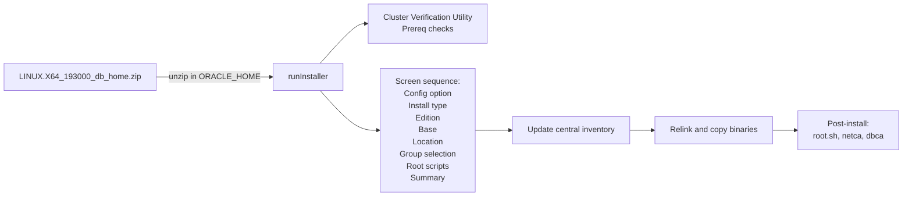

# GUI Installation

## Overview

Oracle Database 19c ships with a Java-based graphical installer (`runInstaller`) that walks through prerequisites, home selection, options, and post-install configuration. GUI installation is **useful for learning** and one-off environments; it is **not appropriate for production** at scale — silent installs with response files are reproducible and version-controllable.

This page covers when to use the GUI, what each installer screen is asking, and how to capture the equivalent response file after the fact.

## Architecture



## Internal Working

### Prerequisites for GUI Install

- X11 display available: `$DISPLAY` set, `xhost +` from the target host, or SSH X11 forwarding (`ssh -X`).
- On modern Linux, install `xorg-x11-xauth` and `libXtst`.
- If VNC is used, launch `runInstaller` from within the VNC session.

### The Install Flow

1. **Configuration Option**
   - _Set up Software Only_ — install binaries only. **Recommended.** Use DBCA later.
   - _Create and configure a single instance database_ — installs and creates a database.

2. **Database Installation Options**
   - _Single instance_ — one server, one instance.
   - _Real Application Clusters_ — requires Grid Infrastructure installed first.
   - _Client_ — Oracle client only.

3. **Database Edition**
   - Enterprise Edition (EE)
   - Standard Edition 2 (SE2)

4. **Oracle Base Location** — canonically `/u01/app/oracle`.

5. **Software Location** — canonically `/u01/app/oracle/product/19.0.0/dbhome_1`.

6. **Privileged OS Groups** — map SYSDBA, SYSOPER, SYSBACKUP, SYSDG, SYSKM, SYSRAC to OS groups. Defaults are `dba`, `oper`, `backupdba`, `dgdba`, `kmdba`, `racdba`.

7. **Root Script Execution** — the installer can be authorized to run `root.sh` itself if given the root password (skip in security-conscious environments).

8. **Prerequisite Checks** — CVU (Cluster Verification Utility) runs; fix or ignore each finding.

9. **Summary** — review; save response file at this point:

   ```
   Save Response File → /tmp/db_install.rsp
   ```

10. **Install** — copies files, relinks binaries.

11. **Root scripts** — installer pauses for you to run:

    ```bash
    /u01/app/oraInventory/orainstRoot.sh   # first install only
    /u01/app/oracle/product/19.0.0/dbhome_1/root.sh
    ```

### The `-executePrereqs` Flag

Prerequisites can be validated without installing:

```bash
./runInstaller -executePrereqs
```

Useful to test a fresh server before you have a maintenance window.

## Components

| Component        | Purpose                                                                   |
| ---------------- | ------------------------------------------------------------------------- |
| `runInstaller`   | Java-based installer launcher                                             |
| `oui`            | Oracle Universal Installer engine                                         |
| `cvu`            | Cluster Verification Utility — prereq checks                              |
| `orainstRoot.sh` | First-time inventory setup script                                         |
| `root.sh`        | Home-specific root operations (symlinks in `/usr/local/bin`, permissions) |
| Installer logs   | `$ORACLE_BASE/oraInventory/logs/installActions<ts>.log`                   |

## Important Parameters

Not directly parameter-driven — captures state in the response file. See [Response Files](response-files.md) for the equivalent silent-mode parameters.

## Important Views

Not applicable — pre-database.

## Diagnostic Queries

```bash
# Confirm X11 works
xdpyinfo | head -3

# Confirm required RPMs are present
rpm -q libXtst xorg-x11-utils xorg-x11-xauth

# Watch the install log live in another terminal
tail -F /u01/app/oraInventory/logs/installActions*.log

# After install: confirm the home registered
cat /u01/app/oraInventory/ContentsXML/inventory.xml
```

## Common Issues

- **Blank installer window** — X11 not forwarding or `LC_ALL`/`LANG` misconfigured. Try `unset LC_ALL; export LANG=en_US.UTF-8`.
- **`No protocol specified`** — Run `xhost +local:` on the console session.
- **Installer hangs at "Preparing to launch Oracle Universal Installer"** — `/tmp` full or noexec-mounted. Set `TMP=/u01/tmp; export TMP`.
- **`INS-13001: Environment does not meet minimum requirements`** — Check `installActions.log` for the exact prereq that failed.
- **Prerequisite check flags kernel parameter** — fix and re-run, or click _Ignore All_ only for known false positives.
- **`root.sh` fails on second attempt** — `root.sh` is not idempotent for all steps. Consult the log; usually requires `deinstall.sh` and retry.

## Troubleshooting

1. Read the latest `installActions<timestamp>.log`. The last few hundred lines usually contain the root cause.
2. For X11 issues, `strace -f ./runInstaller` reveals `connect()` failures to `:0`.
3. If GUI is unusable, switch to `-silent` mode with the saved response file.
4. If the installer crashes mid-copy, `deinstall` the partial home before retrying: `$ORACLE_HOME/deinstall/deinstall`.

## Best Practices

1. Use GUI once — to generate a response file — then switch to silent for every subsequent install.
2. Prefer _Software Only_ + DBCA over the combined install-and-create option. Cleaner separation.
3. Save the response file at the summary screen and check it into Git.
4. Never install as root. Install as `oracle`; run `root.sh` as root when prompted.
5. Verify with `opatch lsinventory` immediately after install.

## Interview Questions

1. **Q:** When would you use the GUI installer?
   **A:** Non-production, one-off, or learning environments — and to generate a response file for later silent installs.

2. **Q:** What does `root.sh` do?
   **A:** Creates symlinks in `/usr/local/bin` (`dbhome`, `oraenv`, `coraenv`), sets ownership and SUID on some binaries, and updates `/etc/oratab`.

3. **Q:** Why is _Software Only_ preferred?
   **A:** It separates binary installation from database creation, allowing you to apply patches before the first database is created.

4. **Q:** How do you save a response file from the GUI?
   **A:** At the Summary screen, click _Save Response File_.

5. **Q:** What does `runInstaller -executePrereqs` do?
   **A:** Runs CVU checks without proceeding to install — useful for validating a server.

## References

- Oracle Database Installation Guide 19c for Linux
- MOS Doc ID 1587357.1 — Master Note for Installation of 19c
- MOS Doc ID 2418739.1 — 19c Installation Steps
- Oracle Universal Installer Concepts
