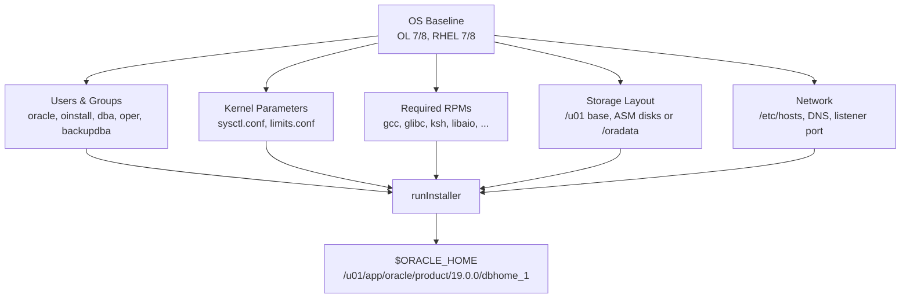

# Installation Prerequisites

## Overview

Installing Oracle Database 19c on Linux requires a specific OS baseline: kernel parameters, packages, users and groups, filesystem layout, storage sizing, and network configuration. Skipping prerequisites is the #1 cause of failed installs. This page enumerates every check the installer performs and how to satisfy each on Oracle Linux 7/8, RHEL 7/8, and derivatives. Solaris, AIX, and Windows have analogous requirements — consult the _Oracle Database Installation Guide_ for those platforms.

The easiest way to satisfy prerequisites on Oracle Linux is to install the `oracle-database-preinstall-19c` package. It sets kernel parameters, installs required RPMs, creates the `oracle` user and `oinstall`/`dba` groups, and applies `nofile`/`nproc` limits.

## Architecture



## Internal Working

### Users and Groups

| Group       | Purpose                                       |
| ----------- | --------------------------------------------- |
| `oinstall`  | Inventory group — owns `oraInventory`         |
| `dba`       | SYSDBA privilege via OS authentication        |
| `oper`      | SYSOPER privilege (start/stop/backup, no DDL) |
| `asmadmin`  | ASM instance ownership (grid user)            |
| `asmdba`    | ASM database access                           |
| `asmoper`   | Limited ASM operations                        |
| `backupdba` | SYSBACKUP separation-of-duty (19c)            |
| `dgdba`     | SYSDG for Data Guard operations               |
| `kmdba`     | SYSKM for TDE key management                  |
| `racdba`    | RAC operations                                |

Standard user creation (Oracle Linux, run as root):

```bash
groupadd -g 54321 oinstall
groupadd -g 54322 dba
groupadd -g 54323 oper
groupadd -g 54324 backupdba
groupadd -g 54325 dgdba
groupadd -g 54326 kmdba
groupadd -g 54327 racdba
groupadd -g 54330 asmadmin
groupadd -g 54331 asmdba
groupadd -g 54332 asmoper

useradd -u 54321 -g oinstall -G dba,oper,backupdba,dgdba,kmdba,asmdba oracle
passwd oracle
```

### Kernel Parameters (`/etc/sysctl.conf`)

Baseline for a server with SGA up to 32 GB:

```conf
fs.aio-max-nr = 1048576
fs.file-max = 6815744
kernel.shmall = 2097152
kernel.shmmax = 4398046511104
kernel.shmmni = 4096
kernel.sem = 250 32000 100 128
kernel.panic_on_oops = 1
net.core.rmem_default = 262144
net.core.rmem_max = 4194304
net.core.wmem_default = 262144
net.core.wmem_max = 1048576
net.ipv4.conf.all.rp_filter = 2
net.ipv4.conf.default.rp_filter = 2
net.ipv4.ip_local_port_range = 9000 65500
```

Apply: `sysctl -p`.

Notes:

- `kernel.shmmax` must be ≥ largest SGA. Set to 50% of RAM as a common rule.
- `net.ipv4.ip_local_port_range` must **exclude** ports used by Oracle Net (1521, 6200, etc.). Adjust if you run TDE proxy or shared server.

### Limits (`/etc/security/limits.d/oracle.conf`)

```conf
oracle   soft   nofile    1024
oracle   hard   nofile    65536
oracle   soft   nproc     16384
oracle   hard   nproc     16384
oracle   soft   stack     10240
oracle   hard   stack     32768
oracle   hard   memlock   134217728    # for HugePages
oracle   soft   memlock   134217728
```

`memlock` should be at least 90% of RAM if using HugePages.

### Required RPMs (Oracle Linux 8)

```bash
dnf -y install bc binutils compat-openssl10 elfutils-libelf \
    fontconfig glibc glibc-devel ksh libaio libaio-devel \
    libgcc libibverbs libnsl librdmacm libstdc++ libstdc++-devel \
    libxcb libX11 libXau libXi libXtst libXrender make \
    net-tools nfs-utils policycoreutils policycoreutils-python-utils \
    smartmontools sysstat unzip xorg-x11-utils xorg-x11-xauth
```

On Oracle Linux 8, `dnf install oracle-database-preinstall-19c` takes care of everything above.

### Storage Layout (OFA)

Oracle recommends the **Optimal Flexible Architecture** (OFA):

```
/u01/app/oraInventory                # global inventory
/u01/app/oracle                      # ORACLE_BASE
/u01/app/oracle/product/19.0.0/dbhome_1   # ORACLE_HOME
/u01/app/oracle/admin/<db>/          # adump, dpdump, pfile
/u01/app/oracle/diag/rdbms/<db>/     # ADR
/u02/oradata/<db>                    # datafiles (or ASM)
/u03/fast_recovery_area/<db>         # FRA
/u04/archivelog/<db>                 # archive logs (or FRA)
```

Sizing minimums for 19c:

| Path                                   | Minimum               | Recommendation                 |
| -------------------------------------- | --------------------- | ------------------------------ |
| `/u01` (`ORACLE_BASE` + `ORACLE_HOME`) | 15 GB                 | 50+ GB (patches consume space) |
| `/u02` (datafiles)                     | project-dependent     | project-dependent              |
| `/u03` (FRA)                           | ≥ 3× largest datafile | double the largest tablespace  |
| `/tmp`                                 | 1 GB                  | 4+ GB                          |
| swap                                   | see below             | see below                      |

Swap requirement (Oracle docs):

- RAM ≤ 2 GB → 1.5× RAM
- 2–16 GB → equal to RAM
- \> 16 GB → 16 GB fixed

### Network

- Fully qualified hostname resolvable via DNS **and** `/etc/hosts` (loopback line + a public IP entry).
- SELinux either disabled or configured for Oracle (audit logs will otherwise flood).
- `firewalld`: open TCP 1521 (listener) and any additional listener ports.
- No dashes or underscores in the hostname (`ORA-15055` misdiagnosed).

```
127.0.0.1   localhost.localdomain localhost
10.0.0.10   dbhost01.corp.example.com dbhost01
```

## Components

| Component          | Provided By                                                         |
| ------------------ | ------------------------------------------------------------------- |
| `oraInventory`     | `oraInst.loc` under `/etc/` (Linux) or `/var/opt/oracle/` (Solaris) |
| Central inventory  | `/u01/app/oraInventory`                                             |
| Software home      | `$ORACLE_HOME`                                                      |
| Diagnostic dest    | `$ORACLE_BASE/diag/rdbms/<db>/<instance>/`                          |
| Fast Recovery Area | `db_recovery_file_dest`                                             |

## Important Parameters

Not applicable at OS level — see [Response Files](response-files.md) for installer parameters.

## Important Views

At OS level: `/proc/meminfo`, `/proc/sys/kernel/shmall`, `ulimit -a`. Once installed, `V$OSSTAT` and `V$PARAMETER` reflect kernel-related settings.

## Diagnostic Queries

```bash
# Verify kernel parameters
sysctl -a | grep -E 'shmmax|shmall|sem|file-max|aio-max'

# Verify user limits
su - oracle -c 'ulimit -a'

# Verify SELinux
getenforce

# Verify hostname resolution
getent hosts $(hostname -f)

# Check that oracle-database-preinstall-19c is installed
rpm -qa | grep preinstall
```

Post-install:

```sql
-- Confirm the installer captured host correctly
SELECT host_name, version, edition FROM v$instance;

-- Confirm HugePages usage (Linux)
SELECT name, value FROM v$parameter WHERE name = 'use_large_pages';
```

## Common Issues

- **`INS-08109: Unexpected error occurred while validating inputs`** — Usually `oraInventory` permissions or missing `oinstall` group.
- **`INS-30131: initial setup requirement for the execution of the installer failed`** — Response file syntax error or missing prereq.
- **`Failed to create tmp directory /tmp/OraInstall...`** — `/tmp` full or noexec-mounted. Set `TMP` and `TMPDIR` to a large writable location.
- **HugePages not used** — check `AnonHugePages` vs `HugePages_Total` in `/proc/meminfo`. If AnonHugePages large, you have Transparent HugePages instead — disable them.
- **`ORA-27301: OS failure message: Resource temporarily unavailable`** — `nproc` too low.
- **`Linking of oracle failed`** — Missing `-devel` RPMs.

## Troubleshooting

1. `runInstaller -executePrereqs` runs prerequisite checks without installing.
2. `runInstaller -silent -responseFile ... -ignorePrereqFailure` — bypass known false positives (use sparingly).
3. Check `installActions<timestamp>.log` in `$ORACLE_BASE/oraInventory/logs/`.
4. Check `oraInst.loc` for correct inventory pointer.
5. For missing RPMs, `dnf install oracle-database-preinstall-19c` is the reliable fix.

## Best Practices

1. Always use `oracle-database-preinstall-19c` on Oracle Linux. It is Oracle-supported.
2. Disable Transparent HugePages (`transparent_hugepage=never` in kernel command line).
3. Configure explicit HugePages sized to your SGA + 5%.
4. Use OFA — even if you deviate for storage, keep `ORACLE_BASE` and `ORACLE_HOME` in canonical locations.
5. Never install as root. Install as `oracle` (or `grid` for Grid Infrastructure).
6. Store the response file in Git alongside your infrastructure code.
7. Automate with Ansible/Terraform — hand-installs drift and cannot be reproduced.

## Interview Questions

1. **Q:** What is the purpose of the `oinstall` group?
   **A:** It owns the Oracle central inventory. Every Oracle software owner (`oracle`, `grid`) must be a member.

2. **Q:** What is OFA?
   **A:** Optimal Flexible Architecture — Oracle's recommended directory layout that separates software (`$ORACLE_HOME`), configuration (`admin`), diagnostics (`diag`), and data (`oradata`).

3. **Q:** What is `oracle-database-preinstall-19c`?
   **A:** An RPM (Oracle Linux) that installs required packages, sets kernel parameters, creates users/groups, and configures limits for 19c installations.

4. **Q:** Why disable Transparent HugePages?
   **A:** THP defragmentation causes latency spikes for Oracle SGA. Oracle recommends explicit HugePages instead.

5. **Q:** What is `kernel.shmmax` used for?
   **A:** Maximum shared memory segment size. Must be ≥ largest SGA to allow allocation.

6. **Q:** Which log has installer diagnostics?
   **A:** `$ORACLE_BASE/oraInventory/logs/installActions<timestamp>.log`.

## References

- Oracle Database Installation Guide 19c for Linux
- MOS Doc ID 401167.1 — Requirements for Installing Oracle Database on Linux
- MOS Doc ID 1587357.1 — Master Note for Oracle Database 19c Installation
- MOS Doc ID 749851.1 — HugePages on Linux
- Oracle Optimal Flexible Architecture whitepaper
