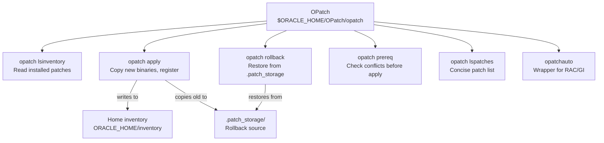

# OPatch

## Overview

**OPatch** is Oracle's patching utility — a Perl-based tool that installs and rolls back binary patches (Release Updates, Interim Patches, One-Off Patches) into an Oracle Home. It is the low-level engine that `opatchauto` (RAC/GI) and Autoupgrade use under the hood. Every DBA needs to understand OPatch's inventory model, its five most-used commands, and how to recover from a stuck apply.

OPatch handles the **binary** portion of a patch. The **SQL** portion (catalog changes) is applied separately by [Datapatch](datapatch.md) after the database is opened on the new binaries.

## Architecture



## Internal Working

### Patch Types

| Type                          | Meaning                                                                           |
| ----------------------------- | --------------------------------------------------------------------------------- |
| Release Update (RU)           | Quarterly consolidated patch (formerly PSU). Named 19.20, 19.21, etc. Cumulative. |
| Release Update Revision (RUR) | Selective backport atop the parent RU. Numbered 19.n.1.0.n.                       |
| Interim Patch                 | One-off patch for a specific bug.                                                 |
| Merge Label Request (MLR)     | Bundle of interim patches merged for a customer.                                  |
| One-Off                       | Same as interim.                                                                  |
| Combo Patch                   | RU + OJVM in one download.                                                        |

### Command Cheatsheet

| Command                                                          | Purpose                                       |
| ---------------------------------------------------------------- | --------------------------------------------- |
| `opatch version`                                                 | OPatch version                                |
| `opatch lsinventory`                                             | Full detail of installed components + patches |
| `opatch lspatches`                                               | One-line summary per patch                    |
| `opatch prereq CheckConflictAgainstOHWithDetail -ph <patch_dir>` | Conflict check                                |
| `opatch prereq CheckMinimumOPatchVersion -ph <patch_dir>`        | Version check                                 |
| `opatch apply <patch_dir>`                                       | Apply patch                                   |
| `opatch napply`                                                  | Apply multiple patches                        |
| `opatch rollback -id <patch_id>`                                 | Roll back patch                               |
| `opatch util cleanup`                                            | Clean `.patch_storage` (careful!)             |

### Applying an RU — Step by Step

```bash
# 0. Update OPatch first — every RU requires a minimum OPatch version
cd /software/RU_19.20/
unzip -q p6880880_190000_Linux-x86-64.zip -d /tmp/opatch_new
mv $ORACLE_HOME/OPatch $ORACLE_HOME/OPatch.old
mv /tmp/opatch_new/OPatch $ORACLE_HOME/
chown -R oracle:oinstall $ORACLE_HOME/OPatch

# 1. Verify OPatch version
$ORACLE_HOME/OPatch/opatch version

# 2. Unzip the patch
unzip -q /software/p35320081_190000_Linux-x86-64.zip -d /software/RU_19.20/

# 3. Conflict check
cd /software/RU_19.20/35320081/
$ORACLE_HOME/OPatch/opatch prereq CheckConflictAgainstOHWithDetail -ph ./

# 4. Shut down all databases and listeners in this ORACLE_HOME
srvctl stop database -d <db>       # RAC
lsnrctl stop LISTENER              # SI

# 5. Apply
$ORACLE_HOME/OPatch/opatch apply

# 6. Restart
srvctl start database -d <db>
lsnrctl start LISTENER

# 7. Apply SQL portion — see datapatch page
$ORACLE_HOME/OPatch/datapatch -verbose

# 8. Verify
$ORACLE_HOME/OPatch/opatch lspatches
```

### Rollback

```bash
# Identify patch IDs
$ORACLE_HOME/OPatch/opatch lspatches

# Shut down instances
srvctl stop database -d <db>

# Roll back
$ORACLE_HOME/OPatch/opatch rollback -id 35320081

# Restart + datapatch
srvctl start database -d <db>
$ORACLE_HOME/OPatch/datapatch -verbose
```

### `opatchauto` — RAC and Grid Infrastructure

`opatchauto` (in `$GRID_HOME/OPatch/`) automates patching across a cluster: stops resources on each node in turn, patches Grid Home + Database Home, then restarts. Requires root.

```bash
# Grid + DB home patching on a RAC cluster
sudo $GRID_HOME/OPatch/opatchauto apply /software/RU_19.20/35320081/

# Analyze only — dry run
sudo $GRID_HOME/OPatch/opatchauto apply /software/RU_19.20/35320081/ -analyze

# Rollback
sudo $GRID_HOME/OPatch/opatchauto rollback /software/RU_19.20/35320081/
```

## Components

| Path                               | Purpose                           |
| ---------------------------------- | --------------------------------- |
| `$ORACLE_HOME/OPatch/opatch`       | Main utility (Perl script + Java) |
| `$ORACLE_HOME/OPatch/datapatch`    | SQL portion applier               |
| `$ORACLE_HOME/inventory/`          | Local home inventory              |
| `$ORACLE_HOME/.patch_storage/`     | Prior binaries kept for rollback  |
| `$ORACLE_HOME/cfgtoollogs/opatch/` | OPatch logs                       |
| Central `oraInventory`             | Cross-home registry               |

## Important Parameters

Not database parameters — OPatch is external to the running DB. Environment matters:

| Variable            | Purpose                                                   |
| ------------------- | --------------------------------------------------------- |
| `ORACLE_HOME`       | Target home                                               |
| `PATH`              | Must include `$ORACLE_HOME/OPatch` and `$ORACLE_HOME/bin` |
| `OCM_RESPONSE_FILE` | Optional MOS registration response file                   |

## Important Views

Post-apply, in each database:

```sql
SELECT * FROM registry$history ORDER BY action_time DESC;
SELECT patch_id, patch_uid, version, action, status, action_time
FROM   dba_registry_sqlpatch
ORDER  BY action_time DESC;
```

## Diagnostic Queries

```bash
# Verify OPatch and inventory
$ORACLE_HOME/OPatch/opatch version
$ORACLE_HOME/OPatch/opatch lsinventory -detail | head -80
$ORACLE_HOME/OPatch/opatch lspatches

# Which patches are on this home?
$ORACLE_HOME/OPatch/opatch lsinventory | awk '/^Patch/'

# All logs from the most recent apply
ls -lt $ORACLE_HOME/cfgtoollogs/opatch/ | head -20
```

```sql
-- Which SQL patches has this DB seen?
SELECT patch_id, patch_uid, action, status, action_time,
       description
FROM   dba_registry_sqlpatch
ORDER  BY action_time DESC;

-- Cross-check binary vs SQL patches
SELECT bug_number, description FROM v$patches;
```

## Common Issues

- **`OPatch failed with error code 41`** — Home not shut down. Stop all databases and listeners from this home first.
- **`OPatch failed with error code 73`** — Conflict with an existing patch. Run `opatch prereq` and either roll back the conflicting patch or request a merge from Oracle Support.
- **`Prereq "CheckMinimumOPatchVersion" failed`** — Update OPatch (`p6880880`).
- **`OPatch failed with error code 104`** — Insufficient disk space in `$ORACLE_HOME`. Each patch needs GB free.
- **RAC rolling patch partial failure** — `opatchauto` leaves the cluster in a mixed state. Do not manually intervene without reading logs; run `opatchauto resume`.
- **`.patch_storage` deleted** — Rollback impossible. Prevention: never `rm -rf` inside `$ORACLE_HOME`.

## Troubleshooting

1. Log path: `$ORACLE_HOME/cfgtoollogs/opatch/opatch<timestamp>_<pid>.log`. Read from the bottom.
2. If OPatch says "Home not registered," fix with `runInstaller -attachHome`.
3. If apply fails mid-way, check the log for the last successful step. Some OPatch operations are resumable (`opatch apply -force` — dangerous, use only with Oracle Support).
4. For `opatchauto` failures in RAC, follow the resume flow: `opatchauto resume` or the explicit `rollback + apply` sequence.
5. Test patches on a scratch home first — never a first-touch on production.

## Best Practices

1. **Adopt each quarterly RU** within 90 days of release. Older RUs are unsupported.
2. Patch **out-of-place** — install a fresh Oracle Home for the new RU, move databases, keep the old home for rollback.
3. Always run `opatch prereq CheckConflictAgainstOHWithDetail -ph <patch_dir>` before apply.
4. Take an RMAN backup + copy `$ORACLE_HOME` (`tar czf oracle_home_pre_patch.tar.gz $ORACLE_HOME`) before applying.
5. Never delete `.patch_storage` — it's your rollback source.
6. Keep the OPatch utility itself up to date: `p6880880` is updated ahead of each RU cycle.
7. In RAC, use `opatchauto -analyze` first to catch problems before you touch nodes.
8. Automate patch inventory audits — quarterly diff of `opatch lsinventory` across servers reveals drift.
9. Run `datapatch -verbose` immediately after starting up on new binaries.

## Interview Questions

1. **Q:** What does OPatch do that `runInstaller` does not?
   **A:** Applies binary patches to an existing Oracle Home — RUs, one-offs, MLRs — and manages rollback via `.patch_storage`.

2. **Q:** Do you have to shut down the database to run OPatch?
   **A:** Yes — all databases and listeners running from that Oracle Home must be down (except for rolling patches applied via `opatchauto` in RAC, where one node at a time is restarted).

3. **Q:** What's the difference between OPatch and Datapatch?
   **A:** OPatch installs the binary changes; Datapatch runs the SQL catalog changes inside each database after startup on the new binaries.

4. **Q:** What is `.patch_storage`?
   **A:** The directory under `$ORACLE_HOME` where OPatch stores the pre-patch binaries so that `opatch rollback` can restore them.

5. **Q:** What does `opatchauto` do?
   **A:** Automates RAC/GI patching: stops resources, patches Grid + DB homes, restarts. Rolling by default so the cluster stays up.

6. **Q:** How do you check the applied patches on a home?
   **A:** `opatch lspatches` (short) or `opatch lsinventory` (detailed).

7. **Q:** What's the recommended out-of-place patching workflow?
   **A:** Clone the current home to a new location, patch the new home offline, then switch databases to the new home via `srvctl modify database -oh` (RAC) or restart with the new `ORACLE_HOME` (SI).

## References

- MOS Doc ID 293369.1 — OPatch Overview
- MOS Doc ID 555.1 — Latest Release Update — with links to each quarterly RU
- MOS Doc ID 2419319.1 — Gold Image / Out-of-Place Patching
- MOS Doc ID 1929745.1 — Oracle DB Software Patching Recommendations
- MOS Doc ID 274526.1 — patch conflict resolution
- Oracle OPatch User's Guide 19c
