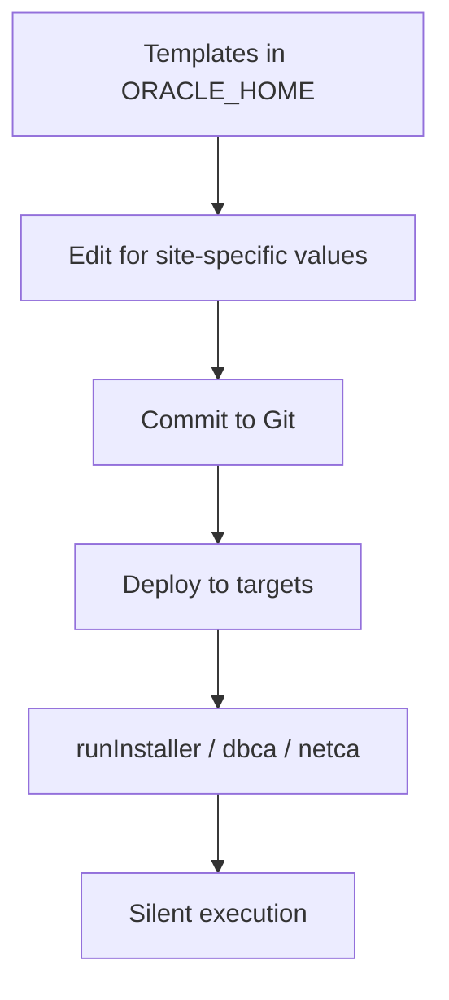

# Response Files

## Overview

A **response file** is a text file containing name=value pairs that drive Oracle's silent installers (`runInstaller`, `dbca`, `netca`, `roohctl`, `opatchauto`). It replaces every prompt an interactive installer would show. Response files are the primary artifact for automating Oracle installations and are the correct place to encode organizational standards (Oracle Base path, OS group mapping, listener name).

Oracle ships template response files inside every installer:

- **runInstaller (DB software)**: `$ORACLE_HOME/install/response/db_install.rsp` (in 19c, present in the unzipped image)
- **DBCA (database creation)**: `$ORACLE_HOME/assistants/dbca/dbca.rsp`
- **NetCA (network config)**: `$ORACLE_HOME/assistants/netca/netca.rsp`
- **Deinstall**: `$ORACLE_HOME/deinstall/response/deinstall.rsp`
- **Grid Infrastructure**: `<grid_zip>/gridSetup/gridsetup.rsp` (grid image)

## Architecture



## Internal Working

### File Format

- One `name=value` per line.
- Blank lines and `#` comments allowed.
- Section headers (`[GENERAL]`) are cosmetic in modern versions — parser reads by name.
- Passwords are cleartext by default; use `-secureResponseFile` on newer utilities or environment variables for automated password entry (never commit passwords).

### Response File Schema Compatibility

Every response file has a version. The `runInstaller` in 19.3 base image expects `oracle.install.responseFileVersion=/oracle/install/rspfmt_dbinstall_response_schema_v19.0.0`. Using a 12.2 template against a 19c installer will fail.

Regenerate a fresh template with:

```bash
$ORACLE_HOME/runInstaller -help | head -30
# The runtime template is at:
$ORACLE_HOME/install/response/db_install.rsp
```

### Categories of Parameters

Response files span three levels:

1. **Installer-level** — behavior of `runInstaller` itself.
2. **Home-level** — Oracle Base, Oracle Home path, edition, options.
3. **Configuration-level** — post-install steps (netca, dbca) if bundled.

## Components

### `db_install.rsp` — Essential Parameters

```ini
# Response File version
oracle.install.responseFileVersion=/oracle/install/rspfmt_dbinstall_response_schema_v19.0.0

# InstallEdition: EE | SE2
oracle.install.option=INSTALL_DB_SWONLY

# UNIX group configuration
UNIX_GROUP_NAME=oinstall
INVENTORY_LOCATION=/u01/app/oraInventory

# Software location
ORACLE_HOME=/u01/app/oracle/product/19.0.0/dbhome_1
ORACLE_BASE=/u01/app/oracle

# Edition
oracle.install.db.InstallEdition=EE

# Operating system groups
oracle.install.db.OSDBA_GROUP=dba
oracle.install.db.OSOPER_GROUP=oper
oracle.install.db.OSBACKUPDBA_GROUP=backupdba
oracle.install.db.OSDGDBA_GROUP=dgdba
oracle.install.db.OSKMDBA_GROUP=kmdba
oracle.install.db.OSRACDBA_GROUP=racdba

# Do NOT create a starter database — use DBCA later
oracle.install.db.rootconfig.executeRootScript=false
```

Values for `oracle.install.option`:

| Value                   | Meaning                                 |
| ----------------------- | --------------------------------------- |
| `INSTALL_DB_SWONLY`     | Install binaries only. **Recommended.** |
| `INSTALL_DB_AND_CONFIG` | Install and create a database           |
| `UPGRADE_DB`            | Upgrade an existing database            |

### `dbca.rsp` — Essential Parameters (19c)

```ini
responseFileVersion=/oracle/assistants/rspfmt_dbca_response_schema_v19.0.0

gdbName=orcl
sid=orcl
databaseConfigType=SI
templateName=General_Purpose.dbc

# Passwords - use env vars in production
sysPassword=<use_env>
systemPassword=<use_env>

# Multitenant
createAsContainerDatabase=true
numberOfPDBs=1
pdbName=orclpdb
pdbAdminPassword=<use_env>

# Storage
storageType=FS
datafileDestination=/u02/oradata
recoveryAreaDestination=/u03/fast_recovery_area
recoveryAreaSize=20480

# Memory
memoryMgmtType=AUTO_SGA
totalMemory=8192

# Character set
characterSet=AL32UTF8
nationalCharacterSet=AL16UTF16

# Listener registration
listeners=LISTENER

# Options
databaseType=MULTIPURPOSE
sampleSchema=false
```

### `netca.rsp` — Listener Setup

```ini
[GENERAL]
RESPONSEFILE_VERSION="19.0"
CREATE_TYPE="CUSTOM"

[oracle.net.ca]
INSTALL_TYPE=""typical""
LISTENER_NUMBER=1
LISTENER_NAMES={"LISTENER"}
LISTENER_PROTOCOLS={"TCP;1521"}
LISTENER_START=""LISTENER""
```

## Important Parameters

Common gotchas:

| Parameter                                        | Note                                                             |
| ------------------------------------------------ | ---------------------------------------------------------------- |
| `ORACLE_HOME`                                    | Must exist and be empty except for the unzipped image files      |
| `ORACLE_BASE`                                    | Must be readable/writable by `oracle`                            |
| `UNIX_GROUP_NAME`                                | Central inventory group — must match `/etc/group`                |
| `oracle.install.db.InstallEdition`               | `EE` or `SE2` — cannot be changed post-install without reinstall |
| `oracle.install.db.rootconfig.executeRootScript` | Set to `false` unless you passed root credentials                |

## Important Views

Not applicable — pre-database.

## Diagnostic Queries

```bash
# Compare a customized rsp to the shipped template — find differences
diff -u $ORACLE_HOME/install/response/db_install.rsp /software/db_install_ee.rsp

# Extract just the non-empty, non-comment lines from a response file
grep -v '^#' /software/db_install_ee.rsp | grep -v '^$' | sort

# Validate that no cleartext passwords are committed
grep -iE 'password' /software/db_install_ee.rsp
```

## Common Issues

- **Response file version mismatch** — `INS-32005`. Regenerate from the current installer's template.
- **`ORACLE_HOME` not empty** — `INS-32025`. Choose a different home path or clean first.
- **Group in `UNIX_GROUP_NAME` not in `/etc/group`** — installer fails silently or with `INS-08109`.
- **Password contains special chars** — SQL command injection risks if passed through response file with unquoted shell substitution. Prefer `sqlplus / as sysdba` post-install password reset over cleartext in response files.
- **`INSTALL_DB_AND_CONFIG` with missing memory params** — installer fails at DBCA phase.
- **DBCA `characterSet` typo** — `WE8ISO8859P1` is legacy; use `AL32UTF8` for new databases.

## Troubleshooting

1. Diff your response file against a fresh copy of the shipped template.
2. Run `runInstaller -silent -responseFile X.rsp -executePrereqs` — validates the file without installing.
3. `installActions.log` shows the parameter parser's interpretation of every line.
4. For DBCA, use `-noConfig` to build the SQL scripts without executing them: `dbca -silent -createDatabase -responseFile X.rsp -progressOnly`. Inspect generated scripts under `$ORACLE_BASE/admin/<db>/scripts/`.

## Best Practices

1. **Never commit passwords.** Use `-secureResponseFile` or read passwords from environment variables:

   ```bash
   export ORACLE_PWD=$(vault kv get -field=sys secret/db/prod)
   dbca -silent -createDatabase -responseFile prod.rsp \
        -sysPassword "$ORACLE_PWD" -systemPassword "$ORACLE_PWD"
   ```

2. Regenerate templates whenever you patch to a new base version.

3. Maintain one canonical response file per (version, edition, role) tuple. Do not fork per-host.

4. Commit `.rsp` files with strict permissions (`chmod 640`). Reviewers can then audit changes.

5. For DBCA in production, generate customized templates:

   ```bash
   dbca -silent -createTemplateFromDB -sourceDB //dbhost/prod \
        -templateName prod_template.dbt
   ```

6. Prefer `-createDatabase -useTemplate` from a well-known DBT template over inline parameters.

7. Test the response file end-to-end in a staging environment before production.

## Interview Questions

1. **Q:** What is a response file?
   **A:** A text file with `name=value` pairs that drives a silent Oracle installer, replacing every interactive prompt.

2. **Q:** What version of `db_install.rsp` do you use for 19c?
   **A:** `rspfmt_dbinstall_response_schema_v19.0.0`.

3. **Q:** How do you avoid committing passwords in response files?
   **A:** Pass passwords via environment variables or `-secureResponseFile`. Never commit cleartext to Git.

4. **Q:** Which parameter chooses software-only vs create-database?
   **A:** `oracle.install.option` — `INSTALL_DB_SWONLY` vs `INSTALL_DB_AND_CONFIG`.

5. **Q:** What does DBCA's `-createTemplateFromDB` do?
   **A:** Captures a live database's structure, sizing, and character set into a reusable template.

6. **Q:** Where are the shipped response file templates in a 19c home?
   **A:** `$ORACLE_HOME/install/response/db_install.rsp`, `$ORACLE_HOME/assistants/dbca/dbca.rsp`, `$ORACLE_HOME/assistants/netca/netca.rsp`.

## References

- Oracle Database Installation Guide 19c — "Installing Oracle Database Software Using Response Files"
- Oracle Database Administrator's Guide 19c — DBCA command reference
- MOS Doc ID 2418739.1 — 19c Silent Install Response File Reference
