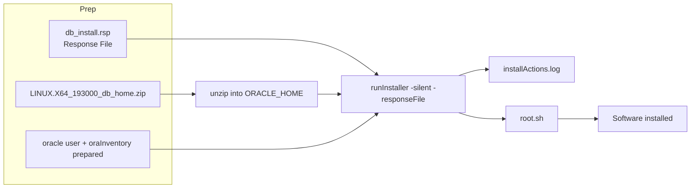

# Silent Installation

## Overview

Silent installation runs `runInstaller` without a GUI, driven entirely by a **response file** (`.rsp`) that specifies every choice the interactive installer would ask. It is the only supported install mode for automated deployments — Ansible, Puppet, Terraform + cloud-init, or Jenkins pipelines all invoke silent install.

Silent install is:

- **Reproducible** — same response file produces the same home.
- **Version-controllable** — commit `.rsp` files to Git.
- **Fast** — no X11 round trips, no click delay.
- **Auditable** — the response file is a complete record of the install decisions.

## Architecture



## Internal Working

### Prerequisites Same as GUI

The silent installer uses the exact same CVU and copy logic — it just skips the UI. All prerequisites from [Installation Prerequisites](installation-prerequisites.md) apply.

### 19c Install Model — Image-Based

19c changed the install model. Instead of unzipping to a staging area and running `runInstaller` from there, you unzip the ZIP **directly into `$ORACLE_HOME`** and run `runInstaller` from the home:

```bash
# 1. Prepare the target home
mkdir -p /u01/app/oracle/product/19.0.0/dbhome_1
chown -R oracle:oinstall /u01/app/oracle
chmod -R 775 /u01/app/oracle

# 2. Unzip the image into the home
su - oracle -c '
cd /u01/app/oracle/product/19.0.0/dbhome_1
unzip -q /software/LINUX.X64_193000_db_home.zip
'
```

### Running Silent Install

```bash
su - oracle -c '
export ORACLE_HOME=/u01/app/oracle/product/19.0.0/dbhome_1
cd $ORACLE_HOME
./runInstaller -silent \
    -responseFile /software/db_install_19c.rsp \
    -ignorePrereqFailure \
    -showProgress
'
```

Then run root scripts as root:

```bash
/u01/app/oraInventory/orainstRoot.sh   # only if central inventory is new
/u01/app/oracle/product/19.0.0/dbhome_1/root.sh
```

### Common Command-Line Flags

| Flag                                               | Purpose                                       |
| -------------------------------------------------- | --------------------------------------------- |
| `-silent`                                          | No UI                                         |
| `-responseFile <path>`                             | Response file with parameter values           |
| `-ignorePrereqFailure`                             | Continue past CVU failures                    |
| `-showProgress`                                    | Print percentage to stdout                    |
| `-noconfig`                                        | Skip post-install configuration (netca, dbca) |
| `-executePrereqs`                                  | Only run CVU, do not install                  |
| `-createGoldImage`                                 | Package the current home as a gold image ZIP  |
| `-attachHome ORACLE_HOME=... ORACLE_HOME_NAME=...` | Register a home into the central inventory    |
| `-detachHome ORACLE_HOME=...`                      | Remove home from central inventory            |
| `-deinstall`                                       | Uninstall the home                            |

### After Install: Apply Latest RU

Best practice is to install the base 19.3, then immediately apply the latest RU and OJVM (Oracle Java VM) patch before creating any database. See [OPatch](opatch.md) and [Datapatch](datapatch.md).

## Components

| Component                    | Role                            |
| ---------------------------- | ------------------------------- |
| Response file (`.rsp`)       | All input values                |
| `runInstaller` script        | Silent installer entry point    |
| CVU (`cluvfy`)               | Prerequisite validator          |
| Central inventory            | Tracks the newly installed home |
| `root.sh` / `orainstRoot.sh` | Post-copy root actions          |

## Important Parameters

Silent-install parameters are declared in the response file — see [Response Files](response-files.md) for the full parameter list. The `-` command line flags above are the runtime knobs.

## Important Views

Not applicable — pre-database. After install, `V$VERSION` confirms the target.

## Diagnostic Queries

```bash
# Check that ORACLE_HOME is registered
cat /u01/app/oraInventory/ContentsXML/inventory.xml \
   | grep -A1 "$ORACLE_HOME"

# Check the install actions log for errors
LATEST_LOG=$(ls -t /u01/app/oraInventory/logs/installActions*.log | head -1)
grep -iE 'error|fail|warn' "$LATEST_LOG" | head -50

# Confirm software version and patchset
$ORACLE_HOME/OPatch/opatch lsinventory | head -30
```

## Common Issues

- **`[FATAL] [INS-10101] The Oracle Home location contains spaces`** — Path names cannot contain spaces.
- **`[FATAL] [INS-32025] The chosen installation conflicts with software already installed`** — Home directory not empty (previous failed install). Clean the directory or use a fresh path.
- **`[FATAL] [INS-08109] Unexpected error occurred while validating inputs`** — Response file syntax error. Check `installActions.log` for the offending line.
- **`Failed to create directory /u01/app/oraInventory`** — Central inventory can't be written. Permissions or SELinux.
- **CVU failures** — Read them carefully. `Physical Memory: Failed` on a small VM is a genuine warning; `resolv.conf: Failed` on a well-configured host is often a false positive tied to search-order oddities.
- **`root.sh` fails on `orainstRoot.sh` step** — The oraInventory path in `oraInst.loc` differs from what the installer used. Delete `/etc/oraInst.loc` and retry.

## Troubleshooting

1. Every silent install writes a log to `$ORACLE_BASE/oraInventory/logs/`. Read the latest.
2. If the installer exits nonzero, echo `$?` and check the log's tail for `Session Failed`.
3. For a fresh restart, deinstall cleanly: `$ORACLE_HOME/deinstall/deinstall -silent -paramfile /tmp/deinstall.rsp`.
4. For a partial install where deinstall fails, manually remove `$ORACLE_HOME`, edit `oraInventory/ContentsXML/inventory.xml` to remove the home, and clean up `/etc/oratab`.
5. Confirm the response file version matches the installer version — old `.rsp` files fail against new installers.

## Best Practices

1. **Automate with Ansible** or equivalent — silent install shines in idempotent playbooks.
2. Version-control the response file. Reviewers should be able to see every install choice.
3. Do _Software Only_ installs. Use [DBCA](dbca.md) separately for database creation.
4. Patch the home immediately after install and _before_ any database is created.
5. Build gold images once patched — deploy to N servers with `unzip` + `runInstaller -silent`.
6. Store response files by version and role: `db_install_19c_ee.rsp`, `db_install_19c_se2.rsp`.
7. Validate with `opatch lsinventory` and `chopt list` immediately after install.

## Ansible Skeleton

```yaml
- name: Prepare Oracle 19c home directory
  file:
    path: /u01/app/oracle/product/19.0.0/dbhome_1
    state: directory
    owner: oracle
    group: oinstall
    mode: "0775"
    recurse: yes

- name: Unzip 19c image into ORACLE_HOME
  unarchive:
    src: /software/LINUX.X64_193000_db_home.zip
    dest: /u01/app/oracle/product/19.0.0/dbhome_1
    remote_src: yes
    owner: oracle
    group: oinstall

- name: Copy response file
  copy:
    src: files/db_install_19c.rsp
    dest: /tmp/db_install_19c.rsp
    owner: oracle
    group: oinstall
    mode: "0640"

- name: Run silent install
  become: yes
  become_user: oracle
  command: >
    /u01/app/oracle/product/19.0.0/dbhome_1/runInstaller
      -silent -responseFile /tmp/db_install_19c.rsp
      -ignorePrereqFailure -showProgress
  register: install_result
  failed_when: install_result.rc not in [0, 6] # 6 = successful with warnings

- name: Run orainstRoot.sh
  command: /u01/app/oraInventory/orainstRoot.sh
  when: install_result.rc in [0, 6]

- name: Run root.sh
  command: /u01/app/oracle/product/19.0.0/dbhome_1/root.sh
```

## Interview Questions

1. **Q:** What is the advantage of silent installation?
   **A:** Reproducibility, automation-friendliness, version-control of install decisions, no X11 dependency.

2. **Q:** In 19c, where do you unzip the software?
   **A:** Directly into `$ORACLE_HOME`. 19c uses the image-based install model.

3. **Q:** What are the two mandatory root scripts?
   **A:** `orainstRoot.sh` (first install on server) and `$ORACLE_HOME/root.sh` (every install).

4. **Q:** What does `-showProgress` do?
   **A:** Displays completion percentage to stdout during a silent install.

5. **Q:** When does the installer return exit code 6?
   **A:** Successful install with warnings. Treat as success for most automation.

6. **Q:** How do you create a gold image?
   **A:** `$ORACLE_HOME/runInstaller -silent -createGoldImage -destinationLocation <zip>`.

7. **Q:** How do you validate the install afterwards?
   **A:** `$ORACLE_HOME/OPatch/opatch lsinventory` shows the components and patches; `chopt list` shows linked-in options.

## References

- Oracle Database Installation Guide 19c for Linux — "Installing Oracle Database Software Only"
- MOS Doc ID 2418739.1 — 19c Installation Steps
- MOS Doc ID 1587357.1 — Master Note for 19c Installation
- MOS Doc ID 2419319.1 — Creating a Gold Image
