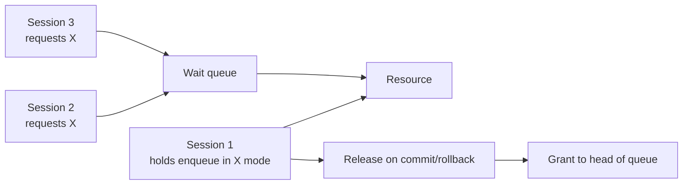

# Enqueue Locks

## Overview

**Enqueues** are Oracle's user-level locks — the ones that block SQL waiting on rows, tables, sequences, or other database objects. Unlike latches (short, non-queued), enqueues are queued: sessions wait in an ordered queue until the resource is available, in the requested mode.

Every wait event beginning with `enq:` is an enqueue wait. The two most common are `enq: TX - row lock contention` (transaction-level row lock) and `enq: TM - contention` (table DML lock).

## Architecture



## Internal Working

### Enqueue Naming

Each enqueue has a two-character type code:

| Type | Purpose                                                 |
| ---- | ------------------------------------------------------- |
| `TX` | Transaction lock (row-level)                            |
| `TM` | DML lock (table-level)                                  |
| `TS` | Temporary segment                                       |
| `UL` | User lock (`dbms_lock`)                                 |
| `HW` | High Water Mark                                         |
| `SS` | Sort segment                                            |
| `CF` | Control file transaction                                |
| `RO` | Multi-object reuse (like `TRUNCATE` on flushed buffers) |
| `SQ` | Sequence cache                                          |
| `US` | Undo segment                                            |
| `TD` | DDL                                                     |
| `PS` | Parallel Slave                                          |

Full list: `V$LOCK_TYPE`.

### Modes

Requested / held in one of six modes:

| Value | Mode      | Meaning             |
| ----- | --------- | ------------------- |
| 0     | None      | —                   |
| 1     | Null      | Semaphore           |
| 2     | RS (SS)   | Row Share           |
| 3     | RX (SX)   | Row Exclusive       |
| 4     | S         | Share               |
| 5     | SRX (SSX) | Share Row Exclusive |
| 6     | X         | Exclusive           |

TX in exclusive mode = row-level lock on an actual row.

### Row Locks (`TX`)

Oracle does not maintain a table of row locks in memory. Instead, each modified row's block header (ITL slot) records the transaction ID (`XID`) of the modifier. Any reader consults the ITL to determine visibility. Any writer wanting the same row queues on the modifier's TX enqueue.

Consequence: **row locks are unlimited** — they cost nothing beyond the ITL slot. There's no "lock escalation" like SQL Server.

## Components

- Enqueue tables in the SGA
- ITL slots in block headers (for TX)
- Wait queues per resource

## Important Parameters

| Parameter                  | Purpose                               |
| -------------------------- | ------------------------------------- |
| `distributed_lock_timeout` | Distributed txn timeout (default 60s) |
| `_enqueue_locks`           | (hidden) cap on lock slots            |
| `_enqueue_resources`       | (hidden) cap on resources             |

Modern versions auto-size these.

## Important Views

| View                          | Purpose                         |
| ----------------------------- | ------------------------------- |
| `V$LOCK`                      | Every enqueue held/requested    |
| `V$LOCKED_OBJECT`             | TX/TM locks with object mapping |
| `V$LOCK_TYPE`                 | Enqueue type reference          |
| `V$SESSION`                   | `blocking_session` column       |
| `V$ENQUEUE_STAT`              | Per-type enqueue statistics     |
| `DBA_BLOCKERS`, `DBA_WAITERS` | Blocker/waiter mapping          |
| `V$TRANSACTION`               | Current transactions            |

## Diagnostic Queries

```sql
-- Any blockers right now?
SELECT s.sid, s.serial#, s.username, s.status,
       s.blocking_session, s.event, s.seconds_in_wait,
       s.sql_id
FROM   v$session s
WHERE  s.blocking_session IS NOT NULL
ORDER  BY s.seconds_in_wait DESC;

-- Blocking tree
SELECT LPAD(' ', LEVEL*2) || s.sid AS chain,
       s.username, s.status, s.event, s.seconds_in_wait
FROM   v$session s
START WITH s.blocking_session IS NULL AND s.sid IN (
  SELECT blocking_session FROM v$session WHERE blocking_session IS NOT NULL)
CONNECT BY PRIOR s.sid = s.blocking_session;

-- TX lock detail
SELECT l.sid, l.type, l.lmode, l.request, l.id1, l.id2, l.block,
       s.username, s.machine
FROM   v$lock l JOIN v$session s ON l.sid = s.sid
WHERE  l.type = 'TX'
ORDER  BY l.sid;

-- Enqueue stats
SELECT eq_type, total_req#, total_wait#, succ_req#,
       failed_req#, cum_wait_time
FROM   v$enqueue_stat
WHERE  total_wait# > 0
ORDER  BY cum_wait_time DESC;
```

## Common Issues

- **`enq: TX - row lock contention`** — Row already locked by another (uncommitted) transaction. Blocker must commit or rollback.
- **`enq: TX - allocate ITL entry`** — Block header has no free ITL slot. Fix: rebuild segment with `INITRANS` higher (10, 20+).
- **`enq: TX - index contention`** — Multiple sessions inserting into the same leaf block of an ascending-key index (e.g., sequence). Fix: reverse key or hash partitioned index.
- **`enq: TM - contention`** — Table-level DML lock; usually because someone is running unindexed FK-referencing DML.
- **`enq: HW - contention`** — High Water Mark contention on parallel inserts; use ASSM or partitioning.
- **`enq: SQ - contention`** — Sequence cache contention; increase `CACHE`.
- **Deadlock `ORA-00060`** — Circular wait. Alert log records the trace file.

## Troubleshooting

1. `V$SESSION.BLOCKING_SESSION` immediately tells you the blocker's SID.
2. Chase the chain — the ultimate blocker is a session with no `blocking_session`.
3. `V$SQL` for the blocker's `sql_id` — see what it's doing (or waiting on!).
4. For deadlocks, the trace file under ADR contains the deadlock graph and the participating SQL.
5. Kill blockers: `ALTER SYSTEM KILL SESSION 'sid,serial#' IMMEDIATE;`.

## Best Practices

1. **Always commit or rollback promptly**. Don't leave transactions open across user think-time.
2. Set `INITRANS=10+` for tables with heavy concurrent DML.
3. Index all foreign key columns — prevents `enq: TM` contention on parent DML.
4. For sequences, `CACHE 1000+ NOORDER`.
5. For hot ascending-key indexes, consider reverse-key or hash partitioning.
6. Configure `ORA-00060` deadlock alerting — deadlocks should be rare.
7. Use SELECT ... FOR UPDATE **NOWAIT** or **SKIP LOCKED** to avoid indefinite waits.
8. Set `RESOURCE_MANAGER` group timeouts to auto-kill idle-in-transaction sessions.

## Interview Questions

1. **Q:** What is an enqueue?
   **A:** An Oracle user-level lock. Queued with wait modes. Distinct from a latch.

2. **Q:** Where does Oracle store row locks?
   **A:** In the ITL (Interested Transaction List) slots in each modified block's header — not in memory. Row locks cost nothing.

3. **Q:** Difference between TX and TM?
   **A:** TX = transaction (row-level) lock. TM = DML lock (table-level).

4. **Q:** What causes `enq: TX - allocate ITL entry`?
   **A:** Insufficient ITL slots in the block header for concurrent modifiers. Increase `INITRANS`.

5. **Q:** How do you find who is blocking?
   **A:** `SELECT sid, blocking_session, event, sql_id FROM v$session WHERE blocking_session IS NOT NULL;`.

6. **Q:** What is Oracle's deadlock detection?
   **A:** Every few seconds Oracle walks lock chains; if a cycle is detected, one session gets `ORA-00060` and its transaction rolls back its current statement.

7. **Q:** What is `NOWAIT`?
   **A:** `SELECT ... FOR UPDATE NOWAIT` returns immediately with `ORA-00054` if the row is locked, instead of waiting.

## References

- Oracle Database Concepts 19c — Data Concurrency and Consistency
- Oracle Database Reference 19c — V$LOCK, V$ENQUEUE_STAT
- MOS Doc ID 62354.1 — TX Enqueue Deep Dive
- MOS Doc ID 15476.1 — TM Contention
- Runbook: [Blocking Sessions](../../27-runbooks/blocking-sessions.md)
