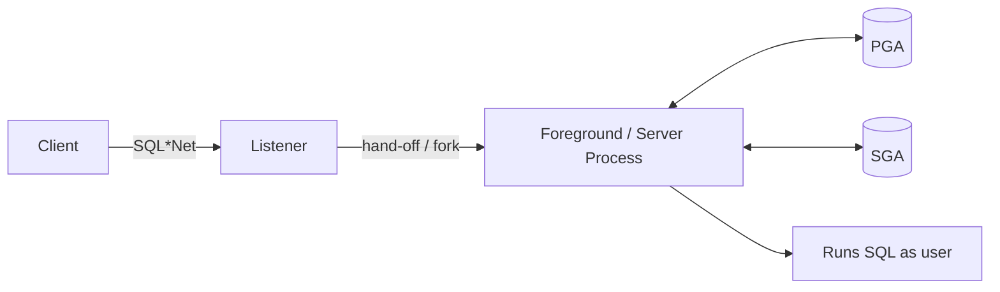

# Foreground Processes

## Overview

A **foreground process** (also called a **server process**) is the Oracle process that executes SQL on behalf of a user session. Every dedicated-server connection gets its own foreground process; the OS-level process is named `oracle<sid>` or `oracle<sid> (LOCAL=NO)`. Foregrounds allocate a PGA, attach to the SGA, and spend their time parsing, executing, and fetching data.

## Architecture



## Internal Working

### Life Cycle

1. **Client connects** — listener spawns (or hands off) a foreground.
2. **Session setup** — allocate PGA, register in `V$SESSION` / `V$PROCESS`, run login triggers.
3. **Execute** — for each SQL: parse (library cache lookup), execute, fetch.
4. **Idle** — foreground waits on `SQL*Net message from client` (idle wait).
5. **Disconnect** — session teardown, PMON releases resources.

### Dedicated vs Shared

- **Dedicated Server** — 1 foreground per session. Default and preferred for most workloads.
- **Shared Server** — dispatchers + shared servers; UGA lives in SGA. Used for very high connection counts with mostly idle sessions.

### Wait Events

Foregrounds report wait events to `V$SESSION_WAIT` and (via MMNL sampling) to ASH. Non-idle waits are the DBA's tuning target.

## Components

| Component         | Purpose                                  |
| ----------------- | ---------------------------------------- |
| PGA               | Private memory                           |
| UGA               | Session state (in PGA for dedicated)     |
| Cursor state      | Bind vars, execution context             |
| Session variables | `V$SESSION.username`, `module`, `action` |

## Important Parameters

| Parameter                  | Purpose                                         |
| -------------------------- | ----------------------------------------------- |
| `processes`                | Max OS processes (upper bound on sessions)      |
| `sessions`                 | Max sessions (default = `processes × 1.5 + 22`) |
| `open_cursors`             | Per-session cursor cap                          |
| `session_cached_cursors`   | Session cursor cache                            |
| `dedicated_through_broker` | Force dedicated even under shared listener      |

## Important Views

| View                     | Purpose                                    |
| ------------------------ | ------------------------------------------ |
| `V$SESSION`              | All sessions                               |
| `V$PROCESS`              | All OS processes (background + foreground) |
| `V$SESSION_WAIT`         | Current wait per session                   |
| `V$SESSTAT`, `V$SESS_IO` | Per-session counters                       |
| `V$SESSION_LONGOPS`      | Long-running operations                    |

## Diagnostic Queries

```sql
-- Every active foreground and what it's doing
SELECT s.sid, s.serial#, s.username, s.status, s.machine,
       s.module, s.program, s.sql_id, s.event, s.seconds_in_wait
FROM   v$session s
WHERE  s.type = 'USER' AND s.status = 'ACTIVE'
ORDER  BY s.seconds_in_wait DESC;

-- Long-running operations
SELECT sid, opname, target, sofar, totalwork,
       ROUND(sofar/totalwork*100, 1) AS pct,
       elapsed_seconds, time_remaining
FROM   v$session_longops
WHERE  sofar <> totalwork
ORDER  BY start_time DESC;

-- Sessions consuming most PGA
SELECT s.sid, s.username, s.program,
       ROUND(p.pga_used_mem/1024/1024, 1) AS pga_used_mb,
       ROUND(p.pga_max_mem/1024/1024, 1)  AS pga_max_mb
FROM   v$session s JOIN v$process p ON s.paddr = p.addr
WHERE  s.type = 'USER'
ORDER  BY p.pga_used_mem DESC
FETCH FIRST 20 ROWS ONLY;
```

## Common Issues

- **`ORA-00020: maximum number of processes exceeded`** — `processes` cap hit. Enlarge and restart, or kill idle sessions.
- **Zombie sessions** — Killed but not fully cleaned up. Kill at OS level (`kill -9 <spid>`).
- **PGA runaway** — A session's PGA grows large; hits `pga_aggregate_limit` → killed with warning.
- **Session leak from app** — Connections not closed. Watch `V$SESSION.last_call_et` climbing to hours/days.

## Troubleshooting

1. `SELECT p.spid FROM v$session s JOIN v$process p ON s.paddr=p.addr WHERE s.sid=X;` — get OS PID for a session.
2. `pstack <spid>` — OS-level stack.
3. `oradebug setospid <spid>; oradebug short_stack;` — Oracle stack.
4. Kill within Oracle: `ALTER SYSTEM KILL SESSION 'sid,serial#' IMMEDIATE;`.
5. Kill at OS if PMON is slow: `kill -9 <spid>` (last resort).

## Best Practices

1. Size `processes` at least 20% higher than expected peak — leaves headroom for background changes.
2. Use connection pooling in applications; do not open-close per operation.
3. Enable `session_cached_cursors` (100–200) — cheap parse-time savings.
4. Set application `MODULE` and `ACTION` for tracing (`DBMS_APPLICATION_INFO`).
5. Monitor `V$SESSION.last_call_et` for idle-forever sessions.
6. Alert on `ORA-00020`.

## Interview Questions

1. **Q:** What is a foreground process?
   **A:** The Oracle server process handling SQL for a user session. One per session in dedicated-server mode.

2. **Q:** Dedicated vs shared server?
   **A:** Dedicated: 1 foreground per session. Shared: dispatchers + shared servers, UGA in SGA — for high connection counts with idle sessions.

3. **Q:** Where does session state (UGA) live?
   **A:** Inside PGA for dedicated servers; inside the large pool (SGA) for shared servers.

4. **Q:** How do you kill a session?
   **A:** `ALTER SYSTEM KILL SESSION 'sid,serial#' IMMEDIATE;`. OS-level `kill -9 <spid>` if PMON can't clean up.

5. **Q:** What is `ORA-00020`?
   **A:** Max `processes` reached — no new sessions accepted until existing ones close.

## References

- Oracle Database Concepts 19c — Process Architecture
- Oracle Database Performance Tuning Guide 19c — Session and Cursor Management
- MOS Doc ID 111160.1 — Resolving ORA-00020
