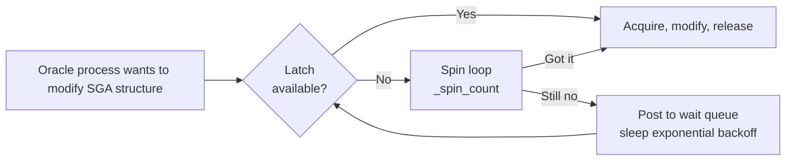

# Latches

## Overview

A **latch** is a lightweight, short-duration serialization primitive Oracle uses to protect access to shared memory structures inside the SGA. Latches differ from user-level locks: they are held for microseconds, they cannot be queued (a session either gets the latch or spins/sleeps), and they exist entirely for internal engine bookkeeping.

Diagnosing latch contention is a DBA staple. `latch: cache buffers chains`, `latch: library cache`, and `latch: shared pool` are canonical symptoms of hot blocks, unshared SQL, and shared pool pressure respectively.

## Architecture



## Internal Working

### Latch Types

- **Willing-to-wait** — if latch unavailable, spin briefly, then sleep and retry. Most latches are this type.
- **No-wait (`latch: sga`)** — try once; if not available, take alternative action (e.g., try another child latch). Used by libraries walking multiple candidate latches.

### Spin Then Sleep

Oracle first **spins** (`_spin_count = 2000` default) — a tight loop checking if the latch became free. Rationale: latches are held for microseconds; spinning on multi-CPU beats context-switching. If spin fails, the process sleeps a few ms and retries.

### Child Latches

Many latches have **child latches** — multiple instances of the same latch protecting different partitions. `cache buffers chains` has thousands of children (one per hash bucket group). `V$LATCH` shows parent totals; `V$LATCH_CHILDREN` shows per-child stats.

### Wait Event Names

- `latch free` — legacy (older versions).
- `latch: <latch_name>` — modern; specific latch name given.

## Components

Latches are per-latch data structures. Some notable ones:

| Latch                     | Protects                      |
| ------------------------- | ----------------------------- |
| `cache buffers chains`    | Buffer cache hash buckets     |
| `cache buffers lru chain` | LRU list                      |
| `library cache`           | Legacy — library cache (10g)  |
| `shared pool`             | Free lists in the shared pool |
| `redo allocation`         | Redo log buffer allocation    |
| `redo copy`               | Copying redo into log buffer  |
| `session allocation`      | UGA/session slot allocation   |
| `enqueues`                | Enqueue lock structures       |
| `row cache objects`       | Dictionary cache              |

## Important Parameters

| Parameter        | Purpose                                     |
| ---------------- | ------------------------------------------- |
| `_spin_count`    | Spin iterations before sleep (default 2000) |
| `_latch_class_n` | (hidden) per-class spin overrides           |

Note: Do not tune `_spin_count` without Oracle Support recommendation — most contention has an application-layer root cause.

## Important Views

| View               | Purpose                                   |
| ------------------ | ----------------------------------------- |
| `V$LATCH`          | Parent latch stats: gets, misses, sleeps  |
| `V$LATCH_CHILDREN` | Per-child latch stats                     |
| `V$LATCHNAME`      | Latch numbers ↔ names                     |
| `V$LATCH_HOLDER`   | Which session holds each latch (snapshot) |
| `V$LATCH_MISSES`   | Where in code the miss occurred           |

## Diagnostic Queries

```sql
-- Top latches by sleeps (indication of contention)
SELECT name, gets, misses, sleeps,
       ROUND(sleeps/DECODE(misses,0,1,misses)*100, 2) AS sleep_pct_of_miss,
       ROUND(misses/DECODE(gets,0,1,gets)*100, 4) AS miss_pct
FROM   v$latch
ORDER  BY sleeps DESC
FETCH FIRST 15 ROWS ONLY;

-- Wait events showing latch: X
SELECT event, total_waits, time_waited, average_wait
FROM   v$system_event
WHERE  event LIKE 'latch:%'
ORDER  BY time_waited DESC;

-- Who is holding a latch right now?
SELECT h.pid, h.sid, l.name AS latch_name
FROM   v$latchholder h JOIN v$latch l ON l.addr = h.laddr;

-- Which child of cache buffers chains is hot?
SELECT addr, gets, misses, sleeps, immediate_gets, immediate_misses
FROM   v$latch_children
WHERE  name = 'cache buffers chains'
ORDER  BY sleeps DESC
FETCH FIRST 10 ROWS ONLY;
```

## Common Issues

- **`latch: cache buffers chains`** — Hot block. A specific block is accessed too often; multiple sessions collide on the hash bucket latch. Fix: reduce access frequency (better index, sequence caching, partitioning) or spread with hash partitioning.
- **`latch: shared pool`** — Shared pool free list contention; usually indicates hard-parse storm from literal SQL. Fix bind variables.
- **`latch: library cache` (10g)** — Old-school library cache serialization; largely replaced by mutexes in 11g+.
- **`latch: redo allocation`** — Redo copy hot spot; usually resolved with `_log_parallelism_max` in 11g/12c on large systems.
- **`latch: enqueues`** — High enqueue traffic; look at `V$ENQUEUE_STAT`.
- **`latch: In memory undo latch`** — IMU (In-Memory Undo) hot; disable IMU as a last resort.

## Troubleshooting

1. Which latch appears in `V$SYSTEM_EVENT` as top wait?
2. `V$LATCH_MISSES` shows the code location.
3. For `cache buffers chains`, find the hot block:
   ```sql
   SELECT * FROM v$latch_children WHERE name = 'cache buffers chains'
   ORDER BY sleeps DESC;
   ```
   Correlate `ADDR` with block address (see MOS 163424.1 for the algorithm).
4. Then find which SQL touches the block: correlate `sql_id` from ASH.
5. Address root cause in application logic (fewer accesses, hash spread, index change).

## Best Practices

1. Latch contention is almost always an application design symptom, not a database bug.
2. Do not tune `_spin_count` blindly.
3. Use bind variables — most `latch: shared pool` incidents disappear with them.
4. For sequence-driven hot blocks, use `CACHE 1000+ NOORDER` and/or reverse-key index.
5. Partition write-heavy tables to spread block access.
6. Monitor top waits in AWR; anything `latch:*` in top 5 warrants investigation.

## Interview Questions

1. **Q:** What is a latch?
   **A:** A lightweight SGA-internal serialization primitive. Held for microseconds. No queue.

2. **Q:** What's the difference between a latch and an enqueue?
   **A:** Latches serialize very short, internal operations; not queued. Enqueues (locks) serialize longer, user-level operations; queued with wait modes.

3. **Q:** What causes `latch: cache buffers chains`?
   **A:** Hot block — many sessions accessing the same block through the same hash bucket.

4. **Q:** What does `latch: shared pool` usually indicate?
   **A:** Hard-parse storm; SQL is not sharing due to literals.

5. **Q:** Latch vs mutex — which is newer?
   **A:** Mutex — introduced in 11g for library cache concurrency; finer-grained than a single library cache latch.

6. **Q:** What is `_spin_count`?
   **A:** Iterations to spin before sleeping when waiting on a latch. Default 2000.

## References

- Oracle Database Concepts 19c — Latches
- Oracle Database Performance Tuning Guide 19c — Latch and Mutex Contention
- MOS Doc ID 62143.1 — Diagnosing Latch Contention
- MOS Doc ID 163424.1 — Cache Buffers Chains Latch Analysis
- Tanel Poder — Latch and mutex deep dives
