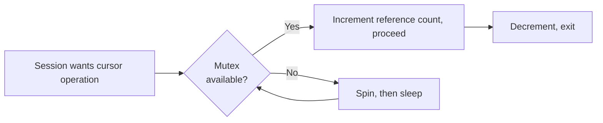

# Mutexes

## Overview

A **mutex** is a lighter-weight serialization primitive than a latch. Introduced in Oracle 11g for the library cache, mutexes protect individual cursors and library cache objects with finer granularity than the old `library cache` latch. Mutex contention shows up as `library cache: mutex X` and `cursor: pin S wait on X` — symptomatic of hot cursors, parent-child cursor churn, or excessive object invalidations.

## Architecture



## Internal Working

### Mutex Modes

- **Shared (S)** — multiple readers; increments a reference count.
- **Exclusive (X)** — single writer; requires ref count = 0.

Semantics:

- Getting a mutex in S is very cheap — atomic compare-and-swap (CAS).
- Getting in X requires the ref count to be 0, then CAS.
- Spin loop before sleep; longer than latch spin because mutex hold times can be a bit longer.

### Wait Events

- `cursor: pin S` — waiting for shared mutex (read).
- `cursor: pin X` — waiting for exclusive mutex.
- `cursor: pin S wait on X` — a shared wait blocked by an exclusive holder.
- `library cache: mutex X` — library cache handle mutex.

### KGX Mutex Framework

Oracle's mutex infrastructure is called **KGX**. It supports:

- Reference-count operations (S)
- Exclusive lock (X)
- Wait-post lists

## Components

Mutex-protected objects:

- Cursors (both parent and child)
- Library cache handles
- Cursor pins
- Object heaps

## Important Parameters

| Parameter            | Purpose                                     |
| -------------------- | ------------------------------------------- |
| `_kks_use_mutex_pin` | (hidden) enables mutex-based cursor pinning |
| `_mutex_wait_scheme` | Waiting scheme (default fine)               |
| `_mutex_spin_count`  | Spin iterations                             |

Do not change hidden params without Support.

## Important Views

| View                    | Purpose                                       |
| ----------------------- | --------------------------------------------- |
| `V$MUTEX_SLEEP`         | Per-mutex sleep counts by location            |
| `V$MUTEX_SLEEP_HISTORY` | Recent mutex sleeps with blocker/blockee info |
| `V$SESSION_WAIT`        | Sessions waiting on mutex                     |

## Diagnostic Queries

```sql
-- Top mutex sleeps
SELECT mutex_type, location, sleeps, gets
FROM   v$mutex_sleep
ORDER  BY sleeps DESC
FETCH FIRST 20 ROWS ONLY;

-- Recent sleep events with SIDs
SELECT sleep_timestamp, mutex_type, location,
       requesting_session, blocking_session, mutex_identifier
FROM   v$mutex_sleep_history
ORDER  BY sleep_timestamp DESC
FETCH FIRST 20 ROWS ONLY;

-- Wait events
SELECT event, total_waits, time_waited, average_wait
FROM   v$system_event
WHERE  event LIKE 'cursor:%' OR event LIKE 'library cache:%'
ORDER  BY time_waited DESC;

-- Sessions currently waiting
SELECT sid, event, p1raw AS hash, p2 AS mutex_val, seconds_in_wait
FROM   v$session_wait
WHERE  event LIKE 'cursor:%';
```

## Common Issues

- **`cursor: pin S wait on X`** — A session tried to modify a cursor another session is reading. Common with parent cursor being invalidated (stats change, DDL) while sessions hold shared pins.
- **`library cache: mutex X`** — Multiple sessions parsing the same statement; also common with high child cursor counts.
- **Excessive child cursor counts** — Look at `V$SQL_SHARED_CURSOR` for the sql_id.
- **DBMS_STATS causing invalidations** — `NO_INVALIDATE=>TRUE` prevents immediate invalidation of dependent cursors.

## Troubleshooting

1. Identify hot cursor from `V$MUTEX_SLEEP_HISTORY`.
2. Correlate `MUTEX_IDENTIFIER` (which is sql_id hash) with `V$SQL`.
3. Check `V$SQL.EXECUTIONS`, `PARSE_CALLS`, `LOADS`, `INVALIDATIONS`, `CHILD_LATCH`.
4. If many child cursors, `V$SQL_SHARED_CURSOR` shows why.
5. Consider making statement schema-neutral (`SESSION_CACHED_CURSORS` helps).

## Best Practices

1. Bind variables everywhere — reduces cursor pressure.
2. `DBMS_STATS.GATHER_TABLE_STATS(..., no_invalidate=>DBMS_STATS.AUTO_INVALIDATE)` — spreads invalidation over hours instead of instant.
3. Reduce hard parses; enable `session_cached_cursors=100+`.
4. Reduce DDL in production; each DDL invalidates dependent cursors.
5. Monitor `V$SQL.EXECUTIONS_DELTA` per snapshot to catch statement patterns.
6. Alert on `cursor: pin S wait on X` climbing.

## Interview Questions

1. **Q:** What is a mutex vs a latch?
   **A:** Both are lightweight serialization. Mutex is finer-grained (per-cursor), introduced in 11g for the library cache. Latch is coarser and older.

2. **Q:** What does `cursor: pin S wait on X` indicate?
   **A:** A shared pin waiter blocked by an exclusive pin holder — typically a session tried to invalidate a cursor that another session was reading.

3. **Q:** How do you find a hot mutex?
   **A:** `V$MUTEX_SLEEP` shows sleeps per location; `V$MUTEX_SLEEP_HISTORY` gives per-event detail.

4. **Q:** What causes library cache mutex contention?
   **A:** Highly concurrent parsing of the same or similar statements; excessive child cursors.

5. **Q:** How does `no_invalidate` help?
   **A:** DBMS_STATS with `no_invalidate=AUTO` invalidates dependent cursors over ~5 hours instead of immediately, avoiding a hard-parse storm.

## References

- Oracle Database Concepts 19c — Mutexes
- MOS Doc ID 1341736.1 — Diagnosing Cursor Mutex Waits
- MOS Doc ID 1298015.1 — cursor: pin S wait on X
- Tanel Poder — Mutex deep dives
