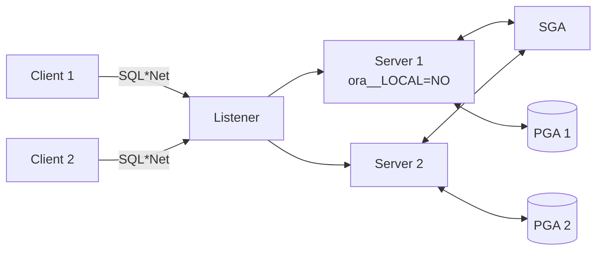
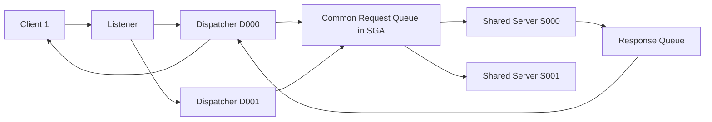

# Server Processes — Dedicated vs Shared

## Overview

Oracle has two client-server connection models:

- **Dedicated Server** — one server (foreground) process per client session. Default. Preferred for most workloads.
- **Shared Server** — a small pool of shared server processes served by dispatchers. Sessions borrow servers only when they have work.

Shared server was popular in 8i/9i era to reduce OS process counts. Modern hardware, larger RAM, and connection pooling have made shared server niche — you'll see it primarily for legacy apps or specific high-concurrency-idle scenarios.

## Architecture

### Dedicated



### Shared



## Internal Working

### Dedicated

- Listener spawns (fork/exec) or hands off a foreground process on connect.
- PGA + UGA live inside the process.
- Session and foreground exist together for the connection lifetime.
- Simple, high-performance, higher RAM cost.

### Shared

- Dispatchers accept client connections and multiplex.
- Client request goes into a **common request queue** in the SGA.
- Any available shared server picks up the request.
- Result goes to a dispatcher-specific response queue.
- UGA lives in the SGA (large pool) — accessible by any server.

### When Shared Server Fits

- Thousands of concurrent sessions that are mostly idle (portal apps).
- Applications that don't use connection pooling.
- Constrained RAM where PGA-per-session is prohibitive.

### When It Doesn't

- Batch or heavy-DML workloads — inter-queue latency hurts.
- OLTP with connection pooling — pooling already amortizes.
- Modern middle-tier apps — WebLogic, HikariCP, C3P0 pool at the app level.

## Components

| Component              | Purpose                                  |
| ---------------------- | ---------------------------------------- |
| Listener               | Accepts, hands off                       |
| Dispatcher (`Dnnn`)    | Multiplexes client I/O for shared server |
| Shared server (`Snnn`) | Executes SQL from request queue          |
| Common request queue   | SGA queue shared by dispatchers          |
| Response queue         | Per-dispatcher response queue            |

## Important Parameters

### Dedicated

- `processes` — total OS process cap.
- `sessions` — session cap.

### Shared

| Parameter            | Purpose                                                             |
| -------------------- | ------------------------------------------------------------------- |
| `dispatchers`        | E.g. `(PROTOCOL=TCP)(DISPATCHERS=3)`                                |
| `max_dispatchers`    | Cap on dispatchers                                                  |
| `shared_servers`     | Initial shared servers                                              |
| `max_shared_servers` | Cap                                                                 |
| `circuits`           | Virtual circuits (dispatchers × concurrent sessions per dispatcher) |
| `large_pool_size`    | UGA lives here                                                      |

### Client-side

- `SERVER=DEDICATED` in connect string forces dedicated even when shared is configured.

Example:

```
prod =
  (DESCRIPTION =
    (ADDRESS = (PROTOCOL = TCP)(HOST = dbhost)(PORT = 1521))
    (CONNECT_DATA =
      (SERVICE_NAME = prod.corp)
      (SERVER = DEDICATED)))
```

## Important Views

| View               | Purpose                                   |
| ------------------ | ----------------------------------------- |
| `V$SHARED_SERVER`  | Shared server state                       |
| `V$DISPATCHER`     | Dispatcher state                          |
| `V$QUEUE`          | Queue lengths                             |
| `V$CIRCUIT`        | Virtual circuits (shared server sessions) |
| `V$SESSION.SERVER` | `DEDICATED` or `SHARED` per session       |
| `V$MTS`            | MTS (shared server) history               |

## Diagnostic Queries

```sql
-- Are any sessions on shared server?
SELECT server, COUNT(*) FROM v$session
WHERE  type = 'USER'
GROUP  BY server;

-- Dispatcher state
SELECT name, network, status, accept, messages, bytes
FROM   v$dispatcher;

-- Shared server state
SELECT name, status, messages, requests, idle, busy
FROM   v$shared_server;

-- Queue length (contention indicator)
SELECT paddr, type, queued, wait, totalq, averageq
FROM   v$queue;
```

## Common Issues

- **Dispatcher busy → new connections rejected** — increase `max_dispatchers`.
- **Request queue backlog** — Insufficient shared servers; increase `shared_servers` or `max_shared_servers`.
- **Large pool exhaustion** — Shared server UGA in large pool fills. Increase `large_pool_size`.
- **`ORA-12520: TNS:listener could not find available handler`** — Both dedicated and shared paths exhausted.

## Troubleshooting

1. `V$QUEUE` — high `wait` means request queue backup.
2. `V$SHARED_SERVER.STATUS = 'BUSY'` most of the time → add more.
3. `V$DISPATCHER.BUSY / (BUSY + IDLE)` > 50% → dispatchers overloaded.
4. Force one connection to dedicated for test: `SERVER=DEDICATED` in TNS entry.

## Best Practices

1. **Use dedicated server** by default. Move to shared only for specific scenarios.
2. When using shared: `dispatchers = ceil(peak_connections / 250)`; `shared_servers = ceil(avg_concurrent_active / 4)`.
3. `SERVER=DEDICATED` for RMAN, Data Pump, batch users — never through shared.
4. Configure large pool floor ≥ 256 MB when shared server is enabled.
5. Use connection pools at the app tier to normalize connection churn.

## Interview Questions

1. **Q:** Dedicated vs shared server?
   **A:** Dedicated: one server process per session. Shared: pool of servers behind dispatchers, UGA in SGA.

2. **Q:** When would you choose shared server?
   **A:** Thousands of concurrent sessions that are mostly idle, no application-level pooling, RAM-constrained.

3. **Q:** Where does UGA live in shared server mode?
   **A:** In the large pool of the SGA.

4. **Q:** Why should RMAN connect dedicated?
   **A:** RMAN needs continuous, high-bandwidth connections; shared server queueing hurts throughput.

5. **Q:** What is a dispatcher?
   **A:** The process (`Dnnn`) that accepts and multiplexes client I/O to the shared server pool.

## References

- Oracle Database Net Services Administrator's Guide 19c — Shared Server
- Oracle Database Concepts 19c — Server Processes
- MOS Doc ID 15112.1 — Shared Server vs Dedicated Server
