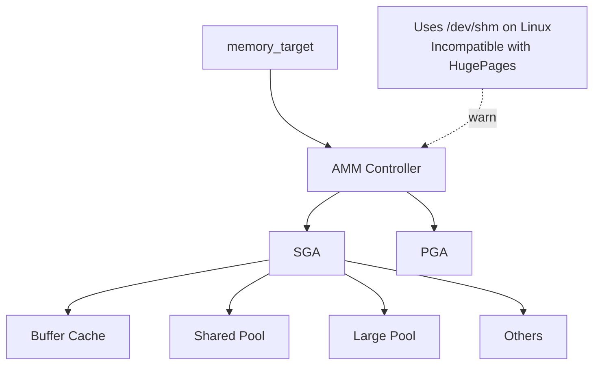

# Automatic Memory Management (AMM)

## Overview

**AMM** unifies SGA and PGA under a single `memory_target` parameter. Oracle dynamically shifts memory between shared (SGA) and private (PGA) allocations.

AMM was the recommended mode in 11g. **In 19c, AMM is not recommended for production Linux systems** for two reasons:

1. AMM on Linux uses `/dev/shm` (tmpfs) instead of System V shared memory. `/dev/shm` must be sized to `memory_target`.
2. AMM is **incompatible with HugePages**.

For any production database on Linux with SGA > 8 GB, use **ASMM** instead. AMM remains useful for small development databases and simplifies memory tuning when HugePages are not a factor.

## Architecture



## Internal Working

Under AMM:

- `sga_target` and `pga_aggregate_target` are **derived** from `memory_target`.
- Oracle shifts allocation between SGA and PGA based on workload demand.
- MMAN performs SGA resizes; PGA changes are per-process.
- `memory_max_target` is the hard ceiling.

On Linux, AMM requires `/dev/shm` (tmpfs) sized to at least `memory_max_target`. If `/dev/shm` is too small: `ORA-00845: MEMORY_TARGET not supported on this system`.

### Why Not on Production Linux?

- HugePages require the SGA to be in System V shared memory (`shmget`) — AMM's `/dev/shm` approach precludes this.
- Without HugePages, a large SGA suffers TLB thrashing and possibly page-out.
- Multiple RAC/Grid components have historically had rough edges with AMM.

## Components

Managed automatically:

- All SGA components (per ASMM rules)
- PGA (aggregate)

## Important Parameters

| Parameter              | Purpose                                    |
| ---------------------- | ------------------------------------------ |
| `memory_target`        | Enable AMM; total SGA + PGA target         |
| `memory_max_target`    | Ceiling                                    |
| `sga_target`           | Set to 0 for AMM (or acts as floor if > 0) |
| `pga_aggregate_target` | Set to 0 for AMM (or acts as floor)        |

## Important Views

| View                          | Purpose                        |
| ----------------------------- | ------------------------------ |
| `V$MEMORY_DYNAMIC_COMPONENTS` | Auto-managed sizes and history |
| `V$MEMORY_RESIZE_OPS`         | Resize history                 |
| `V$MEMORY_TARGET_ADVICE`      | Sizing advice                  |
| `V$MEMORY_CURRENT_RESIZE_OPS` | Ongoing resize                 |

## Diagnostic Queries

```sql
-- AMM component state
SELECT component, current_size/1024/1024 AS current_mb,
       min_size/1024/1024 AS min_mb,
       max_size/1024/1024 AS max_mb,
       last_oper_type
FROM   v$memory_dynamic_components
ORDER  BY component;

-- Resize history
SELECT component, oper_type,
       initial_size/1024/1024 AS from_mb,
       target_size/1024/1024 AS to_mb,
       start_time
FROM   v$memory_resize_ops
ORDER  BY start_time DESC
FETCH FIRST 20 ROWS ONLY;

-- Advice
SELECT memory_size/1024/1024 AS mb,
       memory_size_factor,
       estd_db_time
FROM   v$memory_target_advice
ORDER  BY memory_size;
```

### Enabling AMM

```sql
-- Enable AMM (Linux: verify /dev/shm size first)
!df -h /dev/shm

ALTER SYSTEM SET memory_max_target = 8G SCOPE = SPFILE;
ALTER SYSTEM SET memory_target = 8G SCOPE = SPFILE;
ALTER SYSTEM SET sga_target = 0 SCOPE = SPFILE;
ALTER SYSTEM SET pga_aggregate_target = 0 SCOPE = SPFILE;

-- Bounce
SHUTDOWN IMMEDIATE
STARTUP
```

### Switching from AMM to ASMM

```sql
ALTER SYSTEM SET sga_target = 6G SCOPE = SPFILE;
ALTER SYSTEM SET pga_aggregate_target = 2G SCOPE = SPFILE;
ALTER SYSTEM SET memory_target = 0 SCOPE = SPFILE;
ALTER SYSTEM SET memory_max_target = 0 SCOPE = SPFILE;

SHUTDOWN IMMEDIATE
STARTUP
```

## Common Issues

- **`ORA-00845: MEMORY_TARGET not supported on this system`** — `/dev/shm` too small. Fix: remount larger or switch to ASMM.
- **HugePages not used** — Expected under AMM. To use HugePages, switch to ASMM.
- **AMM slow to react to PGA pressure** — Not all workloads benefit from unified management; DW may see PGA starved.

## Troubleshooting

1. Confirm `/dev/shm` sizing on Linux: `df -h /dev/shm`. Should be ≥ `memory_max_target`.
2. `V$MEMORY_DYNAMIC_COMPONENTS.LAST_OPER_TYPE` shows recent activity.
3. `V$MEMORY_RESIZE_OPS` — thrashing indicator.

## Best Practices

1. **Prefer ASMM in production.**
2. If AMM is required (small dev DB, no HugePages), size `/dev/shm` to `memory_max_target + 10%` at boot (edit `/etc/fstab`).
3. Do not enable AMM on RAC in production.
4. Do not mix AMM with `sga_target > 0` unless you understand the interaction (`sga_target` becomes a floor).

## Interview Questions

1. **Q:** What is AMM?
   **A:** Automatic Memory Management — Oracle auto-manages SGA + PGA under one `memory_target`.

2. **Q:** Why is AMM not recommended for production Linux?
   **A:** Incompatible with HugePages, uses `/dev/shm` (tmpfs) which must be sized appropriately.

3. **Q:** What is the `ORA-00845` fix?
   **A:** Enlarge `/dev/shm` (usually by remounting with a larger size in `/etc/fstab`), or switch to ASMM.

4. **Q:** Can AMM and ASMM be enabled together?
   **A:** No — set `memory_target=0` for ASMM, or `sga_target=0` for AMM.

5. **Q:** How do you migrate from AMM to ASMM?
   **A:** Set `sga_target` and `pga_aggregate_target` explicitly; set `memory_target=0`; restart.

## References

- Oracle Database Administrator's Guide 19c — Memory Management
- MOS Doc ID 986308.1 — Automatic Memory Management (AMM) on Linux
- MOS Doc ID 749851.1 — HugePages vs AMM
