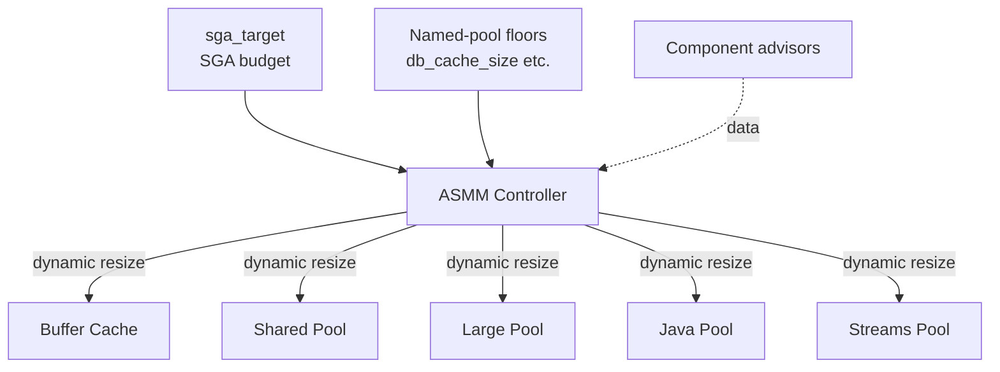

# Automatic Shared Memory Management (ASMM)

## Overview

**ASMM** is Oracle's automatic sizing for SGA sub-pools. Enabled by setting `sga_target > 0` and `memory_target = 0`, ASMM manages `db_cache_size`, `shared_pool_size`, `large_pool_size`, `java_pool_size`, and `streams_pool_size` dynamically according to workload demand.

ASMM is the **recommended** memory management mode for production Oracle 19c on Linux. It plays well with HugePages, avoids `/dev/shm` dependency (unlike AMM), and eliminates most SGA sizing debates.

## Architecture



## Internal Working

MMAN (Memory Manager) is the background process that performs ASMM resizes. It:

1. Reads component **advisors** (buffer cache, shared pool, etc.) that recommend growth or shrink.
2. Compares current sizes to workload demand.
3. Grows pools that show benefit and shrinks pools that are underused.
4. Uses granules — never sub-granule allocations.

### Sizing Rules

- `sga_target` is the _target_. `sga_max_size` is the ceiling.
- Setting `db_cache_size = X` establishes a **floor** — ASMM will not shrink below X.
- If all floors sum > `sga_target`, floors win and total may exceed target.

### AMM vs ASMM vs Manual

| Mode   | Set                                   | Manages              |
| ------ | ------------------------------------- | -------------------- |
| AMM    | `memory_target > 0`                   | SGA + PGA together   |
| ASMM   | `sga_target > 0`, `memory_target = 0` | SGA components only  |
| Manual | Both = 0, explicit component sizes    | Nothing auto-managed |

## Components

Managed automatically:

- Buffer cache
- Shared pool
- Large pool
- Java pool
- Streams pool

**Not** managed by ASMM (must set explicitly):

- Non-default block-size caches (`db_16k_cache_size` etc.)
- KEEP/RECYCLE pools
- `log_buffer` (fixed at startup)
- Result cache (`result_cache_max_size`)

## Important Parameters

| Parameter           | Purpose                                         |
| ------------------- | ----------------------------------------------- |
| `sga_target`        | ASMM target (soft)                              |
| `sga_max_size`      | Hard ceiling (set = `sga_target` for stability) |
| `memory_target`     | Must be 0 for ASMM                              |
| `db_cache_size`     | Floor                                           |
| `shared_pool_size`  | Floor                                           |
| `large_pool_size`   | Floor                                           |
| `java_pool_size`    | Floor                                           |
| `streams_pool_size` | Floor                                           |

## Important Views

| View                          | Purpose                                |
| ----------------------------- | -------------------------------------- |
| `V$SGA_DYNAMIC_COMPONENTS`    | Current auto-managed sizes and history |
| `V$SGA_RESIZE_OPS`            | Resize operation history               |
| `V$SGA_TARGET_ADVICE`         | Sizing advice                          |
| `V$SGAINFO`                   | Current SGA breakdown                  |
| `V$MEMORY_DYNAMIC_COMPONENTS` | Similar but SGA + PGA (AMM view)       |

## Diagnostic Queries

```sql
-- Current ASMM sizes
SELECT component, current_size/1024/1024 AS current_mb,
       min_size/1024/1024 AS min_mb,
       max_size/1024/1024 AS max_mb,
       user_specified_size/1024/1024 AS user_mb,
       oper_count, last_oper_type
FROM   v$sga_dynamic_components
ORDER  BY component;

-- Recent resizes (are they thrashing?)
SELECT component, oper_type,
       initial_size/1024/1024 AS from_mb,
       target_size/1024/1024 AS to_mb,
       start_time, end_time, status
FROM   v$sga_resize_ops
ORDER  BY start_time DESC
FETCH FIRST 30 ROWS ONLY;

-- Frequency of resizes per component (thrash indicator)
SELECT component, COUNT(*) AS resizes_last_day
FROM   v$sga_resize_ops
WHERE  start_time > SYSDATE - 1
GROUP  BY component
ORDER  BY 2 DESC;

-- Advice
SELECT sga_size AS sga_mb, sga_size_factor, estd_db_time
FROM   v$sga_target_advice
ORDER  BY sga_size;
```

## Common Issues

- **ASMM thrashing** — Constant resize between buffer cache and shared pool. Fix: set floors on both to prevent shrink.
- **`ORA-04031` despite ASMM** — Shared pool floor too low or fragmentation. Set floor + investigate cursor sharing.
- **Growth beyond `sga_target`** — Floors sum > target; total exceeds target and hits `sga_max_size`. Reduce floors.
- **Slow resize** — Big shrinks pause on active buffers. Set floors to avoid emergency shrinks.

## Troubleshooting

1. `V$SGA_RESIZE_OPS` — count resizes/hour. > 5/hour on same component = thrashing.
2. Set floors on the thrashing components at their steady-state size + 10%.
3. Check `V$SGA_DYNAMIC_COMPONENTS.OPER_COUNT` — high number = many resize events.
4. If shared pool grows quickly and buffer cache shrinks, suspect a hard-parse storm.

## Best Practices

1. **Use ASMM**. Do not use AMM in production on Linux.
2. Set `sga_max_size = sga_target`. Prevents ambiguity.
3. Set floors of 25% `sga_target` on both buffer cache and shared pool.
4. Explicitly set `large_pool_size ≥ 128M` — even under ASMM.
5. For DW/BI, tilt floors toward buffer cache; for OLTP with lots of parsing, tilt toward shared pool.
6. Monitor `V$SGA_RESIZE_OPS` weekly for the first month after a new workload — spot thrashing early.
7. HugePages: sized to `sga_max_size` + 5%.

## Interview Questions

1. **Q:** What is ASMM?
   **A:** Automatic Shared Memory Management — Oracle auto-sizes SGA components (buffer cache, shared pool, large pool, java pool, streams pool) under a single `sga_target`.

2. **Q:** How is ASMM different from AMM?
   **A:** ASMM manages only SGA; PGA is separate. AMM manages both SGA and PGA under one `memory_target`.

3. **Q:** What background process performs resizes?
   **A:** MMAN.

4. **Q:** What if I set `db_cache_size` under ASMM?
   **A:** That becomes the _floor_ — ASMM will not shrink buffer cache below it.

5. **Q:** How do I detect ASMM thrashing?
   **A:** `V$SGA_RESIZE_OPS` shows frequent grow/shrink cycles on the same component.

6. **Q:** Which pools are NOT managed by ASMM?
   **A:** KEEP/RECYCLE, non-default block-size caches, `log_buffer` (fixed at startup), result cache.

## References

- Oracle Database Concepts 19c — Memory Architecture
- Oracle Database Performance Tuning Guide 19c
- MOS Doc ID 269495.1 — How to Diagnose SGA_TARGET Behavior
- MOS Doc ID 295626.1 — Automatic SGA Memory Management
