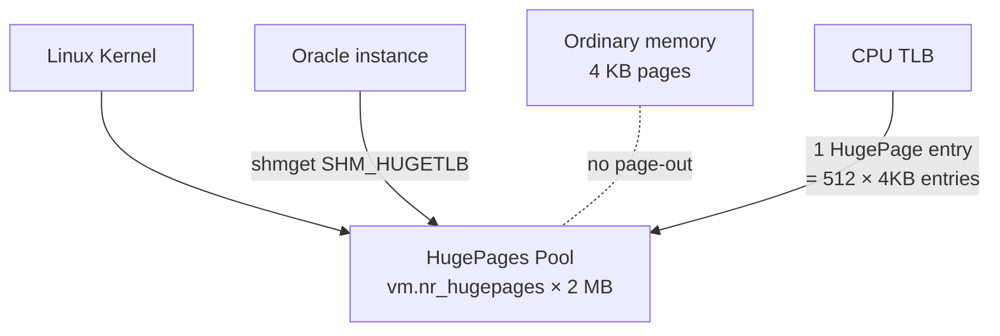

# HugePages (Linux)

## Overview

**HugePages** are large (typically 2 MB) memory pages used by the Linux kernel for applications that need large contiguous memory regions. Oracle SGA is a canonical use case: instead of 4 KB pages, HugePages reduce TLB pressure and eliminate SGA page-out.

**HugePages is mandatory for any production Oracle 19c on Linux with SGA > 8 GB**. Without HugePages, a 32 GB SGA needs 8 million 4 KB pages, thrashing the CPU's TLB and dragging performance by 5–30%.

## Architecture



## Internal Working

HugePages are pre-allocated at boot (or dynamically via `sysctl`). They are **locked** — kernel cannot swap them out. Oracle allocates the SGA in a shared-memory segment marked `SHM_HUGETLB`, and the SGA lives entirely in HugePages.

Benefits:

- **TLB efficiency** — one HugePage entry covers what 512 ordinary pages would.
- **No pageout** — HugePages are permanent RAM; Oracle SGA never faults.
- **Kernel bookkeeping** — Fewer page structs; lower kernel overhead.

### Transparent HugePages (THP) — Different Thing, Disable It

**Transparent HugePages** are automatic anonymous HugePages the kernel tries to promote. THP:

- Defragmentation daemon (`khugepaged`) causes latency spikes.
- Not compatible with SysV SHM_HUGETLB — Oracle SGA is still on 4 KB pages.
- Oracle Support explicitly recommends **disabling THP** for Oracle databases.

Disable THP:

```bash
echo never > /sys/kernel/mm/transparent_hugepage/enabled
echo never > /sys/kernel/mm/transparent_hugepage/defrag
```

Persist in kernel command line: add `transparent_hugepage=never` to GRUB.

## Components

| Component                            | Purpose                         |
| ------------------------------------ | ------------------------------- |
| HugePages pool                       | Kernel-managed 2 MB pages       |
| `vm.nr_hugepages`                    | Configured HugePage count       |
| `HugePages_Total` in `/proc/meminfo` | Allocated                       |
| `HugePages_Free`                     | Unused                          |
| `AnonHugePages`                      | Transparent HugePages (disable) |

## Important Parameters

Oracle-side:

| Parameter         | Purpose                                                                |
| ----------------- | ---------------------------------------------------------------------- |
| `use_large_pages` | `ONLY` (fail if unavailable), `TRUE` (try, fall back), `FALSE`, `AUTO` |

OS-side:

| Setting                    | Purpose                      |
| -------------------------- | ---------------------------- |
| `vm.nr_hugepages`          | Number of HugePages          |
| `vm.hugetlb_shm_group`     | Group ID allowed to allocate |
| `oracle soft/hard memlock` | Must be ≥ HugePages × 2 MB   |

## Important Views

Oracle side (limited):

```sql
-- Confirm HugePages parameter
SHOW PARAMETER use_large_pages;
```

## Diagnostic Queries

```bash
# Check HugePages state
grep -i huge /proc/meminfo
# Expected in production:
#   HugePages_Total:      <configured>
#   HugePages_Free:       <small, most used by Oracle>
#   HugePages_Rsvd:       <reserved>
#   Hugepagesize:         2048 kB
#   AnonHugePages:        0 kB   <-- THP disabled

# Check THP is off
cat /sys/kernel/mm/transparent_hugepage/enabled
cat /sys/kernel/mm/transparent_hugepage/defrag

# Check kernel command line
cat /proc/cmdline | tr ' ' '\n' | grep -i huge

# Verify limits
grep memlock /etc/security/limits.d/*.conf
```

### Sizing Formula

```
Required HugePages = ceil( (SUM of sga_max_size + 512 MB overhead) / 2 MB )
```

Example: SGA = 32 GB → 32 × 1024 / 2 = 16 384 HugePages, plus buffer → **17 000**.

Set:

```bash
echo "vm.nr_hugepages = 17000" >> /etc/sysctl.d/oracle-hugepages.conf
sysctl --system
```

Set `memlock` accordingly:

```conf
oracle   soft   memlock   34816000
oracle   hard   memlock   34816000
# in KB — HugePages × 2 MB
```

## Common Issues

- **HugePages_Free stays high after startup** — Oracle didn't allocate on HugePages. Check `use_large_pages`, `memlock` limits, and alert log.
- **`WARNING: --> Failed to allocate SGA in Huge pages`** in alert log — insufficient HugePages or `memlock` too low.
- **AnonHugePages large** — THP still enabled. Disable per above.
- **`ORA-27125: unable to create shared memory segment`** — kernel shared-memory limits (`shmmax`, `shmall`).
- **`kernel.shmall` too small** — should be `HugePages_Total × 2 MB / PAGE_SIZE` at minimum.

## Troubleshooting

1. `alert.log` at instance startup — Oracle prints how much SGA was placed in HugePages vs regular pages.
2. `/proc/meminfo` — `HugePages_Free` should drop after Oracle startup by (SGA / 2 MB).
3. If `use_large_pages=ONLY` and startup fails, Oracle exits early with clear message. If `use_large_pages=TRUE`, Oracle falls back to 4 KB pages silently — check alert log.
4. In RAC, verify HugePages configured identically on all nodes.

## Best Practices

1. **Always use HugePages** for SGA > 8 GB.
2. Set `use_large_pages=ONLY` in production — fail-fast if misconfigured.
3. **Disable THP** at boot via `transparent_hugepage=never` on the kernel command line.
4. Size HugePages to `sga_max_size / 2 MB` + 5% headroom.
5. Set `memlock` limit high (≥ HugePages × 2 MB).
6. Confirm every RAC node has identical HugePages allocation.
7. Persist `vm.nr_hugepages` via `/etc/sysctl.d/oracle-hugepages.conf` so it survives reboot.
8. Monitor `HugePages_Free` — should equal `Total - (SGA_bytes / 2 MB)` steady state.

## Interview Questions

1. **Q:** Why use HugePages for Oracle?
   **A:** Reduces TLB pressure and prevents SGA page-out. Essential for large SGAs.

2. **Q:** What's the difference between HugePages and Transparent HugePages?
   **A:** HugePages are pre-allocated and used explicitly (via `SHM_HUGETLB`). THP is automatic promotion of anonymous pages — Oracle recommends disabling THP.

3. **Q:** What does `use_large_pages=ONLY` do?
   **A:** Instance fails to start if HugePages allocation for SGA fails — prevents silent fallback to 4 KB pages.

4. **Q:** How do you size `vm.nr_hugepages`?
   **A:** `ceil(sga_max_size / 2 MB) + 5%`.

5. **Q:** What is `memlock` and why does it matter?
   **A:** OS ulimit for locked-in-memory pages. Must be at least HugePages × page size, or Oracle can't lock the SGA.

6. **Q:** Is HugePages compatible with AMM?
   **A:** No. AMM uses `/dev/shm` (tmpfs) which does not use HugePages. Use ASMM instead.

## References

- MOS Doc ID 749851.1 — HugePages on Linux
- MOS Doc ID 361323.1 — HugePages on Oracle Linux 64-bit
- MOS Doc ID 401749.1 — Shell script to calculate HugePages
- MOS Doc ID 1557478.1 — Transparent HugePages Impact on Oracle
- Oracle Database Administrator's Reference for Linux and UNIX-Based OS 19c
