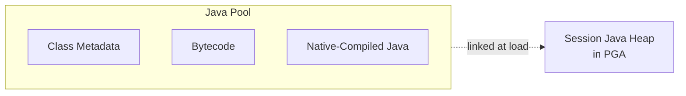

# Java Pool

## Overview

The **Java Pool** is the SGA area that holds session-independent Java code and class metadata for the Oracle JVM (OJVM). Databases without stored Java procedures can leave the Java pool small (default 4–8 MB). Databases running Java stored procedures, XDB (which uses Java), Text (some features), or third-party Java code (Coherence, MDS) need larger allocations.

## Architecture



## Internal Working

The Java pool caches **shared Java class metadata** and **compiled Java code** used across sessions. Per-session Java memory (per-session objects, thread stacks) lives in the PGA, not the Java pool.

When a session invokes a Java stored procedure, Oracle loads the class from the shared pool / Java pool once and reuses it for all sessions. Class loading is expensive, so a Java pool sized to hold your working set of classes reduces reload latency.

The Java pool is managed by ASMM when `sga_target > 0`. Setting `java_pool_size` provides a floor.

### OJVM Options

- **NATIVE compilation** — compiles Java stored procedures to shared libraries; runs faster but larger initial load into Java pool.
- **JIT compilation** — Just-in-time compiles bytecode; smaller initial footprint.

Configure via `dbms_java`.

## Components

| Component      | Purpose                          |
| -------------- | -------------------------------- |
| Class metadata | Loaded class definitions         |
| Bytecode area  | Java bytecode                    |
| Native code    | Native-compiled shared libraries |

## Important Parameters

| Parameter                      | Purpose                           |
| ------------------------------ | --------------------------------- |
| `java_pool_size`               | Java pool size (floor under ASMM) |
| `java_max_sessionspace_size`   | Per-session Java heap cap in PGA  |
| `java_soft_sessionspace_limit` | Warning threshold                 |
| `java_jit_enabled`             | JIT compilation on/off            |

## Important Views

| View                             | Purpose             |
| -------------------------------- | ------------------- |
| `V$JAVA_POOL_ADVICE`             | Sizing advice       |
| `V$SGASTAT` (`pool='java pool'`) | Current allocations |
| `DBA_JAVA_CLASSES`               | Loaded Java classes |
| `DBA_JAVA_METHODS`               | Class methods       |

## Diagnostic Queries

```sql
-- Java pool state
SELECT name, ROUND(bytes/1024/1024, 2) AS mb
FROM   v$sgastat
WHERE  pool = 'java pool';

-- Advice
SELECT java_pool_size_for_estimate AS mb,
       java_pool_size_factor AS factor,
       estd_lc_load_time
FROM   v$java_pool_advice
ORDER  BY java_pool_size_for_estimate;

-- Any Java stored procs?
SELECT owner, COUNT(*) FROM dba_java_classes GROUP BY owner ORDER BY 2 DESC;

-- Is OJVM installed?
SELECT comp_id, version, status FROM dba_registry WHERE comp_id = 'JAVAVM';
```

## Common Issues

- **`ORA-29532: Java call terminated by uncaught Java exception`** — Java code failed. Enable `dbms_java.set_output` and rerun.
- **`ORA-04031` on `joxs heap`** — Java pool too small. Enlarge.
- **`Java out of memory` from `java_max_sessionspace_size`** — Session hitting per-session heap cap. Raise or fix the Java code.
- **OJVM patch mismatch** — Datapatch not run. Fix: run `datapatch -verbose`.

## Troubleshooting

1. If Java stored procs are not in use, keep the Java pool small — the OJVM component still needs a few MB.
2. If Java is in active use, monitor `V$SGASTAT` growth over time and set `java_pool_size` to steady-state peak + 20%.
3. For OJVM patches: OJVM has separate quarterly patches (`p35354406_190000...`). Apply with `opatch apply` and always follow with `datapatch`.

## Best Practices

1. Do not remove OJVM (`dbms_registry.remove_component('JAVAVM')`) unless you're sure nothing uses it — XDB and Text may depend.
2. Size Java pool floor to 64–128 MB when in active use.
3. Apply OJVM RUs alongside DB RUs — quarterly.
4. Use `dbms_java.set_native_compiler_option` for NATIVE compilation of hot classes.

## Interview Questions

1. **Q:** What is the Java pool?
   **A:** SGA area for shared Java class metadata and bytecode used by Oracle JVM stored procedures.

2. **Q:** Is per-session Java memory in the Java pool?
   **A:** No — per-session memory is in the PGA. The Java pool holds only shared code.

3. **Q:** How do you apply Java patches?
   **A:** OJVM RUs are separate binary patches; apply with `opatch apply`, then `datapatch -verbose`.

4. **Q:** Can you remove OJVM?
   **A:** Yes, via `catnojav.sql`, but check dependencies (XDB, Spatial Text) first.

## References

- Oracle Database Java Developer's Guide 19c
- Oracle Database Concepts 19c — Java Pool
- MOS Doc ID 2160607.1 — OJVM Patching Recommendations
