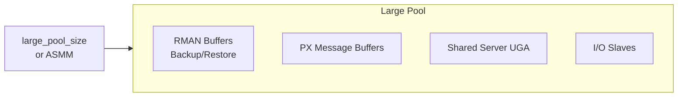

# Large Pool

## Overview

The **Large Pool** is an optional SGA area used for large, transient allocations that would otherwise fragment the shared pool: RMAN backup/restore buffers, Parallel Query message buffers, shared-server session UGA, and I/O slave server buffers. Enabling a large pool of even a few hundred MB dramatically improves shared-pool stability under mixed workloads.

If the large pool is not configured, RMAN and PX borrow from the shared pool.

## Architecture



## Internal Working

Unlike the shared pool, the large pool has **no LRU list**. Every allocation is a permanent chunk until explicitly freed. This makes it fast (no eviction bookkeeping) but requires accurate sizing.

RMAN uses the large pool for I/O buffers during backup and restore. Each channel typically allocates 16 MB of buffer memory per channel — visible as `KSFQ Buffers` in `V$SGASTAT`.

Parallel Query uses the large pool for **PX message buffers** between the query coordinator and slaves. Each slave-slave communication uses buffered messages.

Shared Server allocates each session's UGA (User Global Area) in the large pool rather than PGA, so the same memory is reused across dispatchers.

## Components

| Component          | Uses Large Pool When                                                 |
| ------------------ | -------------------------------------------------------------------- |
| RMAN               | Always (`large_pool_size > 0`) or falls back to shared pool          |
| Parallel Execution | `parallel_execution_message_size` allocations                        |
| Shared Server      | UGA when large pool configured                                       |
| I/O Slaves         | Async I/O emulation with `dbwr_io_slaves` or `backup_tape_io_slaves` |

## Important Parameters

| Parameter                                  | Purpose                                   |
| ------------------------------------------ | ----------------------------------------- |
| `large_pool_size`                          | Explicit size (or floor when ASMM active) |
| `parallel_execution_message_size`          | PX message size (16 KB default in 12c+)   |
| `dispatchers`                              | Enables shared server, drives UGA size    |
| `dbwr_io_slaves` / `backup_tape_io_slaves` | I/O slave counts                          |

## Important Views

| View                           | Purpose                                   |
| ------------------------------ | ----------------------------------------- |
| `V$SGASTAT`                    | `pool = 'large pool'` shows current usage |
| `V$SGA_TARGET_ADVICE`          | Aggregate ASMM advice includes large pool |
| `V$PX_PROCESS`, `V$PX_SESSION` | PX activity                               |
| `V$RMAN_BACKUP_JOB_DETAILS`    | RMAN memory usage                         |

## Diagnostic Queries

```sql
-- Large pool usage
SELECT name, ROUND(bytes/1024/1024, 1) AS mb
FROM   v$sgastat
WHERE  pool = 'large pool'
ORDER  BY bytes DESC;

-- Confirm size
SHOW PARAMETER large_pool_size

-- RMAN buffer allocations (during backup)
SELECT name, bytes FROM v$sgastat WHERE name LIKE 'KSFQ%';

-- PX activity
SELECT s.sid, s.username, s.program, pq.qcsid, pq.server#, pq.request_pieces
FROM   v$px_session pq
JOIN   v$session s ON s.sid = pq.sid;
```

## Common Issues

- **`ORA-04031: unable to allocate ... large pool`** — Large pool exhausted during RMAN or PX; increase or let ASMM grow it.
- **RMAN slow** — No large pool → RMAN buffers fight in shared pool → fragmentation and cursor invalidation. Set `large_pool_size` explicitly.
- **PX degrades** — `parallel_execution_message_size` too small or large pool exhausted. Symptoms: `PX Deq: reap credit` waits.
- **`Streams pool` bleed** — In 12.2+, some GoldenGate features touch the streams pool but occasionally spill to large; monitor both.

## Troubleshooting

1. `SELECT name, bytes FROM v$sgastat WHERE pool='large pool';` before/after workload.
2. If ASMM: check `V$SGA_RESIZE_OPS` for large-pool grow events during peak workload — indicates it's undersized as a floor.
3. For RMAN failures, look at `RMAN-06054` and `ORA-04031` combinations.

## Best Practices

1. Always configure at least `large_pool_size = 128M` even under ASMM — sets a floor.
2. For heavy RMAN, size by `16 MB × RMAN channel count` plus a buffer.
3. For heavy PX, `parallel_max_servers × parallel_execution_message_size × 4` is a common rule.
4. Use shared server only for special use cases (thousands of low-activity connections); UGA in the large pool is a knock-on effect to plan for.
5. Never mix I/O slaves with async I/O — they are legacy. Use `disk_asynch_io=TRUE` (default).

## Interview Questions

1. **Q:** What is the large pool for?
   **A:** Large, transient SGA allocations for RMAN, Parallel Query, Shared Server UGA, and I/O slaves — avoiding fragmentation of the shared pool.

2. **Q:** Does the large pool have an LRU?
   **A:** No. Allocations stay until explicitly released.

3. **Q:** What happens if `large_pool_size = 0` and RMAN runs?
   **A:** RMAN allocates buffers from the shared pool, which can fragment the shared pool and cause `ORA-04031`.

4. **Q:** What's the shared server UGA?
   **A:** With shared server, each session's UGA moves from PGA to the large pool so dispatchers can serve any session.

5. **Q:** What does `parallel_execution_message_size` control?
   **A:** The size of PX inter-slave message buffers allocated from the large pool.

## References

- Oracle Database Concepts 19c — Large Pool
- Oracle Database Performance Tuning Guide 19c
- MOS Doc ID 62252.1 — Large Pool Sizing
- MOS Doc ID 373230.1 — RMAN and Large Pool Sizing
