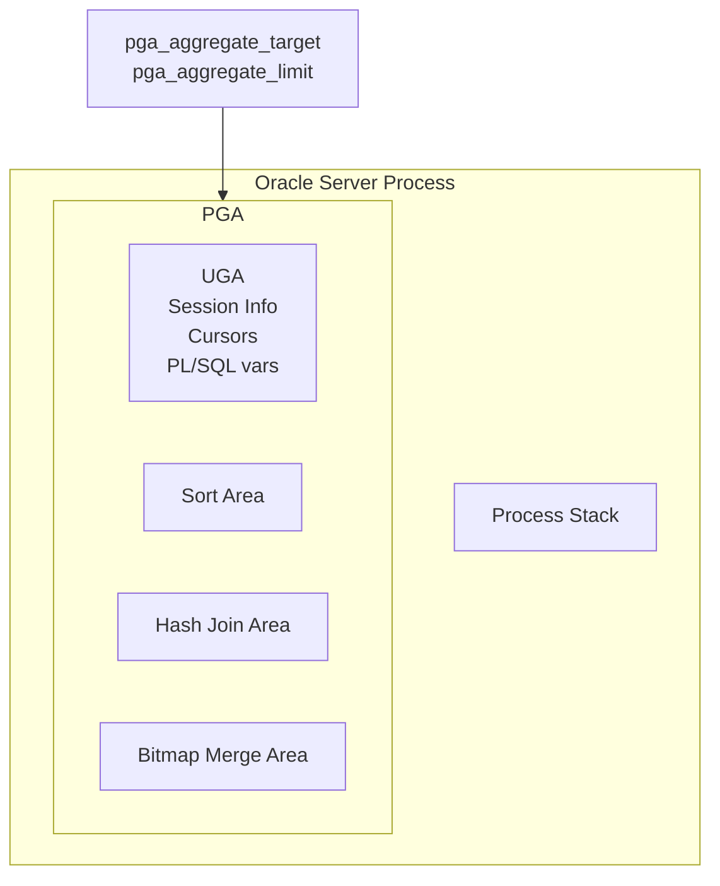

# Program Global Area (PGA)

## Overview

The **PGA** is the _private_ memory allocated per process. Unlike the SGA, which is shared across all Oracle processes, each dedicated server process gets its own PGA. It holds session state, cursor state, sort areas, hash-join areas, bitmap merge areas, and PL/SQL variables.

PGA sizing is second only to SGA in performance impact. Undersized PGA forces sorts and hash joins to spill to TEMP (`direct path read temp`, `direct path write temp`) — the difference between an in-memory hash join and a disk-spill can be 10–100× in elapsed time.

## Architecture



## Internal Working

### UGA vs PGA

- **PGA** — physical process memory.
- **UGA** — session memory (cursors, package vars). In dedicated server mode, UGA lives inside PGA. In shared server mode, UGA moves to the SGA (large pool) so any dispatcher can serve any session.

### Auto PGA (default)

`pga_aggregate_target` sets a target for **aggregate** PGA across the whole instance. Oracle dynamically distributes memory across processes using an **auto-tuned** algorithm — no per-work-area tuning needed.

- Larger `pga_aggregate_target` → larger work areas → fewer TEMP spills.
- Cap: `pga_aggregate_limit` (default = MAX(2 × `pga_aggregate_target`, 3 GB, `processes` × 3 MB)) — hard ceiling. If reached, Oracle kills the biggest offenders.

### Work Areas

Three main work-area types:

- **Sort area** — ORDER BY, DISTINCT, GROUP BY, index build.
- **Hash join area** — HASH JOIN operator.
- **Bitmap merge area** — bitmap index ANDs.

Each has three execution modes:

- **Optimal** — fits entirely in PGA.
- **One-pass** — spills once to TEMP.
- **Multi-pass** — spills multiple times (very slow).

`V$SQL_WORKAREA_HISTOGRAM` shows the distribution.

### Global Work Area Sizing

Auto PGA computes an **expected work area size** for each operator based on the estimated row set and the current aggregate target. The optimizer's plan choice depends on the assumed work area size.

## Components

| Component         | Purpose                           |
| ----------------- | --------------------------------- |
| UGA               | Session state (dedicated servers) |
| Sort area         | ORDER BY / GROUP BY workspace     |
| Hash area         | HASH JOIN workspace               |
| Bitmap merge area | Bitmap index ops                  |
| Cursor state      | Bind vars, execution context      |
| PL/SQL memory     | Package vars, collections         |

## Important Parameters

| Parameter              | Purpose                            |
| ---------------------- | ---------------------------------- |
| `pga_aggregate_target` | Target aggregate PGA (soft)        |
| `pga_aggregate_limit`  | Hard ceiling (kills offenders)     |
| `workarea_size_policy` | AUTO (default) or MANUAL           |
| `sort_area_size`       | Manual sort (deprecated with AUTO) |
| `hash_area_size`       | Manual hash (deprecated)           |
| `_pga_max_size`        | (hidden) per-process cap           |

## Important Views

| View                       | Purpose                     |
| -------------------------- | --------------------------- |
| `V$PGASTAT`                | Overall PGA stats           |
| `V$PROCESS`                | Per-process PGA usage       |
| `V$PGA_TARGET_ADVICE`      | Sizing advice               |
| `V$SQL_WORKAREA_HISTOGRAM` | Work area size distribution |
| `V$SQL_WORKAREA_ACTIVE`    | Currently active work areas |
| `V$SQL_WORKAREA`           | Historical per-cursor stats |

## Diagnostic Queries

```sql
-- PGA overview
SELECT name, value/1024/1024 AS mb
FROM   v$pgastat
WHERE  name IN ('aggregate PGA target parameter',
                'aggregate PGA auto target',
                'total PGA inuse',
                'total PGA allocated',
                'maximum PGA allocated',
                'over allocation count');

-- Top processes by PGA
SELECT p.pid, p.spid, p.program,
       ROUND(p.pga_used_mem/1024/1024, 1) AS used_mb,
       ROUND(p.pga_alloc_mem/1024/1024, 1) AS alloc_mb,
       ROUND(p.pga_max_mem/1024/1024, 1)   AS max_mb
FROM   v$process p
WHERE  p.program IS NOT NULL
ORDER  BY p.pga_max_mem DESC
FETCH FIRST 20 ROWS ONLY;

-- Sizing advice
SELECT pga_target_for_estimate/1024/1024 AS target_mb,
       pga_target_factor AS factor,
       estd_pga_cache_hit_percentage AS hit_pct,
       estd_overalloc_count AS over_allocs
FROM   v$pga_target_advice
ORDER  BY pga_target_for_estimate;

-- How much did we spill?
SELECT optimal_executions, onepass_executions, multipasses_executions
FROM   v$sysstat
WHERE  name = 'workarea executions - optimal';   -- and similar
-- Better: use v$sql_workarea_histogram
SELECT low_optimal_size/1024 AS low_kb,
       high_optimal_size/1024 AS high_kb,
       optimal_executions,
       onepass_executions,
       multipasses_executions
FROM   v$sql_workarea_histogram
WHERE  onepass_executions + multipasses_executions > 0
ORDER  BY low_optimal_size;
```

## Common Issues

- **`ORA-04030: out of process memory`** — Individual process hit OS memory limit. Increase `ulimit`, add RAM, or reduce workload concurrency.
- **`pga_aggregate_limit` exceeded** — Oracle kills biggest sessions (alerts in alert log). Enlarge limit or investigate memory leaks.
- **Multi-pass work areas** — PGA too small vs data volume. Enlarge or rewrite query.
- **TEMP tablespace fills up** — Spilled work areas write to TEMP. Enlarge TEMP and PGA.
- **Wrong per-process cap** — With very high `processes`, aggregate limit may divide too small per process.

## Troubleshooting

1. `V$PGASTAT` shows `over allocation count` — should be 0. Rising means undersized.
2. `V$PGA_TARGET_ADVICE` shows benefit curve.
3. `V$SQL_WORKAREA_HISTOGRAM` — any onepass/multipass = spill.
4. For `ORA-04030`, check OS: `ulimit -a` for `memlock`, `stack`, and `nofile`. Match with `pga_aggregate_limit / processes`.
5. Correlate with `V$SESSION.pga_used_mem` to identify runaway sessions.

## Best Practices

1. Use `workarea_size_policy=AUTO` always. Manual is legacy.
2. Set `pga_aggregate_target` to 25–40% of RAM for DW workloads, 10–20% for OLTP.
3. Set `pga_aggregate_limit = 2 × pga_aggregate_target` (default) — do not disable.
4. Monitor spillage weekly.
5. Enable HugePages for SGA — leaves clean RAM for PGA.
6. Cap runaway sessions with Resource Manager (`switch_estimated_time`, `switch_time`).
7. In RAC, PGA is per-instance.
8. Avoid overly-broad `pga_aggregate_target` on containers — each PDB does not have its own PGA in 19c.

## Interview Questions

1. **Q:** What is the PGA?
   **A:** Private per-process memory holding session state, cursor state, and work areas (sort/hash/bitmap).

2. **Q:** UGA vs PGA?
   **A:** UGA is session memory. In dedicated server it lives inside PGA. In shared server it moves to the SGA (large pool).

3. **Q:** What does `pga_aggregate_limit` do?
   **A:** Hard ceiling on total PGA. When exceeded, Oracle kills the biggest offenders.

4. **Q:** What's an optimal vs one-pass vs multi-pass work area?
   **A:** Optimal fits in memory. One-pass spills once to TEMP. Multi-pass spills multiple times — very slow.

5. **Q:** How do you diagnose PGA spillage?
   **A:** `V$SQL_WORKAREA_HISTOGRAM` — non-zero `onepass_executions` or `multipasses_executions` indicates spillage.

6. **Q:** Auto vs Manual work area sizing — which is default?
   **A:** AUTO (`workarea_size_policy=AUTO`). Manual mode is deprecated for tuning.

## References

- Oracle Database Concepts 19c — Program Global Area
- Oracle Database Performance Tuning Guide 19c — PGA Memory Management
- MOS Doc ID 223730.1 — Automatic PGA Memory Management
- MOS Doc ID 1520324.1 — pga_aggregate_limit Behavior
