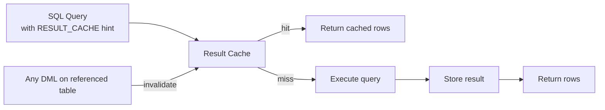

# Result Cache

## Overview

The **Result Cache** stores the results of queries and PL/SQL function invocations so that a subsequent identical call returns cached data without re-executing. Enabled selectively via `RESULT_CACHE` hint or `RESULT_CACHE_MODE`, it can dramatically accelerate repetitive read-heavy workloads (portal dashboards, lookup APIs, reference data queries).

The cache is automatically **invalidated** when underlying tables change. This makes it safe but limits usefulness on highly volatile data.

## Architecture



## Internal Working

The result cache lives in the SGA (subset of the shared pool). Two independent caches:

- **SQL Query Result Cache** — full result sets of queries.
- **PL/SQL Function Result Cache** — return values of `RESULT_CACHE`-annotated deterministic functions.

Each cached entry records which **dependencies** (base tables) it derives from. Any DML on a dependency invalidates the entry.

### Invalidation

- Any DML that changes a dependency triggers invalidation.
- Includes DDL, `TRUNCATE`, and stats updates that force plan re-eval.
- Fine-grained: only affected entries are dropped.

### Blocking Reads

Concurrent computation of the same result is serialized to avoid duplicate work. The second session waits (`result cache: RC latch`) for the first to publish.

## Components

| Component                    | Purpose                      |
| ---------------------------- | ---------------------------- |
| Query Result Cache           | Cached query results         |
| PL/SQL Function Result Cache | Cached function returns      |
| Dependency tracking          | Links results to base tables |
| Invalidation engine          | Drops stale entries on DML   |

## Important Parameters

| Parameter                          | Purpose                                           |
| ---------------------------------- | ------------------------------------------------- |
| `result_cache_mode`                | `MANUAL` (hint required) or `FORCE` (default all) |
| `result_cache_max_size`            | Overall cap                                       |
| `result_cache_max_result`          | Per-result cap (% of total)                       |
| `result_cache_remote_expiration`   | For DB links                                      |
| `result_cache_execution_threshold` | (undocumented) minimum executions before caching  |

## Important Views

| View                        | Purpose                             |
| --------------------------- | ----------------------------------- |
| `V$RESULT_CACHE_STATISTICS` | Hit/miss statistics                 |
| `V$RESULT_CACHE_MEMORY`     | Memory usage per block              |
| `V$RESULT_CACHE_OBJECTS`    | Cached objects with hash and status |
| `V$RESULT_CACHE_DEPENDENCY` | Object → dependency mapping         |

## Diagnostic Queries

```sql
-- Result cache stats
SELECT name, value FROM v$result_cache_statistics ORDER BY name;

-- Current cached entries
SELECT type, status, name, cache_id, row_count, bytes/1024 AS kb
FROM   v$result_cache_objects
WHERE  status = 'Published'
ORDER  BY bytes DESC;

-- Memory usage summary
SELECT SUM(bytes)/1024/1024 AS total_mb,
       COUNT(*) AS entries
FROM   v$result_cache_objects
WHERE  status = 'Published';

-- Query the cache directly
SELECT /*+ RESULT_CACHE */ COUNT(*) FROM sales;
```

Use the result cache in PL/SQL:

```sql
CREATE OR REPLACE FUNCTION get_dept_name(p_id NUMBER)
  RETURN VARCHAR2 RESULT_CACHE RELIES_ON (departments)
IS
  v_name VARCHAR2(100);
BEGIN
  SELECT name INTO v_name FROM departments WHERE id = p_id;
  RETURN v_name;
END;
/
```

## Common Issues

- **Low hit ratio** — Volatile data invalidates frequently; not a fit.
- **`ORA-04031` on `Result Cache Memory`** — `result_cache_max_size` too small vs demand. Enlarge.
- **Latch waits `result cache: RC latch`** — Highly concurrent identical queries computing in parallel. Rare; usually resolves after warm-up.
- **RAC — result cache is per-instance** — Same query on two nodes fills two caches; consider whether this is desired.

## Troubleshooting

1. Check invalidation reasons via `V$RESULT_CACHE_OBJECTS.STATUS`.
2. If cache is full, tune `result_cache_max_size` or reduce eligible queries.
3. Flush ad-hoc: `DBMS_RESULT_CACHE.FLUSH;` (nukes everything).

## Best Practices

1. Use `RESULT_CACHE_MODE=MANUAL` and hint selectively. `FORCE` caches everything and is rarely optimal.
2. Ideal for: reference tables, dashboard queries, low-cardinality lookups.
3. Avoid for: high-DML tables, per-user parameterized queries with wide parameter space.
4. Set `result_cache_max_size` to 1–5% of SGA to start.
5. Use `RELIES_ON` clause on PL/SQL functions for correct invalidation semantics.
6. Monitor `V$RESULT_CACHE_STATISTICS` — hit ratio > 60% justifies the memory.

## Interview Questions

1. **Q:** What is the Result Cache?
   **A:** SGA area caching query results and PL/SQL function returns for reuse.

2. **Q:** When is a result invalidated?
   **A:** When any DML modifies a base table the result depends on.

3. **Q:** What's the difference between `MANUAL` and `FORCE`?
   **A:** MANUAL only caches queries with the `RESULT_CACHE` hint; FORCE caches every eligible query.

4. **Q:** How do you flush the result cache?
   **A:** `DBMS_RESULT_CACHE.FLUSH;` — invalidates all entries.

5. **Q:** Is the result cache shared across RAC instances?
   **A:** No — each instance has its own.

## References

- Oracle Database Performance Tuning Guide 19c — Result Cache
- Oracle Database SQL Language Reference — RESULT_CACHE hint
- MOS Doc ID 782419.1 — Managing the Result Cache
